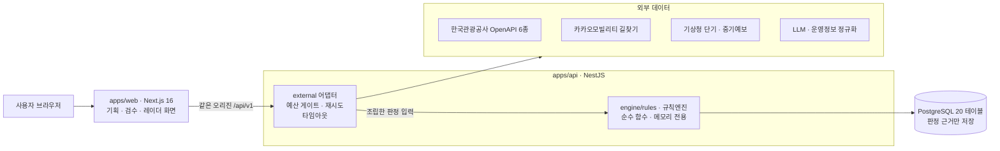
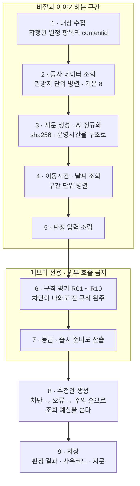
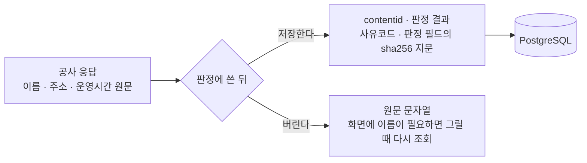
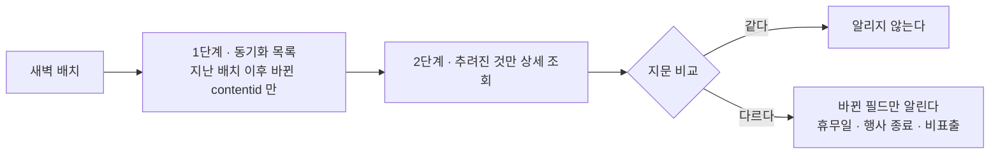

# TourLint

**여행상품을 출시하기 전에, 사람이 일일이 확인하던 것을 대신 확인합니다.**

월요일이 휴관인 미술관을 월요일 일정에 넣었는지. 끝난 축제를 아직 홍보 문구에 쓰고 있는지.
숙소에서 다음 장소까지 40분이 걸리는데 일정표에는 15분으로 잡혀 있는지. TourLint 는 여행상품의
일정표를 한국관광공사 관광정보와 대조해 **무엇이 문제이고 왜 그런지**를 근거와 함께 보여 줍니다.

| | |
|---|---|
| 서비스 | https://tourlint-web.up.railway.app |
| 심사위원 체험 가이드 | [노션](https://app.notion.com/p/TourLint-2-3-3dfec0325d5b802e922fd492799f00e1?source=copy_link) · [PDF](https://tourlint-web.up.railway.app/judge-guide.pdf) |
| API 문서 | https://api-production-1e7c2.up.railway.app/docs |
| 상태 | https://api-production-1e7c2.up.railway.app/health |

2026 관광데이터 활용 공모전 · 웹·앱 구현 부문 · 지정과제 7번 · 팀 **패치와 매치**

---

## 무엇을 푸는가

여행상품 하나에는 보통 10 ~ 20곳이 들어갑니다. 상품을 내보내기 전에 담당자는 그 장소들이
**그날 문을 여는지, 행사가 아직 하는지, 이동이 가능한 시간인지**를 하나씩 확인합니다. 전화를
걸고, 홈페이지를 찾고, 지도를 열어 봅니다. 20곳이면 한나절입니다.

그래서 보통은 다 확인하지 못한 채 나갑니다. 문 닫은 곳이 일정에 남아 있는 상품이 팔리고,
현장에서 고객이 알게 됩니다.

TourLint 는 이 확인을 **관광정보 원본과 대조해 대신** 합니다. 확인이 끝나면 어디가 문제인지,
근거가 무엇인지, 어떻게 고치면 되는지를 한 화면에 냅니다. 고칠 안을 고르면 일정표가 바뀌고,
바뀐 일정으로 다시 검수합니다.

## 40분이면 전 기능을 따라갈 수 있습니다

심사위원용 [체험 가이드](https://app.notion.com/p/TourLint-2-3-3dfec0325d5b802e922fd492799f00e1?source=copy_link)가
있습니다. 강릉 2박 3일 상품 **하나로** 로그인부터 출시까지 한 방향으로 갑니다 —
기획 → 장소 담기 → 검수 → 수정안 → 리포트 → 출시 → 레이더 → 검수 기준 조정.

일정에는 **문제를 일부러 넣어** 두었습니다. 휴관일에 걸린 곳, 끝난 축제, 이동 시간이 모자란
구간이 각각 어떤 판정으로 잡히는지 그대로 보입니다. 홈 화면 맨 위 배너에서 바로 열 수 있고,
노션을 열 수 없는 환경을 위해 PDF 도 로그인 없이 받을 수 있습니다.

## 화면 넷

| 화면 | 하는 일 |
|---|---|
| **기획** | 일정을 만듭니다. 직접 입력 · 엑셀 업로드 · 자연어 붙여넣기 셋 중 편한 방식으로 채우고, 오른쪽 「장소 담기」에서 그 지역의 실제 관광지를 골라 넣습니다. 여기에는 **판정이 없습니다** — 자유롭게 짜는 자리입니다 |
| **검수** | 규칙 10가지로 판정합니다. 카드마다 공사 원문과 계산 과정을 접어 두고, 고칠 수 있는 것에는 수정안을 답니다. 수정안을 고르면 미리보기 → 확정 → 재검수로 이어집니다 |
| **레이더** | 출시한 상품의 관광정보가 **바뀌면** 알려 줍니다. 휴무일 변경, 행사 종료, 비표출 전환. 관심 지역의 새 소식과 수요 신호도 여기서 봅니다 |
| **검수 기준** | 규칙이 무엇을 어떻게 보는지 설명하고, 회사 기준(이동 시간 상한 · 식사 간격)을 표준보다 **엄격하게만** 조정할 수 있습니다 |

## 검수 규칙 10가지

| | 규칙 | 무엇을 보나 | 근거 데이터 |
|---|---|---|---|
| R01 | 쉬는 날 · 운영시간 | 그날 문을 여는가, 일정 시각에 열려 있는가 | 공사 소개정보 |
| R02 | 행사 기간 | 여행일에 그 행사가 진행 중인가 | 공사 행사정보 |
| R03 | 일정 시간 겹침 | 두 일정이 같은 시간에 잡혀 있지 않은가 | 일정표 |
| R04 | 종류 쏠림 | 한 종류에 몰려 있지 않은가 | 일정표 · 공사 분류 |
| R05 | 확정되지 않은 곳 | 관광정보와 이어지지 않은 장소가 남았는가 | 공사 검색 |
| R06 | 정보 바뀜 | 검수 이후 원본이 바뀌었는가 | 공사 동기화 목록 |
| R07 | 식사 · 휴식 | 끼니 간격과 휴식이 사람이 감당할 수준인가 | 일정표 |
| R08 | 이동 시간 | 다음 장소까지 실제로 갈 수 있는 시간인가 | 카카오모빌리티 |
| R09 | 날씨 · 우천 | 비 오는 날 실외 일정이 몰려 있는가 | 기상청 |
| R10 | 상품 구성 | 타깃 · 콘셉트에 견줘 빠진 것이 있는가 | 공사 분류 · 표준 |

판정은 **차단 · 오류 · 주의 · 확인 불가** 네 등급이고, 출시 준비도는
`100 − Σ(등급별 건수 × 가중치)` 로 계산합니다(기본 가중치 25 · 10 · 4 · 3). 차단이 남아 있으면
출시할 수 없습니다. 점수가 어떻게 나왔는지는 화면에서 계산식 그대로 펼쳐 볼 수 있습니다.

## 설계 원칙 넷

이 네 가지가 코드 구조와 테스트를 결정했습니다.

**1. 표시는 실시간, 저장은 판정 근거만.** 관광지 이름 · 주소 · 운영시간 같은 공사 원문은
데이터베이스에도 로그에도 남기지 않습니다. 화면에 필요한 이름은 그릴 때 조회합니다. 저장하는
것은 판정의 근거가 되는 값(콘텐츠 id, 판정 결과, 지문)뿐입니다.

**2. AI 는 정규화까지, 판정은 규칙엔진이 한다.** "매주 월요일 휴무, 단 공휴일인 경우 익일"
같은 자연어를 구조로 바꾸는 데까지만 LLM 을 씁니다. 휴관인지 아닌지는 규칙엔진이 정합니다.
AI 가 판정하면 같은 상품을 두 번 검수했을 때 결과가 달라지고, 그러면 근거가 될 수 없습니다.

**3. 모르는 건 모른다고 한다.** 운영시간 정보가 없는 곳을 "정상"으로 넘기지 않습니다.
**확인 불가**라는 등급을 따로 두고, 대신 전화로 물어볼 내용을 정리해 줍니다.

**4. 예측하지 않고 관측한다.** "이 상품은 잘 팔릴 것"이라고 말하지 않습니다. 바뀐 사실과
관측된 수치만 보여 줍니다.

## 쓰는 데이터

한국관광공사 OpenAPI **6종**을 씁니다.

| 서비스 | 쓰는 곳 |
|---|---|
| 국문 관광정보 | 검색 · 상세 · 소개정보 · 행사 · 지역/위치 기반 목록 · 동기화 목록 · 법정동 · 분류체계 (9개 오퍼레이션) |
| 무장애 여행 정보 | 장소 담기의 휠체어 조건, 장소별 조건 확인 |
| 반려동물 동반여행 | 장소 담기의 반려동물 조건 |
| 관광지별 연관 관광지 | 「함께 많이 가는 순」 정렬 |
| 두루누비 | 걷기 길 일정 |
| 빅데이터 지역별 방문자수 | 레이더 수요 신호(작년 같은 달 대비) |

여기에 **기상청** 단기 · 중기예보(R09)와 **카카오모빌리티** 길찾기(R08), 그리고 운영정보
정규화용 **LLM** 을 씁니다. 호출은 모두 어댑터 한 곳을 지나며, 서비스마다 일일 예산 게이트가
붙어 있습니다.

## 시스템 구조



바깥과 이야기하는 코드와 판정하는 코드가 갈라져 있습니다. **규칙엔진은 네트워크도 DB 도
모릅니다** — 조립이 끝난 입력을 받아 메모리에서만 판정합니다.

**경계는 도구가 막습니다.** `engine/rules` 가 `external` 이나 `persistence` 를 import 하면
eslint 가 거부합니다. 규칙 안에서 외부를 부르는 순간 같은 입력에 같은 결과가 보장되지 않고,
그러면 검수 결과가 근거가 될 수 없기 때문입니다.

```
apps/api          NestJS — 검수 엔진과 API
  src/engine      규칙엔진. 순수 함수 · 메모리 전용
  src/external    공사 · 기상청 · 카카오 · LLM 어댑터
  src/batch       새벽 배치 — 변경 감지와 수요 신호
apps/web          Next.js 16 — 사용자 화면
packages/shared   두 쪽이 같이 쓰는 상수 · 타입 · 표준값
db/schema.sql     스키마 정본 (20 테이블)
docs/notion       요구사항 명세 13종의 저장소 사본
fixtures          실호출 스냅샷. 개발 · 테스트는 이걸로 리플레이한다
```

### 검수 한 번이 도는 순서



1박 2일 8곳이면 공사 호출이 약 29회, 2박 3일 12곳이면 43회입니다. 순차로 부르면 목표
시간을 맞출 수 없어 **2단계와 4단계를 병렬로** 돕니다. 외부가 느려 목표를 넘겨도 검수는
멈추지 않고 진행률을 계속 갱신합니다.

실패는 **가장 작은 단위로 격리**합니다. 한 관광지의 조회가 실패하면 그 관광지만 확인
불가이고, 카카오가 실패하면 그 구간의 이동 시간만 확인 불가입니다. 검수 자체는 끝까지 갑니다.

### 무엇을 저장하고 무엇을 저장하지 않나



지문만 남기기 때문에 **원문을 갖고 있지 않아도 바뀐 것을 알 수 있습니다.** 다음 배치에서
같은 필드를 다시 해시해 지문이 다르면 바뀐 것입니다.

데이터베이스 전체를 훑어 공사 원문이 한 글자라도 들어갔는지 보는 검사가 테스트에 있습니다.

### 레이더 — 바뀐 것만 알려 주는 법



전수 조회가 아니라 **바뀐 것만** 두 단계로 좁힙니다. 하루 호출 예산 안에서 출시한 상품
전체를 지켜볼 수 있는 이유입니다.

## 품질

- **테스트 2,100여 개.** 규칙별 판정, 실호출 스냅샷 회귀, 화면 문구, 저장 경계까지 덮습니다
- **결정론** — 같은 상품을 세 번 검수하면 점수뿐 아니라 사람이 읽는 문장까지 같아야 합니다
- **저장 경계 전수 검사** — 데이터베이스 전체를 훑어 공사 원문이 한 글자라도 들어갔는지 봅니다
- **가드는 되돌려 확인합니다** — 새로 넣은 검사를 고치기 전 코드로 되돌려 실제로 빨개지는지
  본 뒤에만 남깁니다. 통과하지만 아무것도 지키지 않는 검사를 여러 번 잡았습니다
- 배포는 `main` 머지로 자동이고, `/health` 의 커밋이 올라오는지 CI 가 15분간 지켜봅니다

## 개발

```bash
pnpm install
pnpm verify        # build · lint · typecheck · test
```

공사 API 는 평소에 부르지 않습니다. 예산이 아니라 **결정론** 때문입니다 — 같은 입력에 같은
결과를 봐야 회귀를 잡을 수 있습니다.

```bash
KTO_MODE=fixture pnpm --filter @tourlint/api test
```

저장소 테스트는 실제 Postgres 를 씁니다(`db/README.md`). 실호출은 게이트에서만 한 번 돕니다.

## 문서

| | |
|---|---|
| [`docs/notion`](docs/notion) | 요구사항 명세 13종. 노션 정본과 글자 단위로 맞춰 둔 사본입니다 |
| [`CLAUDE.md`](CLAUDE.md) | 코드 작업 전에 읽는 것 — 하지 않는 것과 검증 절차 |
| [`.github/CONTRIBUTING.md`](.github/CONTRIBUTING.md) | 브랜치 · 라벨 · 검증 명령 · 배포 |
| [`.github/ISSUE_PR_PLAYBOOK.md`](.github/ISSUE_PR_PLAYBOOK.md) | 이슈 · PR · 커밋 규칙과 그 근거 |

명세가 코드보다 먼저입니다. 어긋난 것을 발견하면 `spec-mismatch` 라벨로 올립니다.

---

출처: ©한국관광공사 · 사진 변경금지
