# TourLint 심사위원 체험 가이드 · 해시태그 연계 핵심 기능별 흐름도

> 작성·운영 확인: 2026-09-18 | v1.0

[노션 원본](https://app.notion.com/p/3dfec0325d5b802e922fd492799f00e1) · [서비스](https://tourlint-web.up.railway.app/)

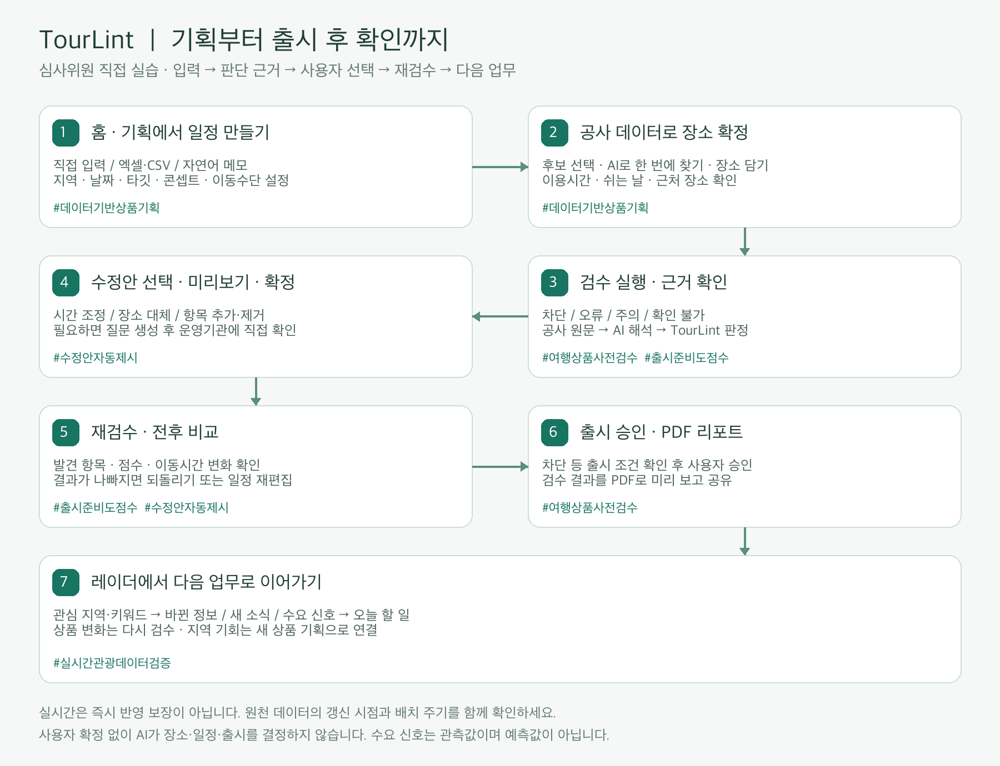

[실습 CSV 내려받기](강릉_실습일정.csv)

이 가이드는 심사위원이 준비된 예시를 살펴보고, 같은 흐름으로 새 상품을 직접 만들어 볼 수 있도록 구성했습니다.
서비스: TourLint 배포 사이트
테스트 계정: openapi@tourlint.kr · 비밀번호는 제출 서류의 테스트 계정 항목을 이용해 주세요.
화면 확인일: 2026-09-18 · 실제 관광정보와 AI 제안은 조회 시점에 따라 달라질 수 있습니다.
1. 전체 이용 흐름
홈에서 업무 현황 확인 → 기획에서 일정 초안 등록 → 공사 데이터로 장소 확정 → 검수 시작 → 발견 항목과 근거 확인 → 수정안 미리보기·적용 → 자동 재검수와 전후 비교 → 출시 승인·PDF 리포트 → 레이더에서 변경·수요 신호 확인 → 다시 검수하거나 새 상품 기획
2. 해시태그와 핵심 기능의 연결
• #데이터기반상품기획 — 직접 입력·파일 업로드·자연어 초안 → 장소 고르기·장소 담기 → 관광정보 확인 → 검수 시작. 분산된 정보 탐색을 기획 화면에 연결합니다.
• #여행상품사전검수 — 검수 실행 → 차단·오류·주의·확인 불가 확인 → 원문·해석·판정 근거 → 직접 확인할 곳과 질문 정리. 확인되지 않은 정보는 정상으로 간주하지 않습니다.
• #출시준비도점수 — 최초 점수와 감점 사유 → 일정 보완 → 재검수 → 전후 점수·발견 항목 비교. 점수와 출시 가능 여부를 함께 확인합니다.
• #수정안자동제시 — 발견 항목의 수정안 선택 → 미리보기 → 사용자 확정 → 일정에 적용·자동 재검수 → 전후 비교. AI가 임의로 일정을 확정하지 않습니다.
• #실시간관광데이터검증 — 출시한 상품·관심 지역 등록 → 레이더의 바뀐 정보·새 소식·수요 신호 → 오늘 할 일 → 재검수 또는 이 지역으로 새 상품 기획. 관측된 정보를 활용하며 미래 수요를 예측한 값으로 표현하지 않습니다.
3. 준비된 예시와 직접 실습
아래 실제 화면과 단계별 입력값을 따라 진행해 주세요. 공용 계정이므로 새 실습 상품명에는 심사위원의 이니셜을 붙이면 다른 체험과 구분하기 쉽습니다. 기존 예시 상품은 둘러보고, 변경 실습은 새로 만든 상품에서 진행해 주세요.

## 4. 실제 화면으로 따라 하기

### 4-1. 새 상품 만들기와 자연어 일정 변환

홈의 새 상품 기획 → 자연어 붙여넣기를 선택합니다. 상품명은 「[실습-이니셜] 강릉 시간 충돌 해결」, 지역은 강원특별자치도 > 강릉시, 출발일은 2026-11-12, 박수는 당일, 타깃은 시니어, 예상 인원은 12명, 콘셉트는 역사문화, 이동수단은 자가용으로 입력합니다.

아래 예문을 붙여넣고 「일정으로 바꾸기」를 누르세요. 첫 관광 일정과 다음 일정이 30분 겹치도록 만든 실습입니다. 변환 후 「3개 항목으로 바꿨습니다」를 확인하고 「직접 입력에서 편집」으로 결과를 확인합니다.

당일 강릉 여행
1일차 10:00~11:30 강릉 경포대 관광
1일차 11:00~12:30 강릉 오죽헌·시립박물관 관광

1일차 13:00~14:00 가람집옹심이 점심 식사

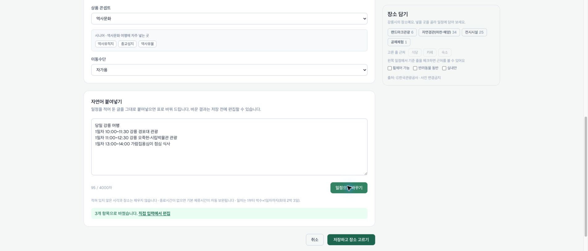

### 4-2. 장소 확정과 기획 화면

「저장하고 장소 고르기」를 누르면 기획 화면으로 이동합니다. 장소명만 저장하는 것이 아니라 공사 콘텐츠와 연결된 「고른 곳」 상태인지 확인합니다. 이번 예문은 세 장소가 자동 연결되었고 이용시간·쉬는 날·앞 장소에서 걸리는 시간이 표시됐습니다. 자동 연결되지 않은 경우 입력칸의 후보를 고르거나 「장소 찾기」 제안을 확인하세요. AI 제안은 사용자가 선택해야 확정됩니다.

오른쪽 「장소 담기」에서는 전시시설 등 분류를 고른 뒤 「자세히」로 원문 정보를 보고 「일정에 넣기」로 추가합니다. 넣을 일차·위치를 선택할 수 있고, 기준 장소가 있으면 근처 식당·카페·숙소를 찾을 수 있습니다. 휠체어·반려동물·실내 조건은 공사 데이터의 제공 여부에 따라 결과가 달라집니다. 걷기 길은 직접 정한 곳으로 추가되어 공사 개별 관광지와 검수 범위가 다릅니다.

기획의 「자동 저장됨」을 확인한 뒤 「검수 시작 →」 → 확인창의 「검수 시작」을 누릅니다. 현재 배포 화면은 검수 화면으로 이동한 뒤 「검수 실행」을 한 번 더 눌러 실제 검수를 시작합니다.

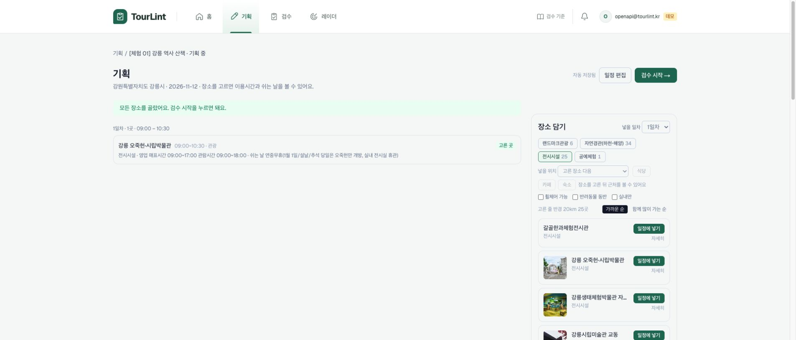

### 4-3. 검수 결과와 판단 근거 읽기

검수 완료 후 출시 준비도와 차단·오류·주의·확인 불가 건수를 확인합니다. 예문 첫 검수는 86점(오류 1, 주의 1)이었습니다. 「일정 시간 겹침」은 30분 중복을, 「상품 구성」은 시니어·역사문화 콘셉트에 부족한 분류를 알려줍니다. 「판단 근거 보기」를 열면 공사 원문 → AI 해석 → TourLint 판정을 구분해 볼 수 있습니다. 카카오모빌리티 이동시간·기상 정보는 외부 참고로 따로 표시됩니다.

점수는 출시 준비도를 설명하는 지표입니다. 출시 가능 여부는 점수 하나로 정하지 않으며, 차단 항목 등 별도 조건을 확인해야 합니다. 이번 86점 예시는 차단 0건이어서 출시 가능으로 표시됩니다. 조회 시각·대상 콘텐츠·데이터 지문·규칙셋도 함께 확인하세요. 아래는 실제 시간 겹침 근거 화면입니다.

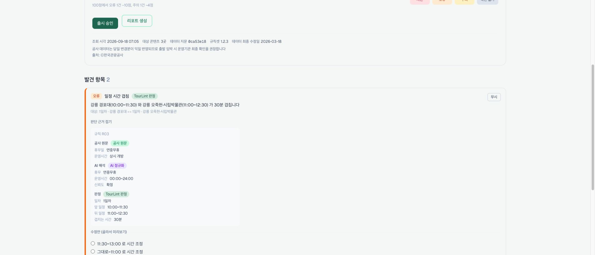

### 4-4. 수정안 미리보기 → 확정 → 전후 비교 → 되돌리기

시간 겹침 카드에서 「11:30~13:00로 시간 조정」을 선택하고 하단 「미리보기」를 누릅니다. 좌우의 기존 일정과 수정 후 일정을 비교한 뒤 「확정하고 재검수」를 누릅니다. 이 예제에서는 겹침은 없어지지만 이동 여유가 0분이 되어 이동시간 오류 2건이 새로 나타났고, 86점 → 76점으로 낮아졌습니다. 자동 제안도 전체 일정에서 다시 검증해야 한다는 것을 보여 주는 실제 사례입니다.

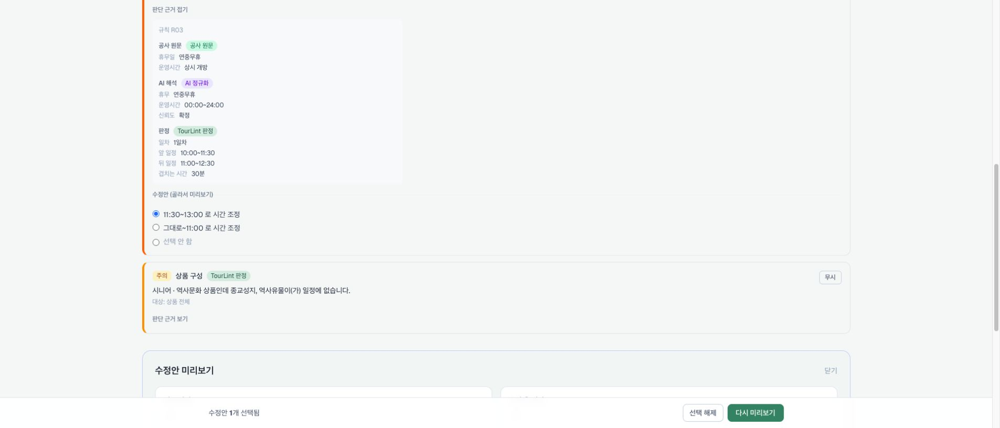

「전후 비교」에서 오류 수·점수·총 이동시간·이동거리·수요 적합성을 확인합니다. 낮아진 결과를 원하지 않으면 「되돌리기」 → 확인창의 「되돌리기」를 누르세요. 일정은 반영 전으로 복원되지만 검수 결과는 자동으로 갱신되지 않으므로 「지금 재검수」가 필요합니다.

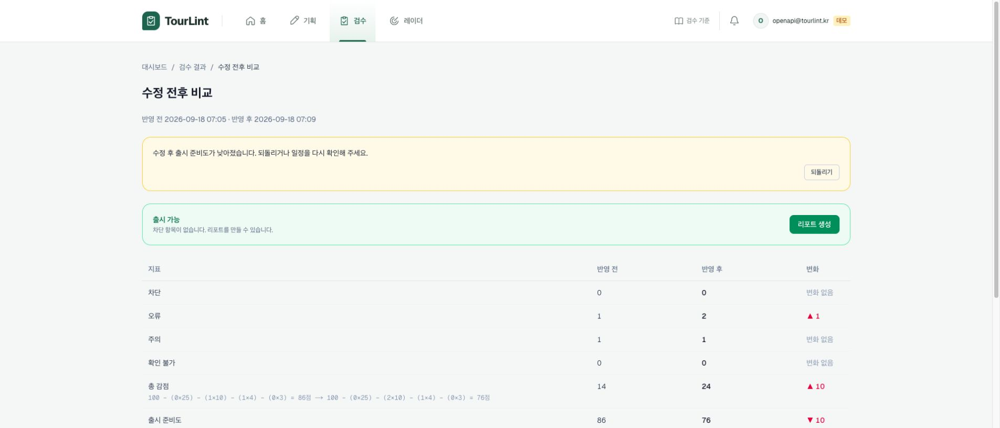

해결 실습: 결과의 「편집」에서 오죽헌을 12:00~13:30, 가람집옹심이를 14:00~15:00으로 바꾸고 저장 → 「지금 재검수」를 누릅니다. 각 이동 구간에 30분 여유를 둔 예시입니다. 출발일·공사 데이터·외부 이동시간에 따라 점수는 달라질 수 있으므로 숫자보다 실제 항목의 해결 여부를 확인합니다.

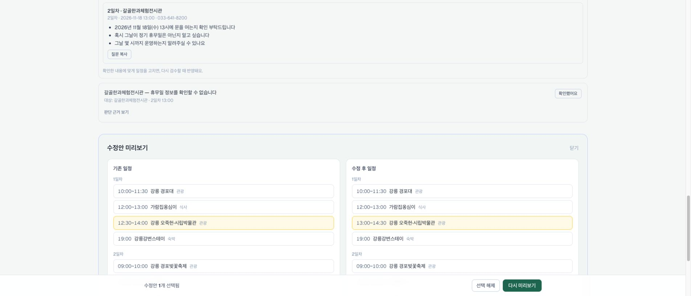

### 4-5. 출시 승인과 PDF 리포트

시간을 직접 고친 뒤 재검수한 실제 결과는 96점(오류 0, 주의 1)이었습니다. 「리포트 생성」을 누르면 상품 개요·일정·검수 결과가 담긴 PDF 미리보기가 열립니다. 「내려받기」 또는 PDF 뷰어의 다운로드 버튼으로 저장할 수 있습니다. 보고서는 생성 시점의 결과이므로 일정을 고친 뒤에는 재검수하고 다시 생성하세요. 차단 항목이 없는지 확인한 뒤 「출시 승인」을 누르면 출시 상태로 바뀌고 레이더의 변경 확인 대상이 됩니다. 공용 예시 「강릉 역사·힐링 2박 3일」은 이미 출시 승인해 두었습니다.

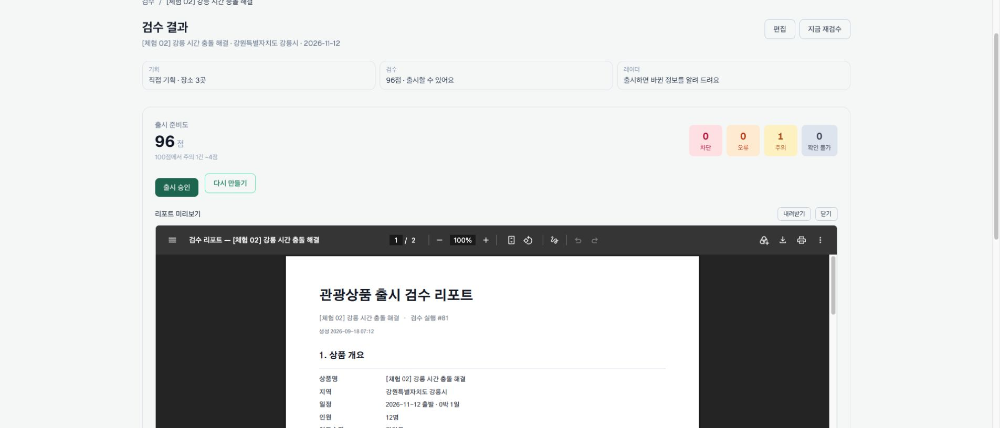

### 4-6. 레이더: 관심 지역 → 근거 → 다음 기획

상단 「레이더」로 이동합니다. 관심 키워드에 「역사」를 추가하고, 관심 지역에 강원특별자치도 > 강릉시, 기준 월 2026-11을 추가합니다(테스트 계정에는 미리 저장됨). 「근거 보기」에서 집계 기간과 방문자 기준을 확인하세요. 확인 당시 이달 행사 0건, 새로 등록된 곳 1곳, 지난해 11월 방문자 8,559,848명이 표시됐습니다. 이 숫자는 관광 데이터의 관측값이며 판매량이나 미래 수요 예측이 아닙니다.

「오늘 할 일 보기」는 바뀐 상품과 관심 지역의 후속 업무를 요약합니다. 「수요 신호」에서 상품을 선택하면 그 상품의 지역·기간에 맞춘 행사·신규 콘텐츠 정보를 볼 수 있습니다. 「이 지역으로 새 상품 기획」을 누르면 지역·월이 전달된 새 상품 화면으로 이어집니다. 자동 확인 중에는 최근 집계 결과를 읽으며 새 지역의 결과는 다음 집계 뒤 나타날 수 있습니다.

「바뀐 정보」와 「새 소식」 알림은 실제 데이터 변화가 있을 때 쌓입니다. 이번 확인 시 알림은 0건이었으며, 체험을 위해 가짜 변경 알림을 만들지는 않았습니다. 알림이 생기면 상세 근거 확인 → 해당 상품 검수 또는 신규 기획 → 읽음·무시 처리 순서로 진행합니다. 상단 종 아이콘도 레이더 알림 영역으로 연결됩니다.

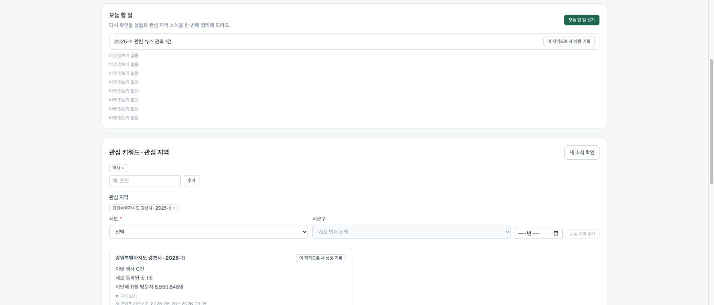

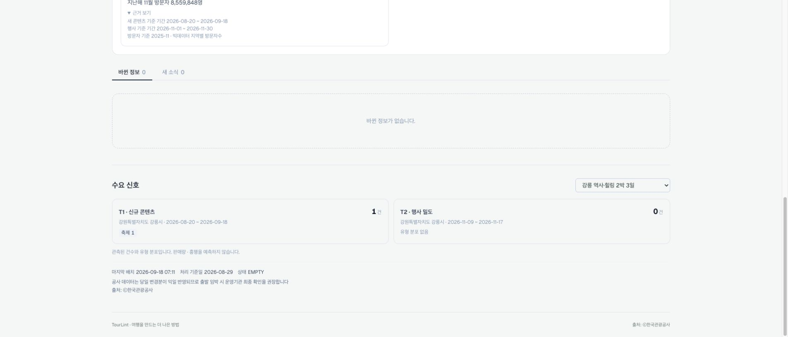

### 4-7. 장소 제안·전화 질문·예외 처리

장소 선택 실습은 「[체험 03] 강릉 장소 확인 연습」에서 볼 수 있습니다. 직접 새 상품을 만들 때 장소명에 「오죽」, 10:00~11:00, 유형 관광을 입력하고 저장하세요. 여러 후보가 나오면 주소·유형을 비교하고 「고르기」를 누릅니다. 「AI로 한 번에 찾기」는 선택 이유와 함께 후보를 제안하며, 「이곳으로 선택」 또는 「찾은 1곳 모두 선택」을 눌러야 확정됩니다. 준비된 체험 03은 심사위원이 선택해 볼 수 있도록 미확정 상태로 남겼습니다.

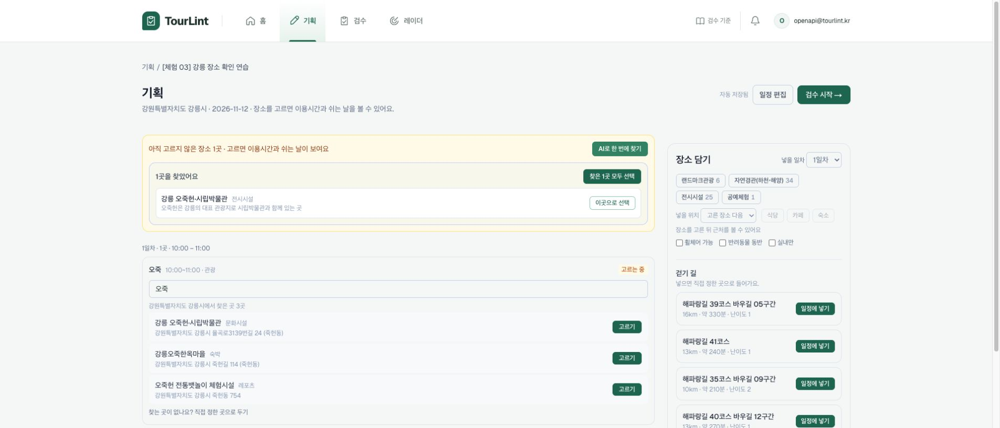

공사 데이터에 없는 자체 장소는 「찾는 곳이 없나요? 직접 정한 곳으로 두기」를 사용합니다. 이 경우 공사 데이터로 운영정보를 검증할 수 있는 범위가 줄어듭니다. 데이터가 없는 상태를 검증 완료와 혼동하지 마세요.

「강릉 감성 1박 2일」 결과 하단의 「직접 확인할 곳」 → 「물어볼 내용 만들기」를 누르면 갈골한과체험전시관의 방문일(2026-11-18)·시각(13:00)에 맞춘 휴무·운영시간 질문이 생성됩니다. 「질문 복사」로 복사할 수 있습니다. 서비스가 대신 전화하지는 않습니다. 실제 운영기관에 확인한 뒤에만 「확인했어요」를 눌러 확인 상태를 기록하세요. 이 버튼은 별도 입력창 없이 즉시 기록됩니다. 이번에는 기능 동작 확인 후 재검수하여 현재 예시를 미확인 상태로 다시 준비했습니다.

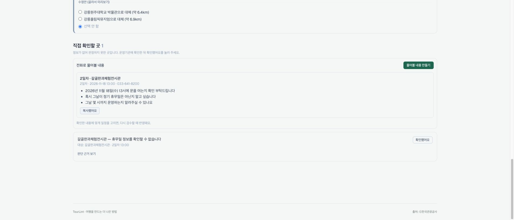

오류·주의·확인 불가 카드의 「무시」는 고객 요청 사항 / 계약 업체·확정 일정 / 전화로 직접 확인함 / 기타 중 사유를 정하고 처리합니다. 실제 근거에 맞는 사유만 남기세요. 차단 항목은 무시로 우회할 수 없습니다. 이 안내서는 공용 예시의 차단을 유지하여 출시 제한을 확인할 수 있게 했습니다.

### 4-8. 엑셀·CSV와 직접 입력으로 같은 일정 만들기

기획 화면의 「일정 파일 가져오기」 또는 새 상품의 「엑셀·CSV 업로드」를 선택합니다. 기본정보를 입력하고 「지정 양식 내려받기」로 양식을 받습니다. 열은 일차, 시작시간, 종료시간, 장소명, 유형 순서입니다. 일차는 1~3, 유형은 관광·식사·숙박·휴식·이동·자유 중 하나입니다. 종료시간을 비우면 기본 체류시간을 보완합니다. 준비된 CSV의 3행을 올리고 「저장하고 장소 고르기」를 누른 뒤 장소 매칭을 확인하면 자연어 실습과 같은 흐름으로 이어집니다.

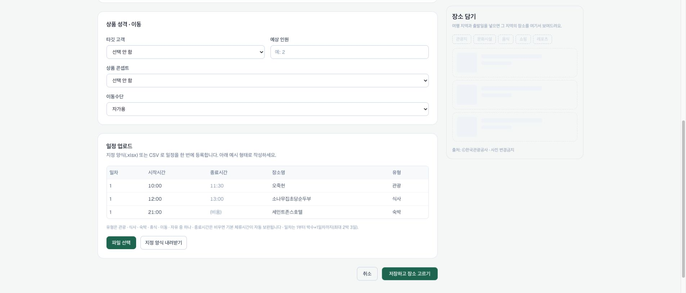

직접 입력에서는 「+ 항목 추가」로 행을 만들고 시작·종료·장소명·유형을 채웁니다. 일차 탭과 위로·아래로 버튼으로 순서를 조정할 수 있습니다. 지역·박수는 저장 후 바꿀 수 없으므로 만들 때 확인하세요. 날짜·타깃·인원·콘셉트·이동수단과 일정은 「편집」에서 보완하고 다시 검수합니다. 상품 삭제는 실제 상품을 지우는 기능이므로 공용 예시 대신 본인이 만든 실습 상품에만 사용하세요.

### 4-9. 검수 기준과 회사 기준

상단 「검수 기준」에서 R01~R10 설명, 등급별 감점, 기본 체류시간, 실내·야외 분류, 타깃·콘셉트 기대 콘텐츠를 확인합니다. 현재 감점은 차단 25·오류 10·주의 4·확인 불가 3점입니다. 회사 기준은 표준보다 엄격하게만 바꿀 수 있습니다. 연속 일정은 6시간 이하, 최소 식사는 60분 이상입니다. 변경은 다음 검수부터 적용되며 과거 결과에 소급되지 않습니다. 공용 계정은 표준 6시간·60분을 유지했고, 기준 변경 실습 후에는 이 값으로 복원해 주세요.

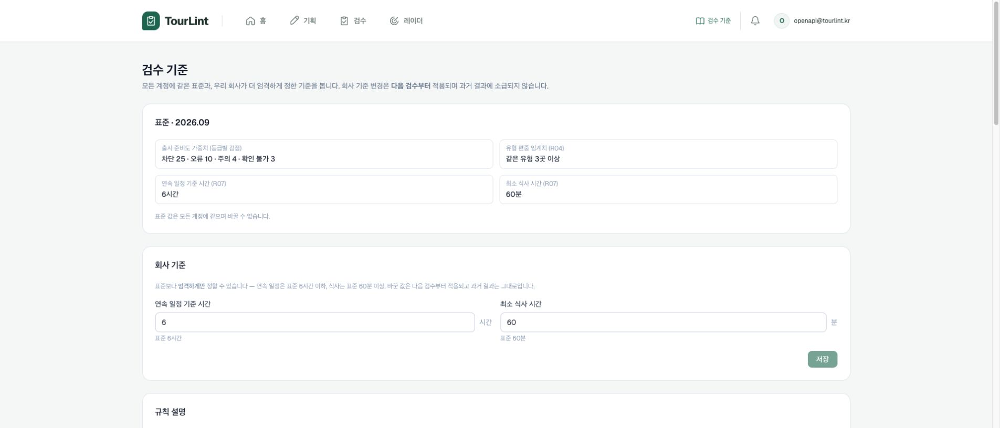

### 4-10. 홈·기획·검수 화면을 오가며 업무 관리

홈은 전체 업무 현황과 다음 행동을 보는 출발점입니다. 기획은 작성 중인 일정과 세 가지 등록 방식, 검수는 검수 중·출시 가능·출시 완료 상품을 보여 줍니다. 검수의 보드/목록 전환, 단계 필터, 상품명·지역 검색, 출발일·준비도·최근 검수 정렬로 원하는 상품을 찾으세요. 계정 버튼에는 로그아웃만 표시되며 사용량·데모 표시는 제거했습니다.

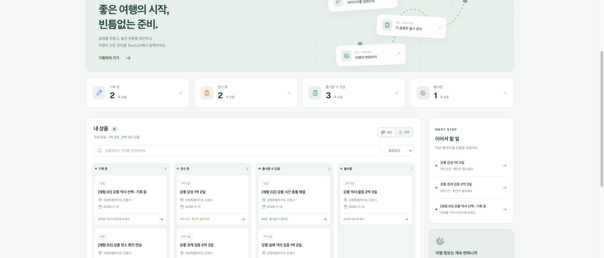

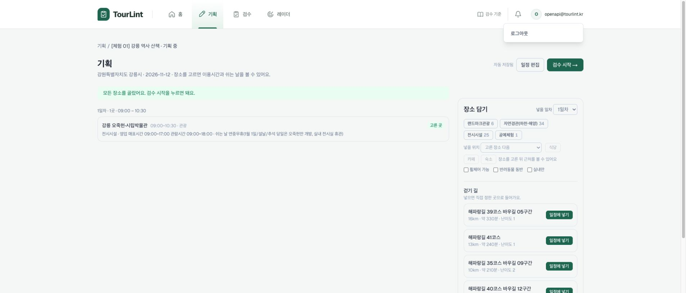

## 5. 미리 준비된 테스트 계정 데이터

총 8개 상품: 기획 중 2개 · 검수 중 2개 · 출시 가능 3개 · 출시 완료 1개(2026-09-18 확인). 아래 점수·상태는 조회 시점 기준이며 공용 계정의 후속 실습과 재검수에 따라 달라질 수 있습니다.

[체험 01] 강릉 역사 산책 · 기획 중 — [바로가기](https://tourlint-web.up.railway.app/products/30/plan) — 오죽헌 1곳을 담은 기획 초안. 장소 담기와 일정 편집을 살펴봅니다.

[체험 02] 강릉 시간 충돌 해결 — [바로가기](https://tourlint-web.up.railway.app/products/31) — 자연어로 만든 3곳 일정. 86점 → 수정안 적용 76점 → 이동 여유를 직접 보완한 최종 96점. 출시 승인과 PDF 생성 실습에 사용합니다.

[체험 03] 강릉 장소 확인 연습 — [바로가기](https://tourlint-web.up.railway.app/products/32/plan) — 「오죽」 미확정 1곳. 후보 비교와 AI 장소 제안을 체험합니다. 레이더의 지역 기획 연결로 생성했습니다.

강릉 감성 1박 2일 — [바로가기](https://tourlint-web.up.railway.app/products/24) — 29점, 차단 2·오류 1·주의 2·확인 불가 1. 화요일 휴무, 종료된 행사, 시간 겹침, 짧은 식사, 부족한 콘텐츠, 전화 확인 질문을 한 상품에서 볼 수 있습니다.

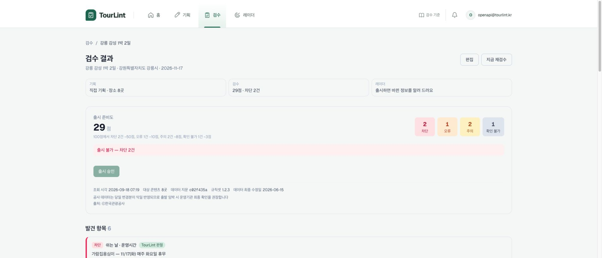

강릉 경계 검증 2박 3일 — [바로가기](https://tourlint-web.up.railway.app/products/23) — 63점, 차단 1·주의 3. 출시 제한과 경계 사례 확인용입니다.

강릉 역사·힐링 2박 3일 — [바로가기](https://tourlint-web.up.railway.app/products/22) — 92점, 출시 완료. 출시 후 상태와 레이더 수요 신호 확인용입니다.

강릉 실패 격리 검증 1박 2일 — [바로가기](https://tourlint-web.up.railway.app/products/25) — 92점, 출시 가능. 제주 우천 리스크 검증 1박 2일 — [바로가기](https://tourlint-web.up.railway.app/products/26) — 48점, 오류 3·주의 4·확인 불가 2. 지역·데이터 조건별 결과를 비교할 수 있습니다.

## 6. 심사 실습을 마쳤는지 확인

① 새 상품을 직접 만들었나요? ② 장소가 공사 데이터와 연결되었나요? ③ 검수 결과와 원문·해석·판정을 구분해서 읽었나요? ④ 수정안을 미리 보고 직접 확정했나요? ⑤ 재검수 전후를 비교하고 필요한 후속 수정을 했나요? ⑥ 출시 조건·PDF를 확인했나요? ⑦ 레이더 근거와 오늘 할 일에서 다음 상품 기획으로 이동했나요?

추가 체험: 자연어 외 직접 입력·CSV 경로, AI 장소 후보 선택, 전화 질문 복사, 검수 기준 설명, 보드·목록·검색·정렬, 관심 키워드·지역 관리까지 확인해 주세요. 실습은 공용 예시를 그대로 따라 읽는 데서 끝나지 않고, 본인 이니셜의 새 상품을 만들어 마지막 결과까지 확인하는 방식으로 진행합니다.

## 7. 데이터 해석과 현재 확인 범위

실제 운영 사이트에서 상품 생성·장소 담기·자연어 변환·AI 장소 제안·검수·수정안 적용·되돌리기·전후 비교·직접 편집·재검수·출시 승인·PDF 미리보기·질문 생성과 복사·레이더 수요 조회·지역 기획 연결을 확인했습니다. 파일 업로드 화면과 양식도 확인하고 실습 CSV를 준비했습니다. 자동화 브라우저의 파일 선택·다운로드 제한 때문에 CSV 업로드 완료와 PDF 파일 저장까지는 이 세션에서 검증하지 못했습니다.

화면의 「실시간」 관련 기능은 원천 데이터와 배치 갱신 주기의 영향을 받습니다. 공사 당일 변경분은 익일 반영될 수 있으며 출발 임박 시 운영기관 확인이 필요합니다. 기상 정보는 예보 제공 기간 밖이면 확인 불가일 수 있습니다. 변경 알림·새 소식이 0건인 것도 정상 결과입니다.

캡처는 실제 서비스를 조작해 얻은 화면입니다. 초기 캡처에 남은 데모 표시는 작업 중 배포 전 화면이며 현재 서비스에서는 제거되었습니다. 캡처의 시간·점수·AI 표현은 고정된 정답이나 재현 보장이 아닙니다.

## 기능별 흐름도 (편집용 Mermaid)

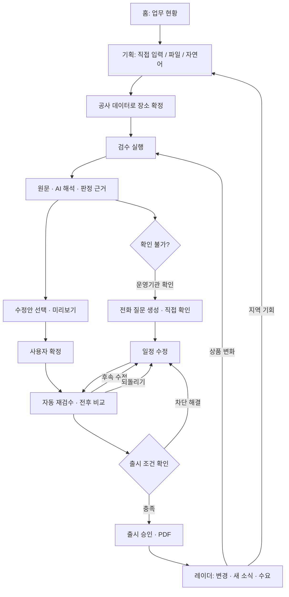
