# TourLint 심사위원 체험 가이드 — 2박 3일 한 상품으로 전 기능 따라 하기

**처음부터 끝까지 한 방향으로 따라 하면 TourLint 의 기능을 전부 거칩니다.** 로그인 → 상품 기획(장소 담기 포함) → 검수 · 수정안 · 리포트 · 출시 → 레이더 → 검수 기준 조정 순서입니다. 뒤에 따로 모아 둔 「추가 체험」 은 없습니다. 상품 하나(강릉 2박 3일)로 끝까지 갑니다. 소요 시간은 40 ~ 50분이고 외부 조회 시간에 따라 달라집니다.

[서비스 열기](https://tourlint-web.up.railway.app/) · 테스트 계정 `openapi@tourlint.kr` · 비밀번호는 제출 서류의 테스트 계정 항목을 사용하세요.

> 상품명의 ‘내이름’ 만 본인 이니셜로 바꾸고 나머지 값은 그대로 입력하세요. 아래 일정은 **문제를 일부러 넣은 연습 일정**입니다.
>
> 공용 계정입니다. 다른 상품은 건드리지 않습니다. 19단계에서 바꾸는 회사 기준은 **같은 단계 안에서 원래 값으로 되돌립니다.**
>
> 화면의 점수 · 건수 · 장소는 2026-09-19 실측값입니다. 관광정보와 이동시간은 실시간 조회라 값이 조금 다를 수 있습니다. 숫자가 같은지가 아니라 **근거 → 선택 → 일정 변경 → 새 결과**가 이어지는지를 보세요.

## 전체 흐름

| 단계 | 하는 일 | 거치는 기능 |
|---|---|---|
| 1 ~ 2 | 로그인 · 홈 | 단계별 현황, 보드/목록, 검색 · 정렬 |
| 3 ~ 6 | 새 상품 만들기 | 기본정보와 ‘자주 넣는 곳’, 지정 양식 내려받기 · 업로드, 자연어 붙여넣기, 직접 입력 · 장소 확인 · 기준, 등록 화면 장소 담기 |
| 7 ~ 9 | 기획 화면 | AI로 한 번에 찾기, 후보 검색, 직접 정한 곳, 운영정보 카드 · 이동시간, 장소 담기(숙소 · 분류 · 필터 · 정렬 · 걷기 길), 일정 편집 |
| 10 ~ 15 | 검수와 보완 | 첫 검수, 판단 근거 3단, 수정안 충돌 · 미리보기 · 확정 · 전후 비교, 검수 화면 장소 담기, 상품 구성 수정안(야간 일정 · 공예체험), 점수 하락 경고와 되돌리기, 전화로 물어볼 내용, 무시 |
| 16 | 산출물 | 검수 리포트 PDF, 출시 승인, 검수 목록 |
| 17 ~ 18 | 레이더 | 관심 키워드 · 관심 지역, 새 소식 확인, 근거, 수요 신호, 오늘 할 일, 날씨 판정 읽기 |
| 19 | 검수 기준 | 표준 · 규칙 설명, 회사 기준 조정 → 재검수 → 복원 |

## 1. 로그인

[서비스 열기](https://tourlint-web.up.railway.app/)에서 **로그인** 탭에 테스트 계정을 넣습니다. 옆의 **회원가입** 탭은 이메일 인증코드로 새 계정을 만드는 길입니다. 테스트 계정은 이미 가입돼 있어 누르지 않아도 됩니다.

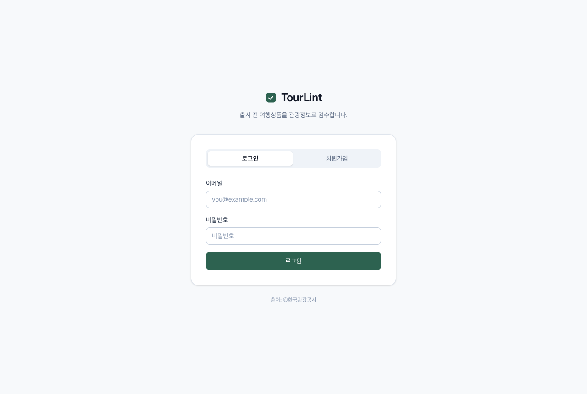

## 2. 홈에서 흐름 보기

상단 메뉴는 **홈 · 기획 · 검수 · 레이더** 순서이고 이 가이드도 같은 순서로 갑니다. 아래로 내려 **기획 중 · 검수 중 · 출시할 수 있음 · 출시함** 네 칸과 미리 준비된 상품들을 봅니다. **보드 / 목록** 전환, 검색란, **출발일순 · 준비도순 · 최근 검수순** 정렬을 한 번씩 눌러 봅니다. 다 봤으면 오른쪽 위 **새 상품 기획**을 누릅니다.

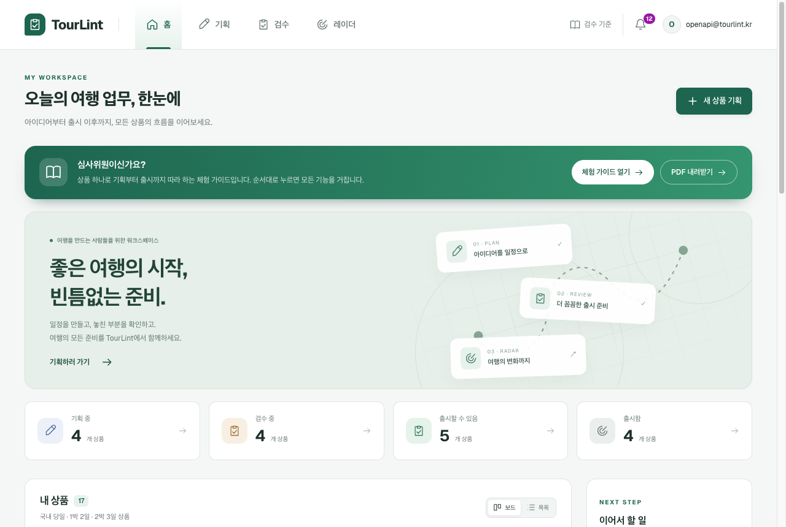

## 3. 기본정보 입력

| 화면 항목 | 입력값 |
|---|---|
| 상품명 | `[실습-내이름] 강릉 감성 2박 3일` |
| 시도 / 시군구 | 강원특별자치도 / 강릉시 |
| 출발일 | 2026-11-17 (화요일) |
| 박수 | 2박 3일 |
| 타깃 고객 / 상품 콘셉트 | 20대 / 감성 |
| 예상 인원 / 이동수단 | 15 / 자가용 |

지역과 출발일을 넣으면 오른쪽 **장소 담기**에 강릉의 장소 종류가 뜹니다.

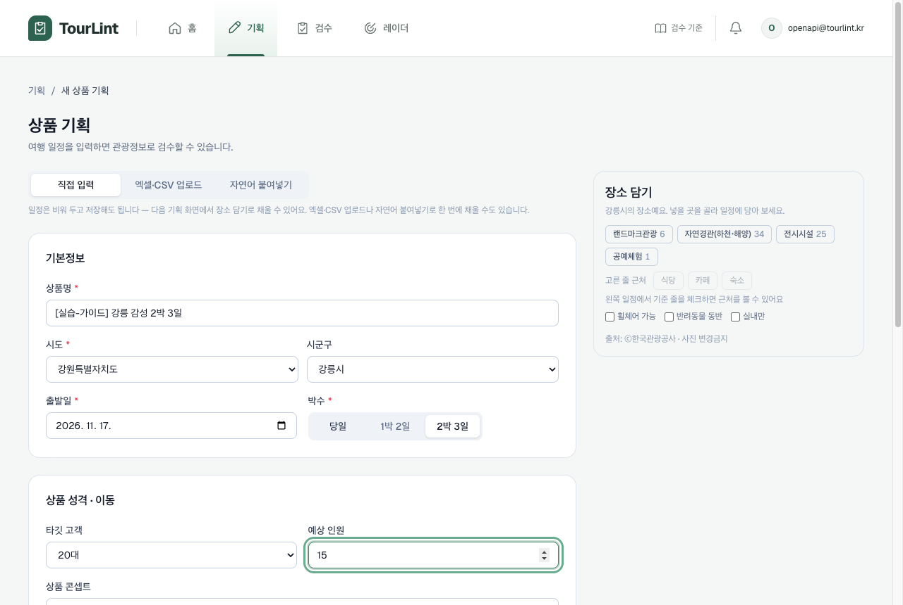

타깃과 콘셉트를 둘 다 고르면 그 아래에 **‘20대 · 감성 여행에 자주 넣는 곳’** 이 나옵니다 — 공예체험 · 카페/찻집 · 랜드마크관광 · 저녁 일정. 이 기준은 14단계의 ‘상품 구성’ 검수에 그대로 쓰입니다.

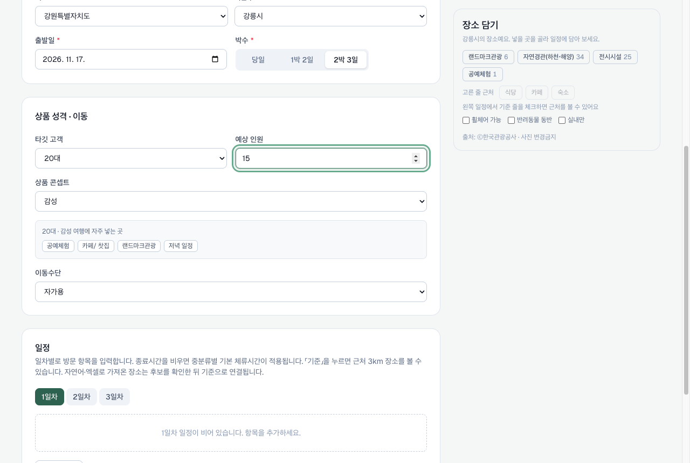

## 4. 지정 양식 내려받아 그대로 올려 보기

일정을 넣는 방법은 세 가지입니다 — 직접 입력, 엑셀·CSV 업로드, 자연어 붙여넣기. 셋을 이어서 써 봅니다.

1. **엑셀·CSV 업로드** 탭 → **지정 양식 내려받기**. 받은 파일(`tourlint_schedule_template.xlsx`)에는 예시 일정이 들어 있습니다.
2. **파일 선택**으로 방금 받은 파일을 그대로 올립니다.
3. **‘18개 항목을 불러왔습니다.’** 를 확인합니다. 박수도 파일의 최대 일차에 맞춰집니다.

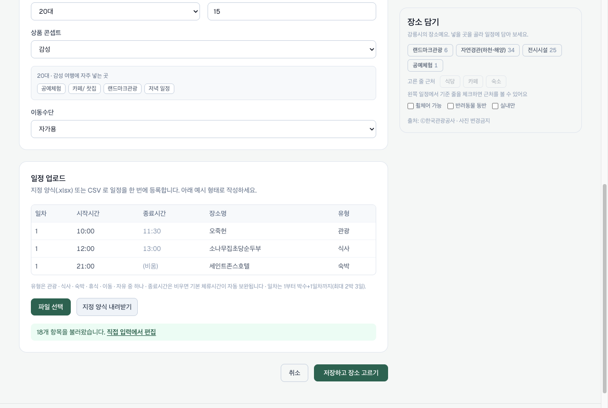

## 5. 자연어로 실습 일정 넣기

**자연어 붙여넣기** 탭으로 옮겨 아래 상자를 통째로 붙여넣고 **일정으로 바꾸기**를 누릅니다. 나중에 넣은 것이 앞의 것을 대체하므로 4단계의 예시 18개는 이 일정으로 바뀝니다.

```text
강릉 감성 2박 3일
1일차 10:00~11:30 강릉 경포대 관광
1일차 11:00~12:30 강릉 오죽헌·시립박물관 관광
1일차 13:00~14:00 가람집옹심이 식사
1일차 15:00~16:00 강릉 경포벚꽃축제 관광
2일차 09:00~10:00 경포해변 관광
2일차 10:00~11:00 안목해변 관광
2일차 11:00~12:00 정동진해변 관광
2일차 16:00~17:00 주문진해변 관광
3일차 09:00~09:30 강릉역 집결
3일차 12:30~13:30 초당할머니순두부 식사
```

**‘10개 항목으로 바꿨습니다.’** 가 나오면 **직접 입력에서 편집**을 누릅니다. 1일차 4개 · 2일차 4개 · 3일차 2개가 표로 들어와 있습니다. ‘강릉역 집결’ 은 유형 **이동**으로 읽힙니다.

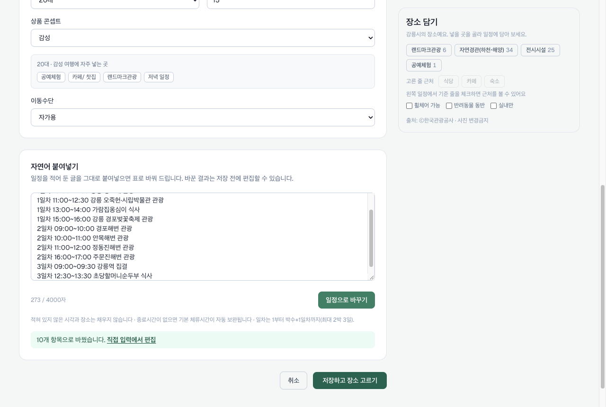

## 6. 직접 입력으로 보완하고 저장 전에 장소 담기

### 6-1. 숙소 한 줄을 직접 입력

**2일차** 탭 → **+ 항목 추가** → 시작 **18:00**, 장소명에 **세인트존스** 를 입력합니다. **‘강릉시에서 찾은 곳 1곳’** 아래의 **세인트존스 호텔**을 누르고 유형을 **숙박**으로 바꿉니다. 종료는 비워 둡니다.

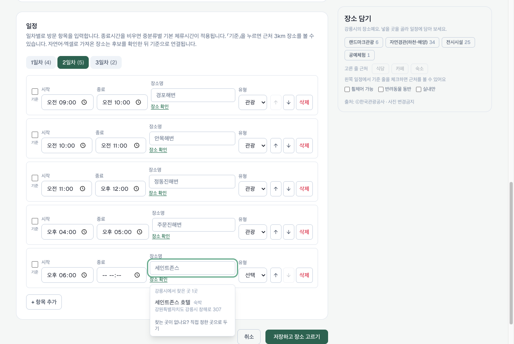

### 6-2. ‘기준’ 을 체크해 근처 3km 보기

방금 넣은 숙소 줄 왼쪽의 **기준**을 체크합니다. 오른쪽 장소 담기가 **“세인트존스 호텔” 근처**로 바뀌고 **식당 · 카페 · 숙소**가 눌립니다. **카페**를 눌러 거리순 목록과 **다음 →** 페이지를 봅니다. 여기서는 보기만 합니다.

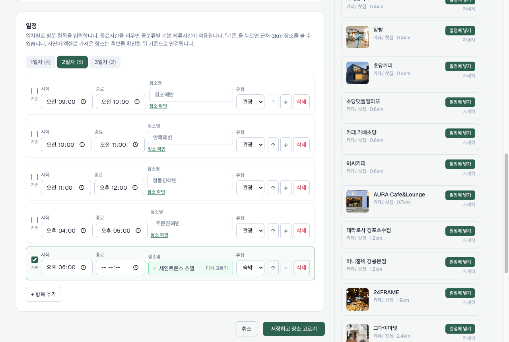

### 6-3. 저장 전에 장소 하나 담기

장소 담기에서 **랜드마크관광**을 누르고 **주문진 등대**의 **일정에 넣기** → 일차 **3일차**, 넣을 위치 **초당할머니순두부 다음 (맨 뒤)** → **여기에 넣기**. 왼쪽 **3일차** 탭에 새 줄이 생기면 시작에 **14:30** 을 넣고 종료는 비웁니다(종료를 비우면 분류별 기본 체류시간이 적용됩니다). **저장하고 장소 고르기**를 누릅니다.

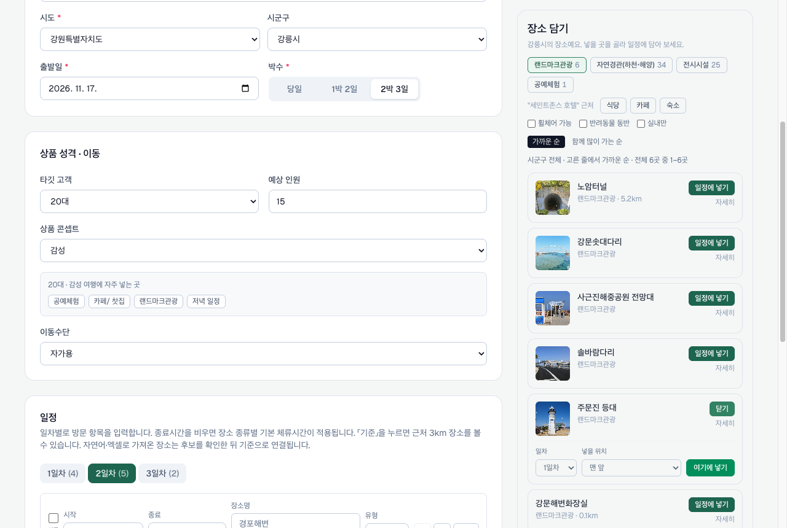

## 7. 기획 화면 — 이름을 실제 관광정보에 연결하기

저장하면 같은 상품의 기획 화면으로 넘어갑니다. 이름이 하나로 정해지는 곳은 이미 **고른 곳**이고, **경포해변**과 **강릉역** 두 곳이 **고르는 중**으로 남습니다.

1. **AI로 한 번에 찾기**를 누릅니다. AI 는 후보와 이유를 내놓을 뿐이고 확정은 사람이 누릅니다. 후보가 나오면 **이곳으로 선택**, 아래처럼 못 찾았다고 하면 다음으로 갑니다.

   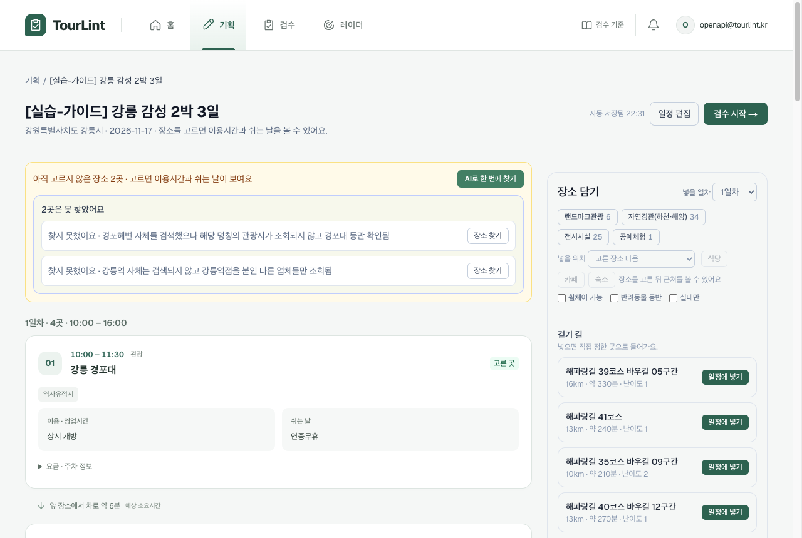

2. 경포해변 줄의 **장소 찾기** → 검색란에 공식 이름 **경포해수욕장** → **고르기**.

   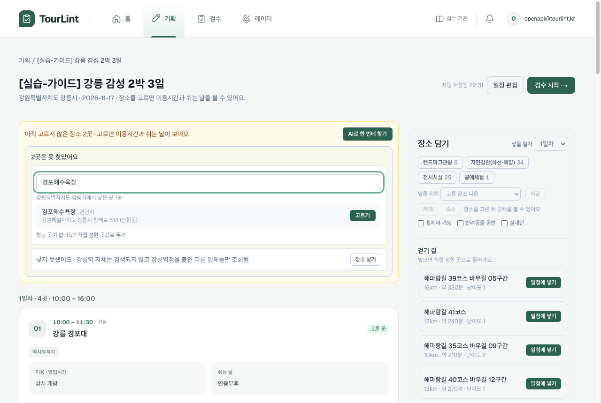

3. 강릉역 줄은 **찾는 곳이 없나요? 직접 정한 곳으로 두기**를 누릅니다. 집결지처럼 관광정보에 없는 곳은 **직접 정한 곳**으로 두며, 운영정보 검수 대상에서 빠집니다.

   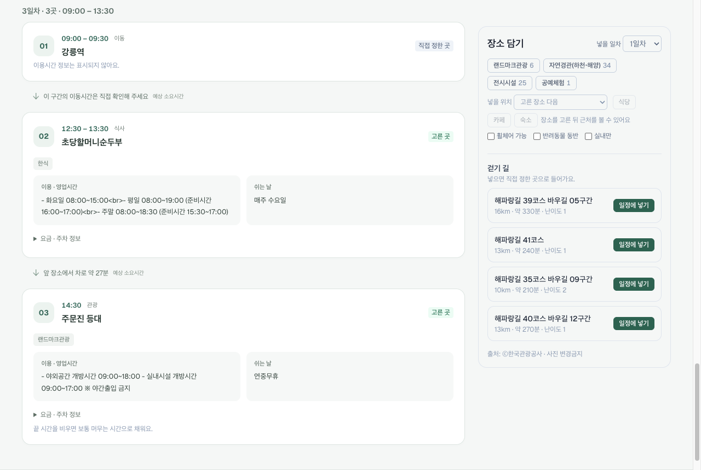

**‘모든 장소를 골랐어요’** 가 뜨면 카드들을 읽어 봅니다. 가람집옹심이의 **쉬는 날 · 매주 화요일**, 경포벚꽃축제의 **행사 기간 2026-04-04 ~ 04-11**, 오죽헌의 **이용 · 영업시간**, 접혀 있는 **요금 · 주차 정보**, 카드 사이의 **앞 장소에서 차로 약 N분**. 1일차가 화요일이고 축제는 4월이라는 점이 10단계에서 차단으로 잡힙니다.

## 8. 장소 담기 — 숙소 · 분류 · 필터 · 정렬 · 걷기 길

### 8-1. 1일차 숙소

오른쪽 장소 담기에서 **넣을 일차 1일차** → **넣을 위치 강릉 경포벚꽃축제 다음** → **숙소**. **하이오션 경포**의 **자세히**로 주소 · 이용시간 · 주차 · 무장애 편의를 읽고 **일정에 넣기**. 왼쪽 1일차 끝에 **16:04 · 숙박**으로 들어옵니다 — 앞 일정 종료 16:00 에 조회된 이동 4분을 더한 값입니다. 목록에 없으면 다른 호텔을 담으세요.

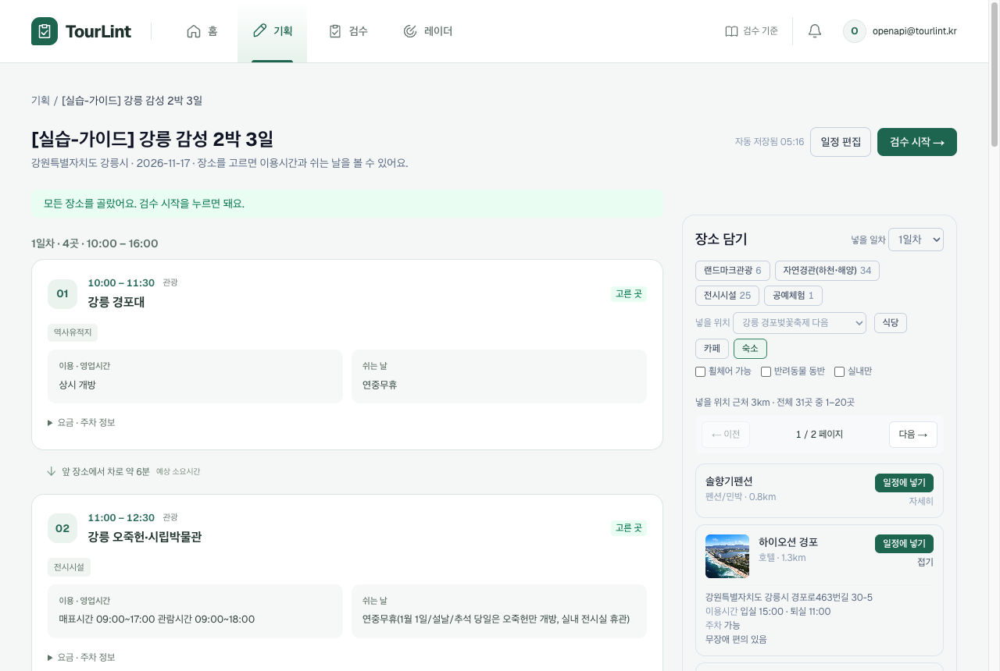

### 8-2. 분류 · 필터 · 정렬

**넣을 일차 2일차** → **넣을 위치 정동진해변 다음** → 분류 칩 **전시시설**(25곳). **휠체어 가능**을 체크하면 21곳, **반려동물 동반**은 1곳으로 줄어듭니다. 체크를 풀고 **함께 많이 가는 순**을 누르면 **하슬라아트월드 · 함께 많이 가는 곳 4위**가 맨 위에 옵니다. 이 카드의 **일정에 넣기**를 누르면 2일차에 **12:05 – 13:35** 로 들어옵니다(정동진해변 종료 12:00 + 이동 5분, 전시시설 기본 체류 90분).

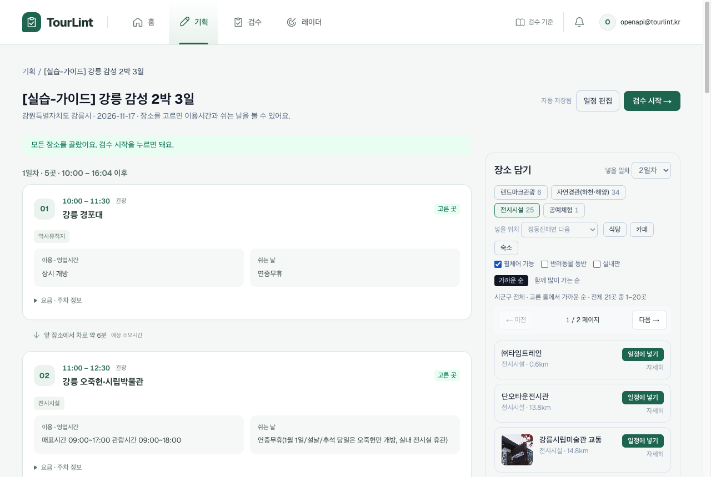

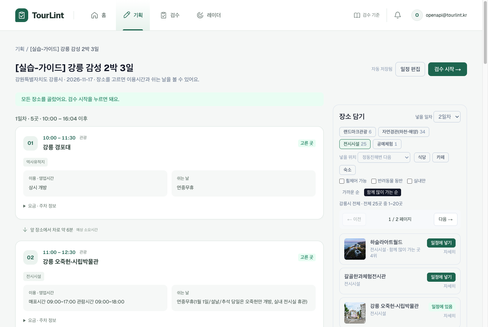

### 8-3. 걷기 길

**넣을 일차 3일차**로 바꾸고 아래 **걷기 길**에서 **해파랑길 35코스 바우길 09구간**(10km · 약 210분)의 **일정에 넣기**. 걷기 길은 **직접 정한 곳**으로 들어가며 3일차 맨 끝에 붙습니다.

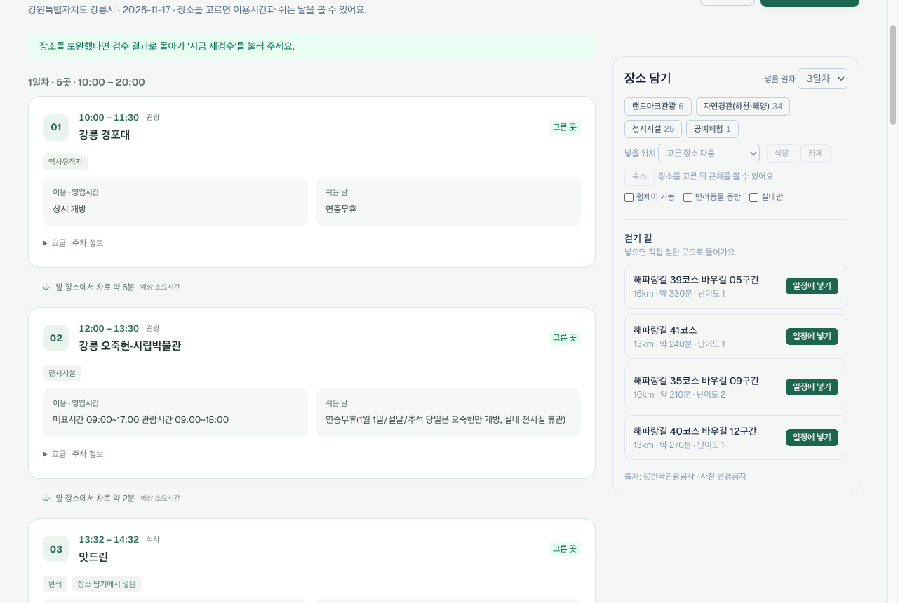

## 9. 일정 편집으로 시간과 순서 다듬기

상단 **일정 편집**을 누릅니다. 장소 담기가 채운 시각은 초안입니다.

- **1일차** — 하이오션 경포 시작을 **18:00** 으로.
- **3일차** — 걷기 길을 **09:30 – 12:00** 으로 바꾸고 **↑** 를 두 번 눌러 강릉역 다음으로 올립니다.

**저장**을 누르면 기획 화면으로 돌아옵니다. 여기까지 1일차 5개 · 2일차 6개 · 3일차 4개, 모두 15개 일정입니다.

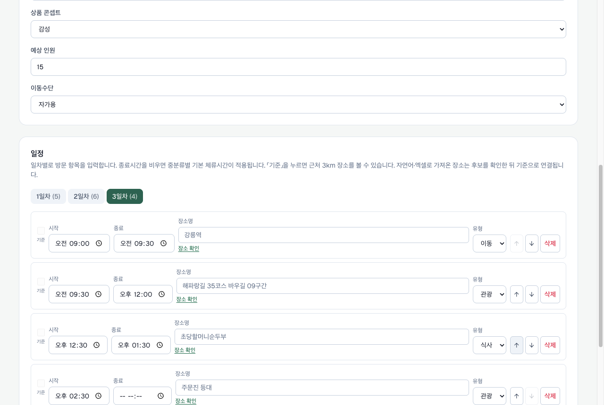

## 10. 첫 검수

**검수 시작 →** → 설명창의 **검수 시작**. 결과 화면에 ‘아직 검수하지 않았습니다’ 가 보이면 **검수 실행**을 누르고 기다립니다.

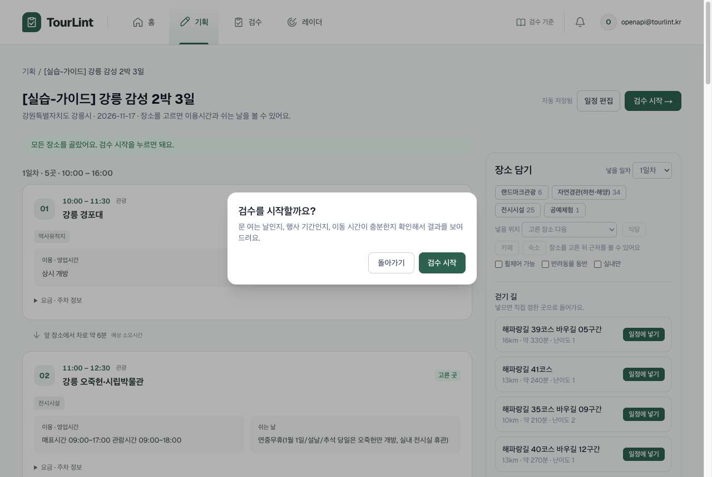

**실측: 출시 준비도 0점 · 차단 2 · 오류 4 · 주의 4 · 확인 불가 1.** 점수 아래에 감점 계산식과 조회 시각 · 데이터 지문 · 규칙셋이 나옵니다. 왼쪽 **현재 일정표**는 문제 카드나 수정안을 고를 때 관련 장소를 강조합니다.

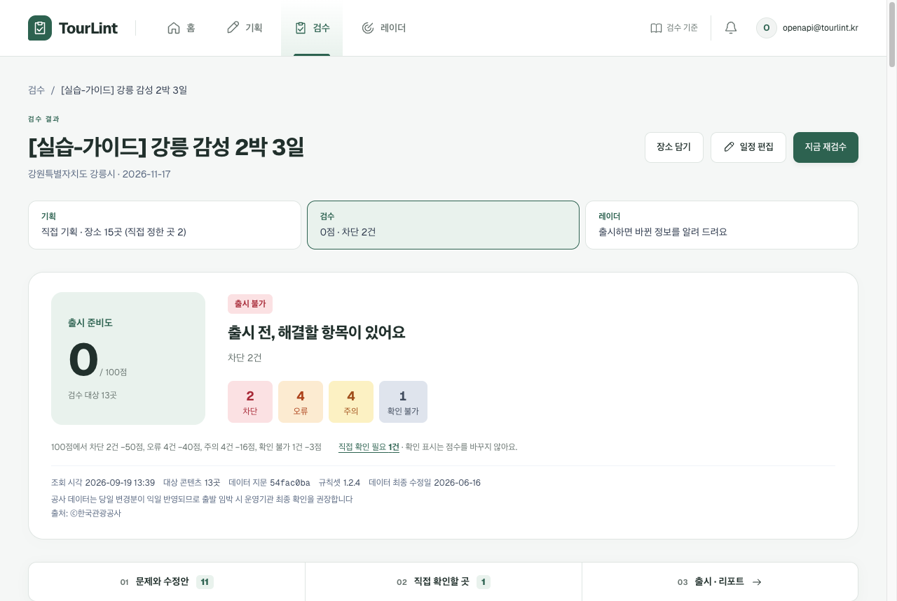

| 필터 | 이 일정에서 나오는 문제 | 이유 |
|---|---|---|
| 차단 | 가람집옹심이 쉬는 날 | 1일차가 화요일, 매주 화요일 휴무 |
| 차단 | 경포벚꽃축제 행사 기간 | 4월에 끝난 행사를 11월에 방문 |
| 오류 | 경포대 ↔ 오죽헌 일정 시간 겹침, 이동 시간 | 30분 겹침 + 이동 6분 = 36분 부족 |
| 오류 | 경포해변 → 안목해변, 안목해변 → 정동진해변 | 이동에 13분 · 35분이 걸리는데 배정 0분 |
| 주의 | 종류 쏠림 2건 | 관광지 7곳, 바다 · 강 풍경 4곳 |
| 주의 | 식사 · 휴식 | 2일차 9시간에 식사 · 휴식 없음 |
| 주의 | 상품 구성 | 20대 · 감성인데 공예체험 · 카페 · 19:00 이후 일정 없음 |
| 확인 불가 | 주문진 등대 운영시간 | 제공된 정보로는 판정할 수 없음 — 정상으로 넘기지 않는다 |

**차단** 필터에서 가람집옹심이 카드의 **판단 근거 보기**를 엽니다. **공사 원문**(휴무일 매주 화요일) → **AI 해석**(매주 휴무 · 화요일, 신뢰도 확정) → **판정**(방문일 2026-11-17 · 화요일) 3단으로 이어집니다. 이동 시간 카드의 **외부 참고 · 카카오모빌리티**는 관광정보와 다른 출처라는 표시입니다. 맨 아래 **출시 승인**은 차단이 남아 있어 눌리지 않습니다.

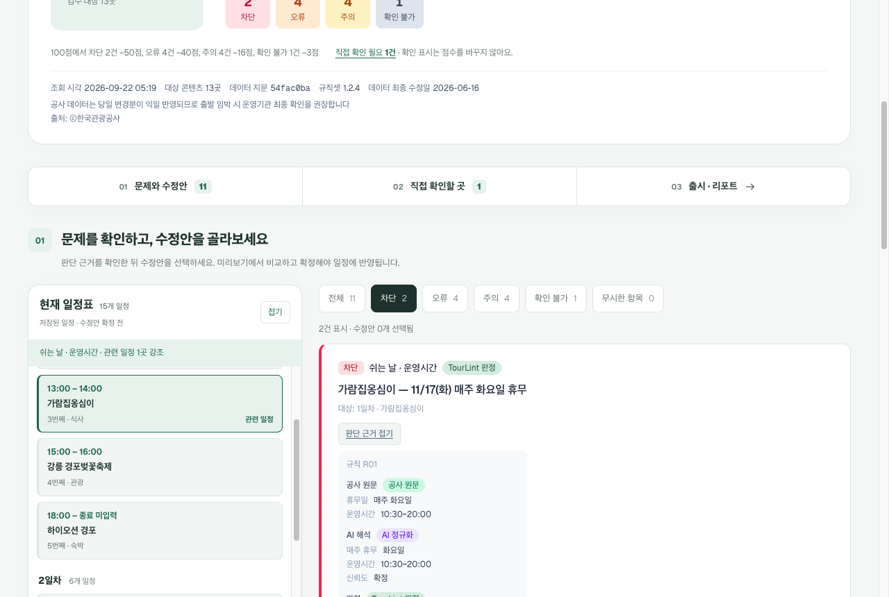

## 11. 수정안 — 충돌, 미리보기, 확정, 전후 비교

### 11-1. 충돌 안내 보기

**오류** 필터에서 겹침 카드의 **오죽헌 → 12:00 – 13:30** 과 이동 시간 카드의 **두 장소의 방문 순서·시간 교환**을 함께 고르고 아래 **미리보기**를 누릅니다. 같은 일정을 두 수정안이 바꾸므로 **‘선택한 수정안 사이에 충돌이 있습니다’** 가 뜨고 확정이 막힙니다. **선택 해제**를 누릅니다.

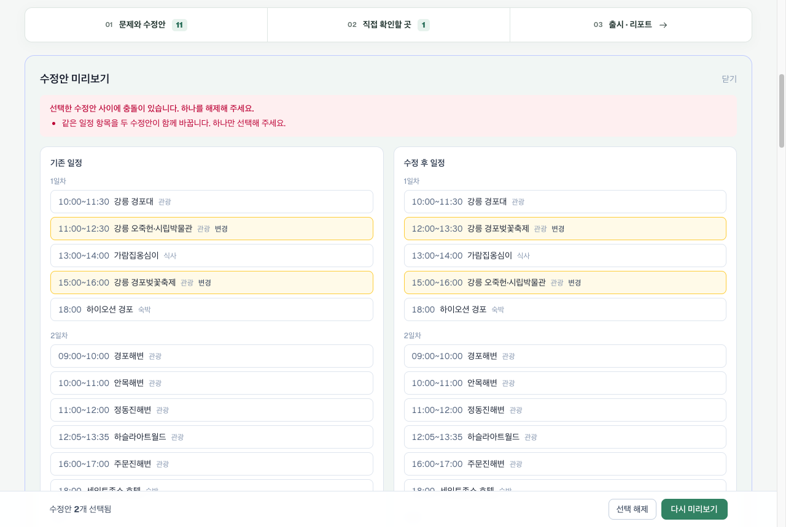

### 11-2. 세 개를 골라 확정

**전체** 필터에서 카드마다 하나씩 고릅니다.

| 카드 | 고를 수정안 |
|---|---|
| 가람집옹심이 쉬는 날 | 방문 일차·시간 변경 — 1일차 → 2일차 14:05 – 15:05 (수요일은 영업) |
| 경포벚꽃축제 행사 기간 | 방문 삭제 |
| 경포대 ↔ 오죽헌 일정 시간 겹침 | 방문 시간 변경 — 오죽헌 11:00 – 12:30 → 12:00 – 13:30 |

**미리보기**에서 기존 일정과 수정 후 일정을 비교하고 **확정하고 재검수**를 누릅니다. 아직 저장 전이라 미리보기만으로는 일정이 바뀌지 않습니다.

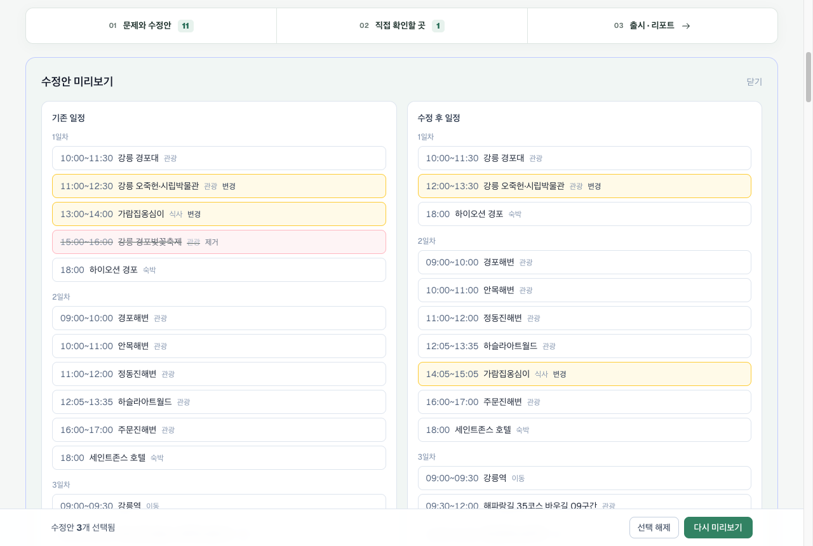

**실측: 준비도 0 → 61점, 차단 2 → 0.** 출시 가능으로 바뀝니다. 가람집이 2일차로 가면서 1일차 점심이 비어 식사 · 휴식 주의가 1일차로 옮겨 옵니다.

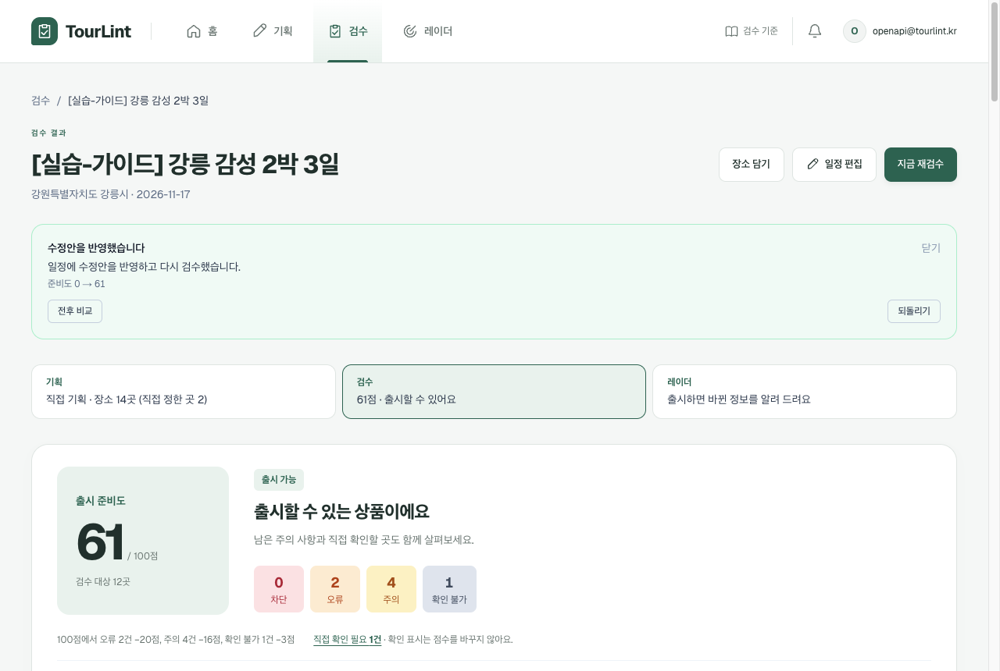

배너의 **전후 비교**를 누르면 차단 · 오류 · 주의 · 총 감점 계산식 · 이동시간 · 수요 적합성이 반영 전후로 나란히 나옵니다. 뒤로 가기로 돌아옵니다.

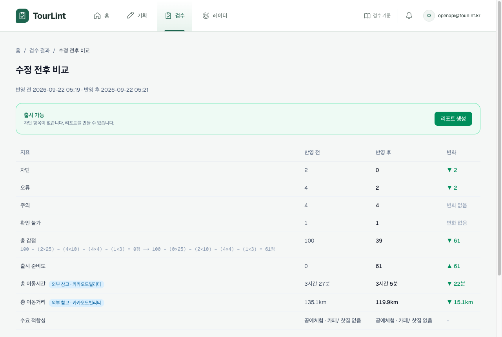

## 12. 검수 화면에서 바로 장소 담기

식사 · 휴식 카드의 **식당·카페 찾기**를 누르면 화면을 떠나지 않고 오른쪽에 장소 담기가 열립니다. 경고의 일차(1일차)와 기준 장소(오죽헌 다음), **식당**이 미리 골라져 있습니다. **맛드린**의 **자세히**로 이용시간 · 쉬는 날을 읽고 **일정에 넣기** → 아래 **담은 일정 재검수**. 오죽헌 종료 13:30 에 이동 2분을 더한 **13:32 – 14:32 · 식사**로 들어가고 **준비도 61 → 65점**이 됩니다.

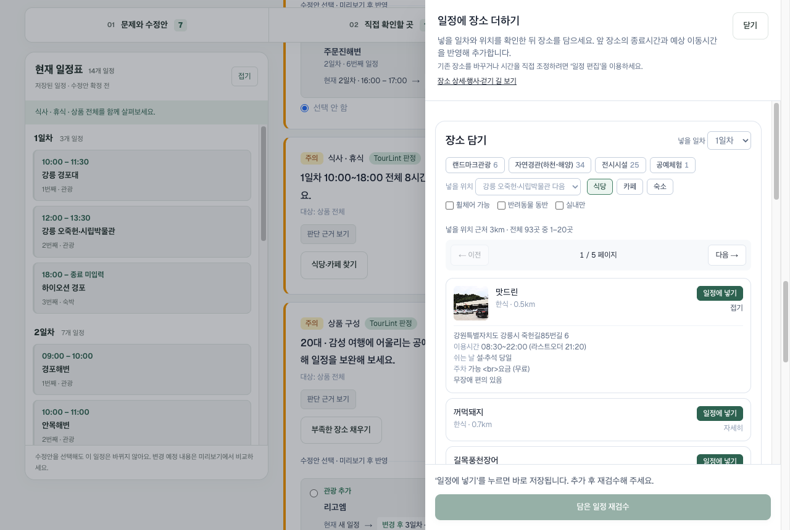

## 13. 남은 이동 오류를 일정 편집으로 풀기

2일차는 여러 일정이 줄줄이 밀려야 해서 수정안 하나로는 안 풀립니다. **일정 편집 → 2일차**에서 아래처럼 고치고 **저장 → 지금 재검수**.

| 장소 | 시작 | 종료 |
|---|---|---|
| 경포해변 | 09:00 | 10:00 |
| 안목해변 | 10:20 | 11:00 |
| 정동진해변 | 11:40 | 12:20 |
| 하슬라아트월드 | 12:30 | 13:45 |
| 가람집옹심이 | 14:30 | 15:30 |
| 주문진해변 | 16:15 | 17:00 |
| 세인트존스 호텔 | 18:00 | 비움 |

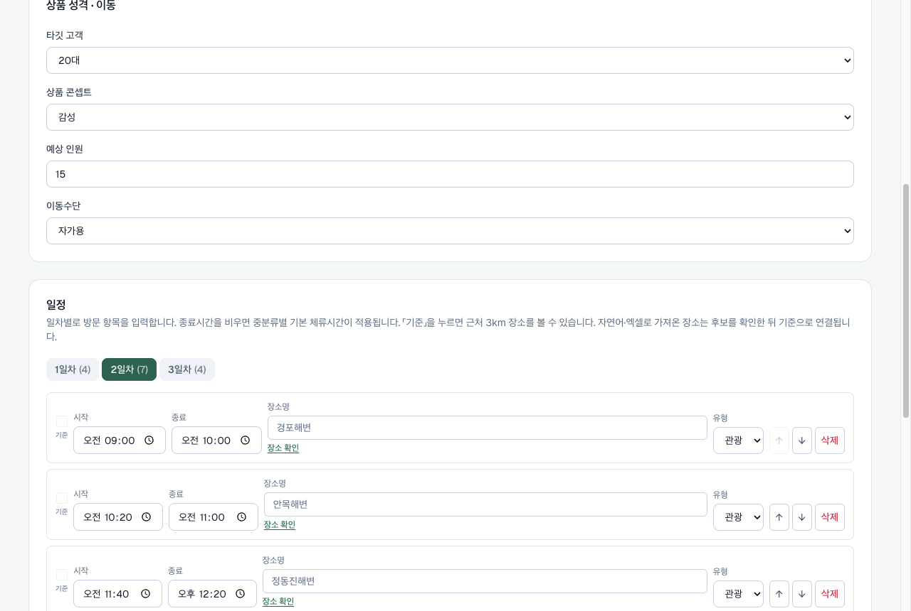

**실측: 준비도 85점, 차단 0 · 오류 0 · 주의 3 · 확인 불가 1.** 조회된 이동시간이 표의 간격보다 길게 나오면 뒤 일정을 더 늦춰 다시 검수하세요.

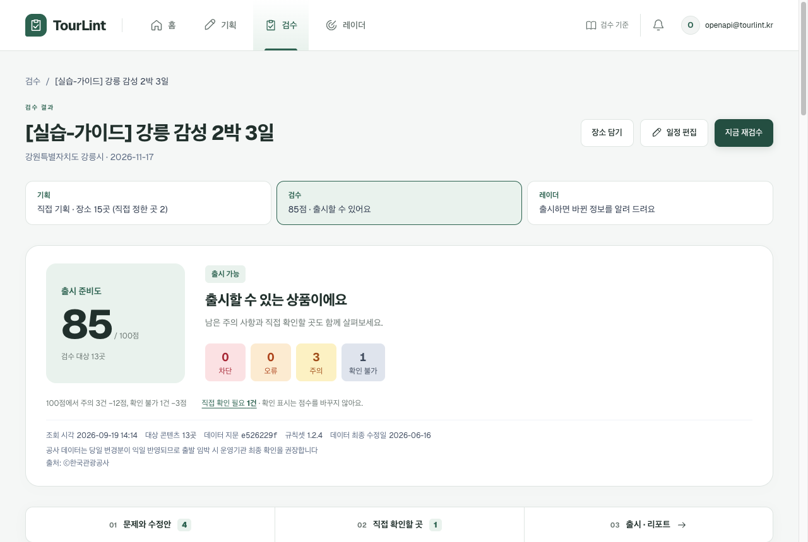

## 14. 상품 구성 수정안 — 점수가 내려가면 되돌린다

**주의** 필터의 **상품 구성** 카드를 봅니다. 3단계에서 본 ‘자주 넣는 곳’ 기준으로 **공예체험 · 카페/찻집 · 19:00 이후 일정**이 없다는 판정이고, 수정안이 둘 붙어 있습니다. 한 카드에서는 한 번에 하나만 고를 수 있습니다.

- **관광 추가 · 1일차 19:00 – 20:00 카페** — 숙소 근처에서 찾고, **그 시각에 영업하는 것이 관광정보로 확인된 곳만** 제안합니다. 하나로 ‘카페 없음’ 과 ‘19:00 이후 없음’ 이 같이 풀립니다.
- **관광 추가 · 3일차 16:00 – 17:30 공예체험** — 마지막 일정 뒤 빈 시간에 넣습니다.

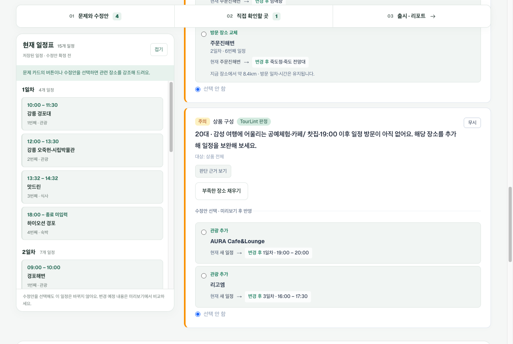

### 14-1. 공예체험을 넣었다가 되돌리기

먼저 **공예체험**을 골라 **미리보기 → 확정하고 재검수**. **‘출시 준비도가 85점에서 82점으로 내려갔습니다’** 라는 경고가 뜹니다. 새로 넣은 공예체험장은 이용시간 원문이 ‘체험에 따라 상이함(전화 문의)’ 이라 확인 불가가 하나 늘었기 때문입니다. 시스템이 일정을 제멋대로 되돌리지 않고 사람에게 묻습니다.

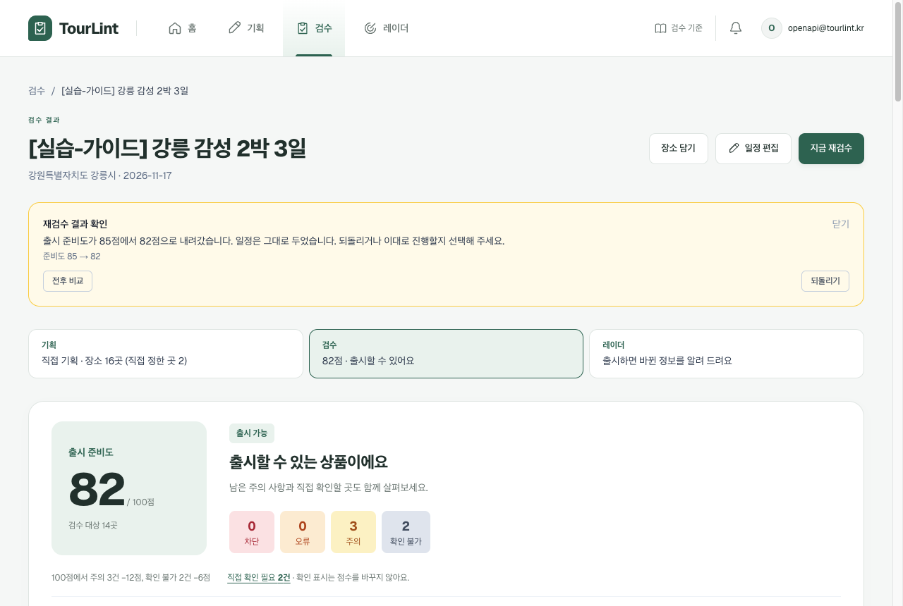

**전후 비교**에서 어디서 3점이 빠졌는지(확인 불가 1 → 2) 확인하고 **되돌리기 → 되돌리기**. 결과 화면으로 돌아오면 **지금 재검수**를 눌러 85점으로 돌아온 것을 확인합니다.

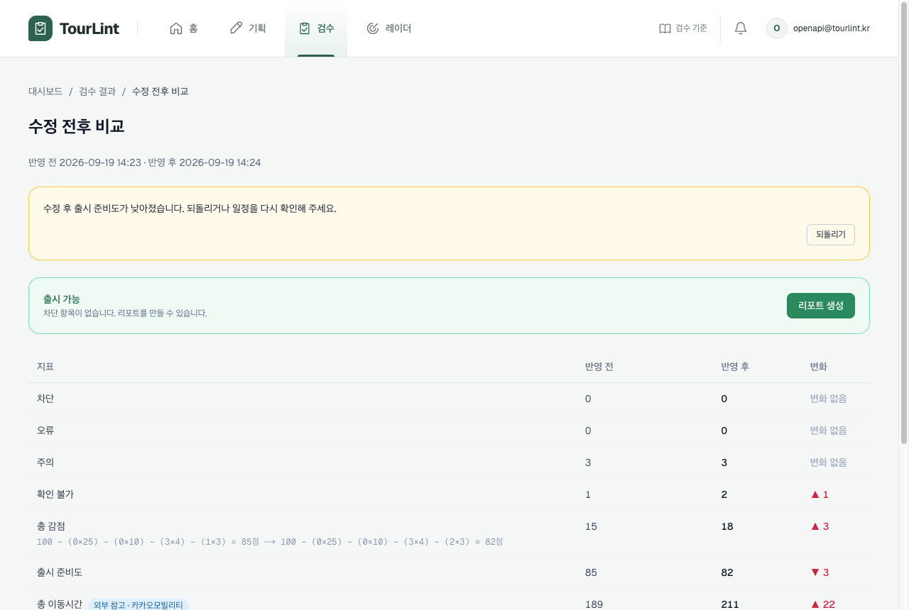

### 14-2. 야간 카페 넣기

이번에는 **1일차 19:00 카페**(실측: AURA Cafe&Lounge)를 골라 **미리보기 → 확정하고 재검수**. 점수는 85점 그대로지만 상품 구성 문구가 **‘공예체험 방문이 아직 없어요’** 하나로 줄어듭니다.

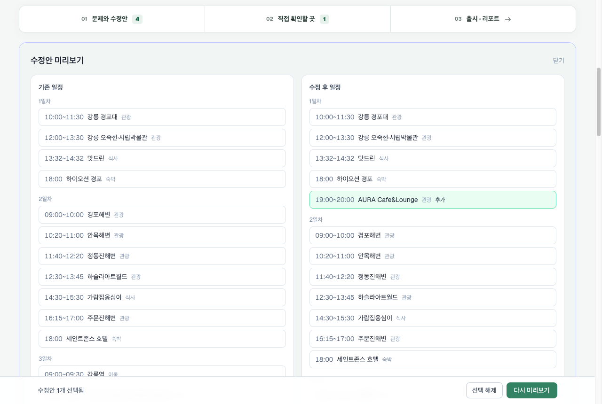

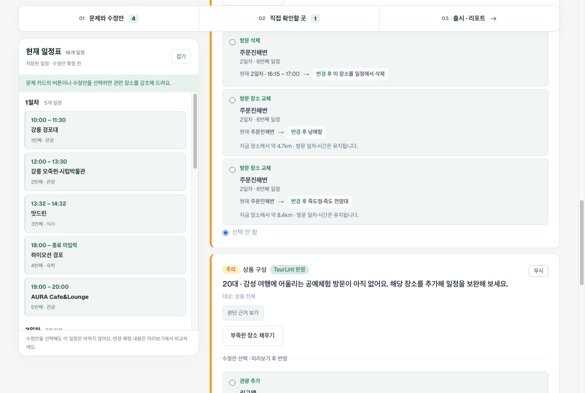

## 15. 직접 확인할 곳과 무시

### 15-1. 전화로 물어볼 내용

**02 직접 확인할 곳**으로 내려가 **물어볼 내용 만들기**를 누릅니다. 주문진 등대의 방문 일시 · 전화번호와 물어볼 질문이 만들어집니다. **질문 복사**로 복사할 수 있습니다. 실제 업무에서는 통화로 확인한 뒤에 **확인했어요**를 누릅니다(실습에서는 눌러만 봅니다). 확인 표시는 점수를 바꾸지 않습니다.

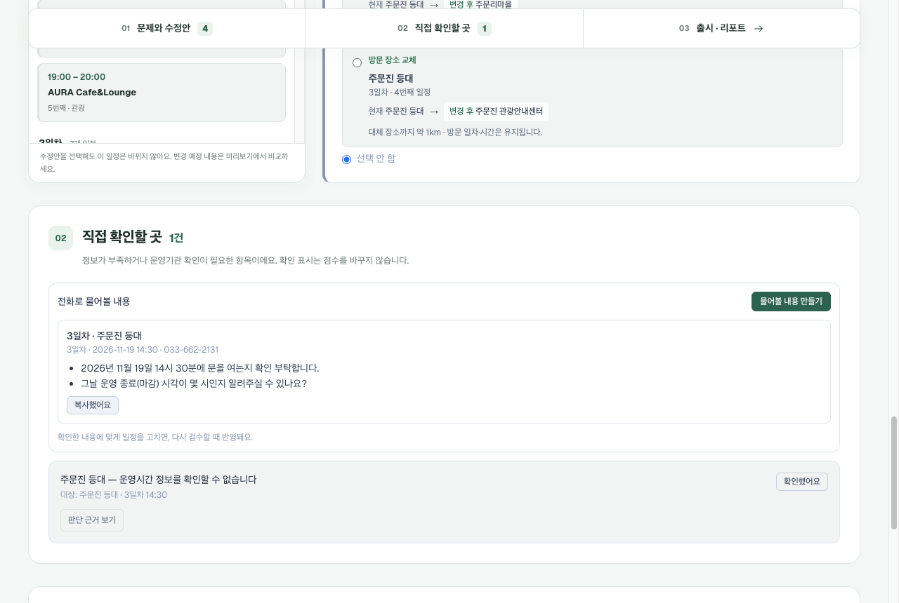

### 15-2. 무시

**주의** 필터 → 상품 구성 카드의 **무시** → 사유 **전화로 직접 확인함** → 아래 **무시**. 사유를 고르기 전에는 확정 버튼이 눌리지 않습니다. 차단에는 무시 버튼이 없습니다.

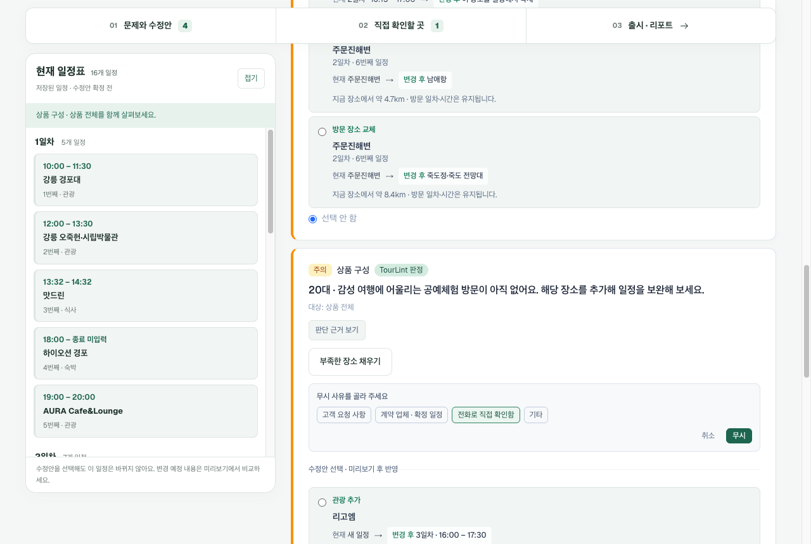

**무시한 항목** 필터에 카드가 사유와 함께 남고(**무시 해제** 가능) 요약에 **‘무시 1건은 감점에서 제외됐어요.’** 가 붙으며 **89점**이 됩니다.

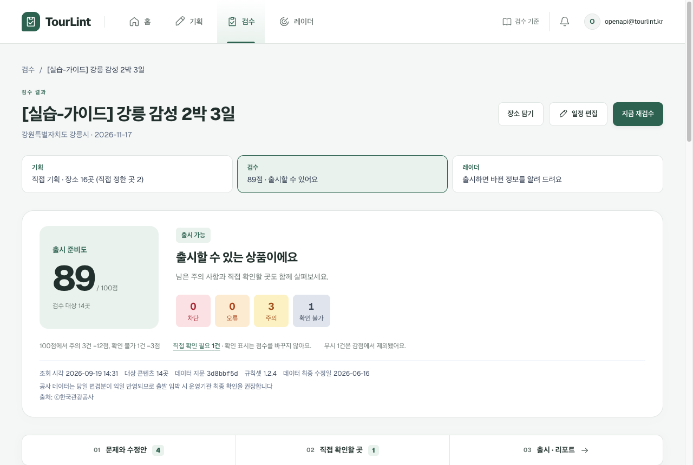

## 16. 리포트와 출시

**03 출시 · 리포트**로 내려갑니다.

1. **리포트 생성** → **리포트 미리보기**에서 상품 개요, 검수 요약과 산출식, 일정표(수정 반영본), 판정 내역과 공사 원문 근거, 수정 이력, 직접 확인 필요 목록, 데이터 출처를 넘겨 봅니다. **내려받기**로 PDF 를 받습니다.
2. **출시 승인** → **‘출시 승인됨 · 날짜’** 로 바뀝니다. 출시하면 출발일까지 바뀐 정보를 레이더가 알려 줍니다.

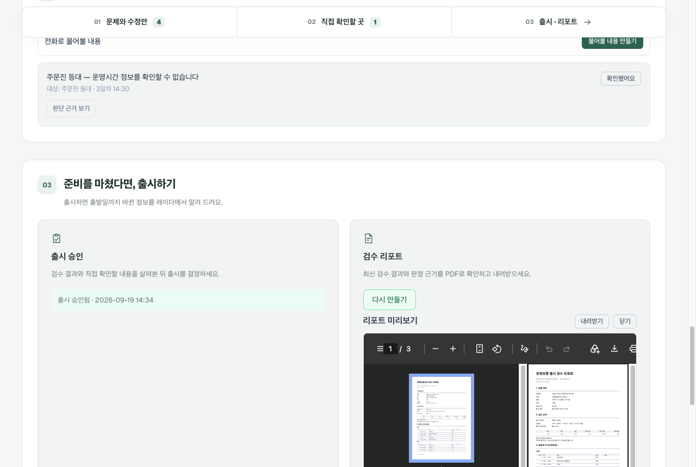

상단 **검수**로 가면 기본이 **목록** 보기입니다. **전체 · 검수 중 · 출시할 수 있음 · 출시함** 필터에서 방금 상품이 **출시함**으로 옮겨 간 것을 확인합니다.

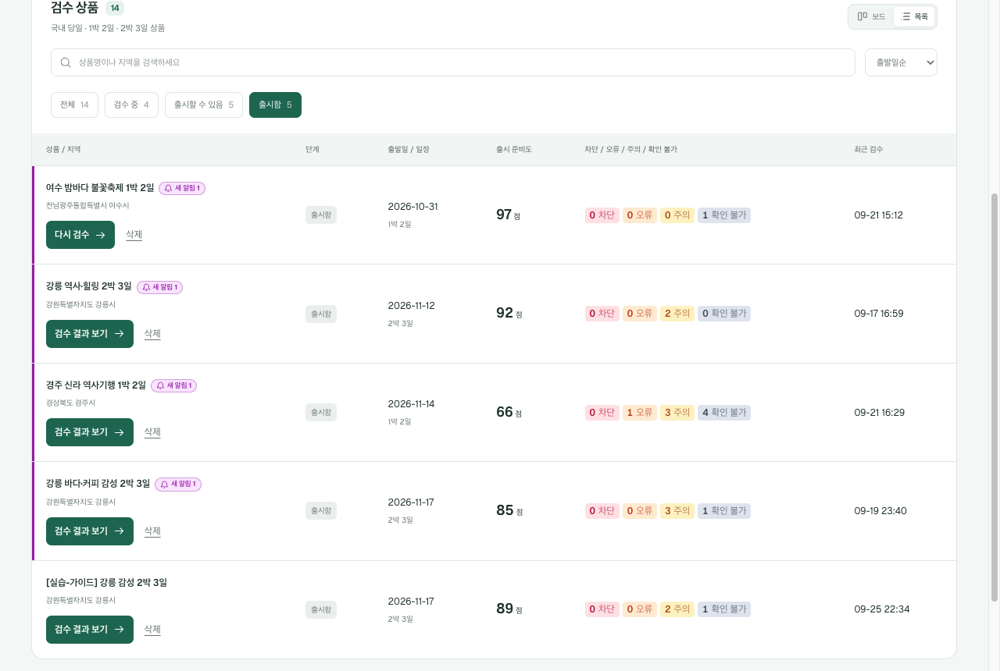

## 17. 레이더

상단 **레이더**로 갑니다.

1. **관심 키워드**에 **커피** → **추가**(이미 있으면 다른 말을 넣습니다).
2. **관심 지역**에서 **강원특별자치도 → 속초시 → 2026-11 → 관심 지역 추가**.
3. **새 소식 확인**. 지역 카드에 이달 행사 · 새로 등록된 곳 · 지난해 같은 달 방문자 수가 나오고 **근거 보기**에 기준 기간과 출처가 나옵니다. 방문자 수는 관측 자료이고 판매 예측이 아닙니다. 방금 추가한 지역은 다음 확인 때 채워집니다.

   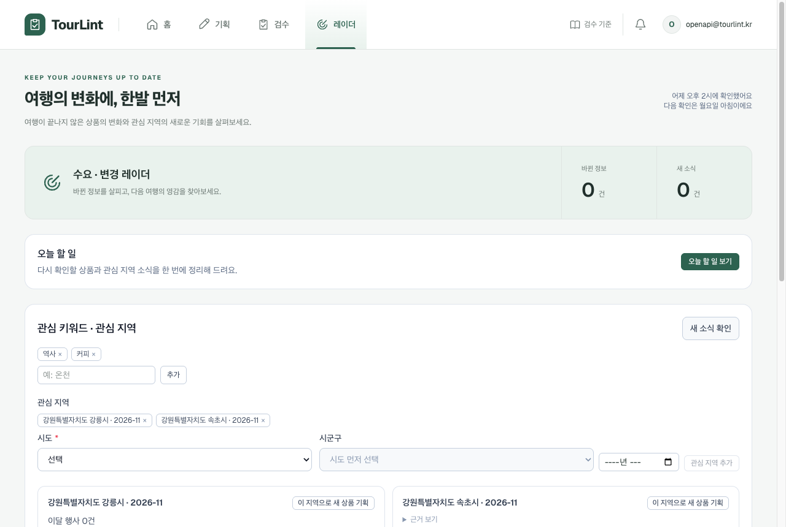

4. 아래 **수요 신호**에서 방금 출시한 내 상품을 고릅니다. 여행 지역 · 기간의 **신규 콘텐츠**와 **행사 밀도**가 건수와 유형 분포로 나옵니다.

   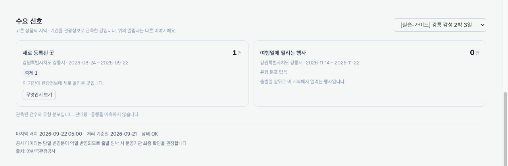

5. 위쪽 **오늘 할 일 보기**를 누르면 다시 확인할 상품과 관심 지역 소식이 정리됩니다. 할 일에는 **다시 검수** 또는 **이 지역으로 새 상품 기획** 버튼이 붙습니다. 뒤의 버튼을 누르면 지역과 출발일(그 달 1일)이 채워진 3단계 화면이 열립니다 — 확인만 하고 **취소**로 돌아오세요.
6. **바뀐 정보 / 새 소식** 탭은 출시한 상품의 관광정보가 실제로 바뀌었을 때만 채워집니다. 0건이면 정상입니다.

## 18. 날씨 판정 읽기

날씨 · 우천 판정은 출발일의 예보나 평년값이 기준을 넘을 때만 나옵니다. 11월 강릉은 해당하지 않으므로 준비된 상품에서 봅니다. **검수 → 제주 우천 리스크 검증 1박 2일 → 검수 결과 보기 → 주의** 필터의 **날씨 · 우천** 카드 — 야외 비중, 근거(평년 기준 12월 제주 강수일수), 출처 **외부 참고 · 기상청**, 그리고 실내 · 야외 순서를 바꾸는 수정안을 읽습니다. 이 상품은 읽기만 하고 고치지 않습니다.

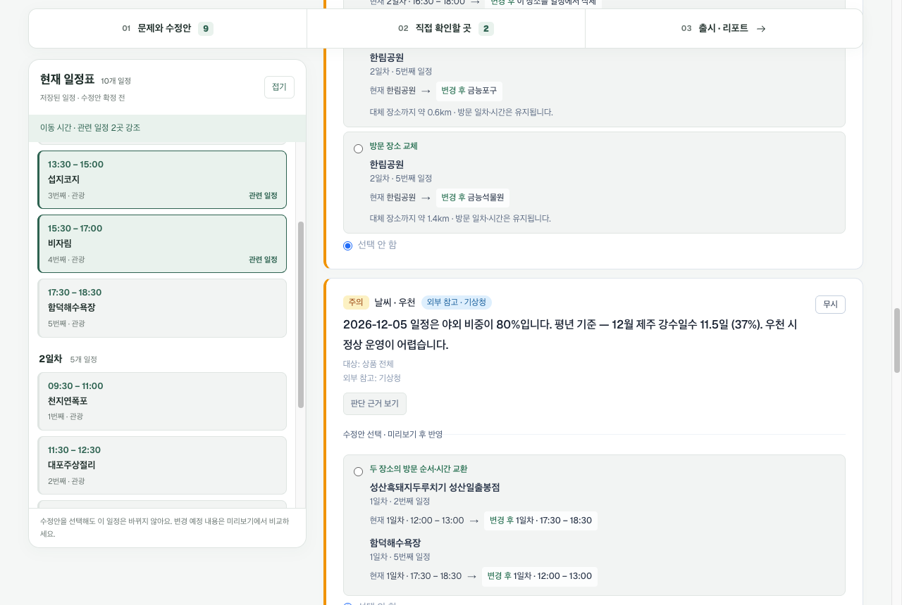

## 19. 검수 기준 — 확인하고, 조정하고, 되돌리기

오른쪽 위 **검수 기준**을 누릅니다. 맨 위 **표준**은 모든 계정에 같고 바꿀 수 없습니다 — 등급별 감점, 같은 유형 3곳 이상, 연속 일정 6시간, 최소 식사 60분. 아래 **규칙 설명**에서 R01 ~ R10 의 **설명**을 펼쳐 무엇을 보고 어떤 데이터를 쓰는지 읽습니다. 더 아래에는 기본 체류시간 · 실내/야외 · 타깃별 기대 구성 표가 있습니다.

**회사 기준**은 표준보다 엄격하게만 정할 수 있습니다.

1. **최소 식사 시간**에 **45** 를 넣어 봅니다. **‘표준 60분보다 짧게는 정할 수 없어요’** 가 뜨고 저장이 막힙니다.
2. **90** 으로 바꾸고 **저장**. 아래 **변경 이력**에 **최소 식사 시간 60 → 90** 이 남습니다.

   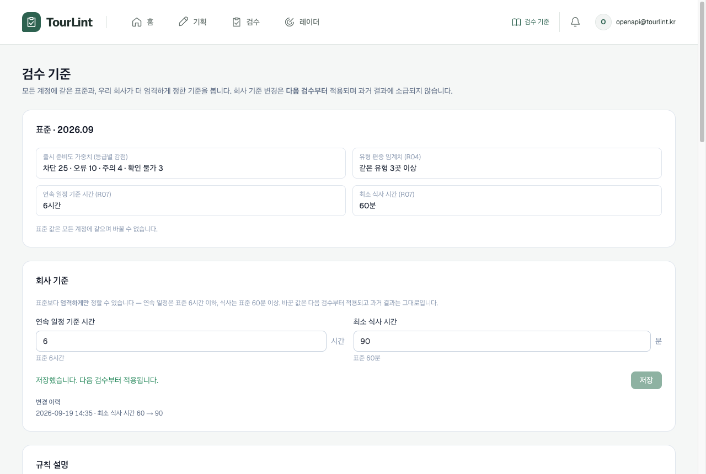

3. **검수 → 내 상품 → 검수 결과 보기 → 지금 재검수**. 회사 기준은 다음 검수부터 적용되고 과거 결과는 그대로입니다. **실측: 77점**, 요약에 **‘회사 기준: 식사 90분’** 이 붙습니다.

   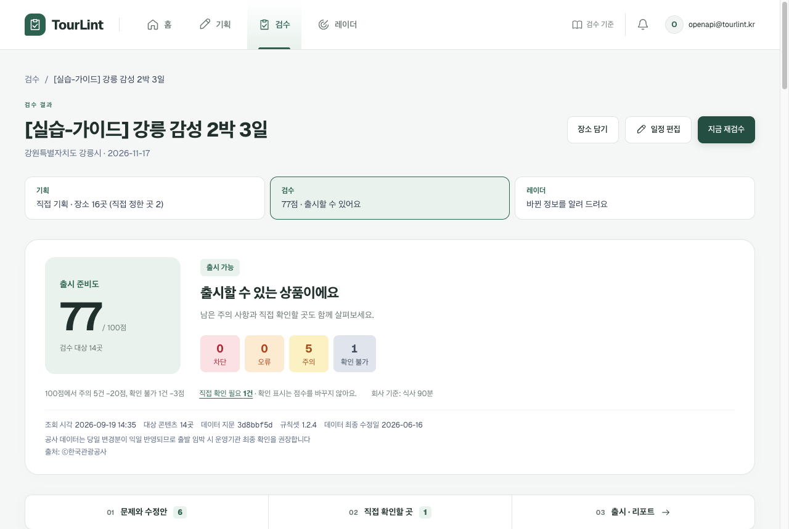

4. **주의** 필터에 식사 · 휴식 카드가 둘 생깁니다 — **‘식사가 60분으로 회사 기준 90분보다 짧습니다. TourLint 표준 60분은 충족합니다.’** 표준과 회사 기준을 구분해서 말합니다.

   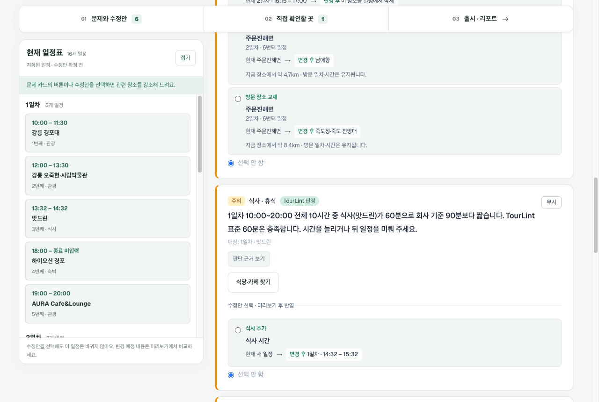

5. **반드시 되돌립니다.** **검수 기준 → 최소 식사 시간 60 → 저장**. 변경 이력에 **90 → 60** 이 추가됩니다. 공용 계정이라 다른 심사위원의 검수에도 영향을 주는 값입니다. 내 상품을 한 번 더 **지금 재검수**하면 85점으로 돌아옵니다.

   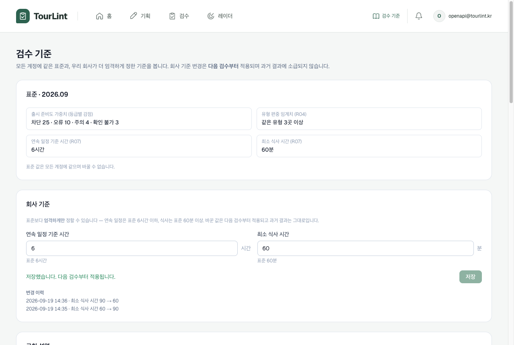

마지막으로 오른쪽 위 계정 메뉴에서 **로그아웃**합니다. 다시 로그인하면 상품과 검수 결과, 출시 상태가 그대로 남아 있습니다.

## 마지막 확인표

| 확인 | 직접 본 것 |
|---|---|
| □ 입력 세 가지 | 양식 내려받기 · 업로드 18개, 자연어 10개, 직접 입력 숙소 · 기준 · 등록 화면 담기 |
| □ 장소 연결 | AI 후보, 공식 이름 검색, 직접 정한 곳, 운영정보 카드 · 이동시간 |
| □ 장소 담기 | 근처 3km 숙소 · 상세, 분류 · 필터 · 함께 많이 가는 순, 걷기 길, 이동시간을 반영한 시각 |
| □ 검수 | 차단 · 오류 · 주의 · 확인 불가와 판단 근거 3단, 외부 참고 표시 |
| □ 수정안 | 충돌 안내, 미리보기, 확정 · 자동 재검수, 전후 비교, 점수 하락 경고와 되돌리기 |
| □ 보완 | 검수 화면 장소 담기, 일정 편집, 야간 카페 수정안, 전화로 물어볼 내용, 무시 |
| □ 산출물 | 리포트 PDF, 출시 승인, 검수 목록 |
| □ 레이더 | 관심 키워드 · 지역, 새 소식과 근거, 수요 신호, 오늘 할 일, 날씨 판정 |
| □ 검수 기준 | 표준 · 규칙 설명, 회사 기준 60 → 90 → 재검수 → 60 복원 |

출시 가능은 출시를 막는 조건을 통과했다는 뜻이고, 현장 운영이 보장된다는 뜻은 아닙니다. 관광정보는 당일 변경분이 다음 날 반영되므로 출발이 임박하면 운영기관에 최종 확인하세요. 출처: ⓒ한국관광공사

---

이전 판의 실측 기록: [기능별 확장 실습 (2026-09-18)](2026-09-18_기능별_확장실습.md) · [실제 화면 모음 (2026-09-18)](2026-09-18_이전실측기록.md)

홈 화면의 `PDF 내려받기`는 **노션 가이드를 내보낸** `apps/web/public/judge-guide.pdf` 입니다. 가이드를 고치면 노션에서 다시 내보내(파일 → 내보내기 → PDF) 같은 경로에 덮어씁니다 — 저장소에서 자동 생성하지 않습니다.
