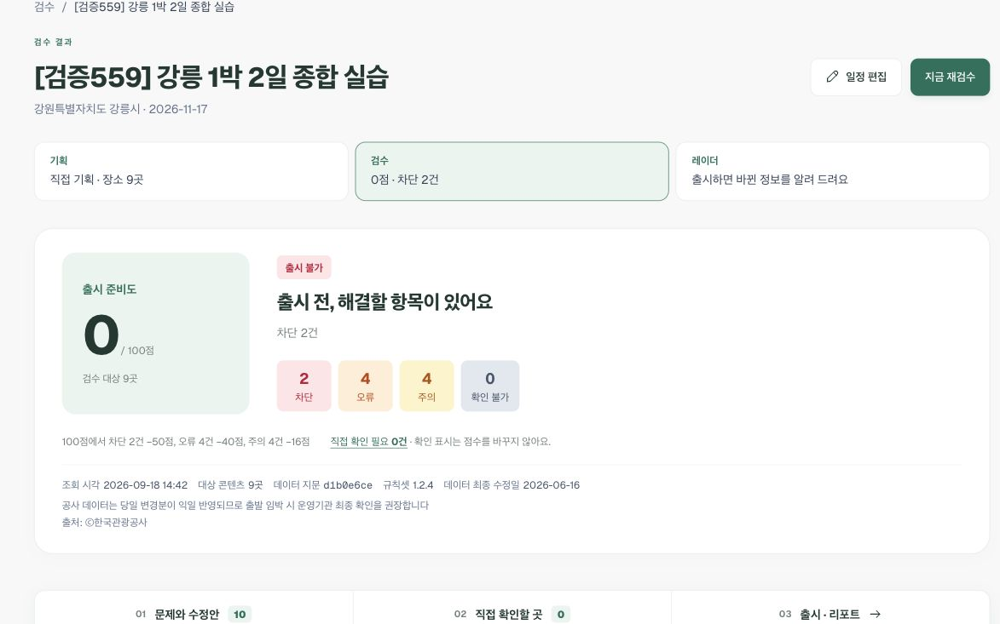
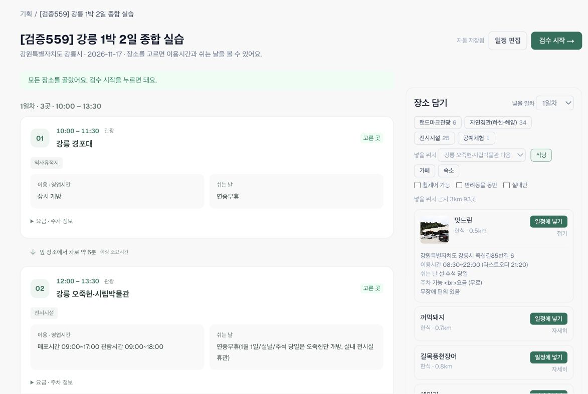
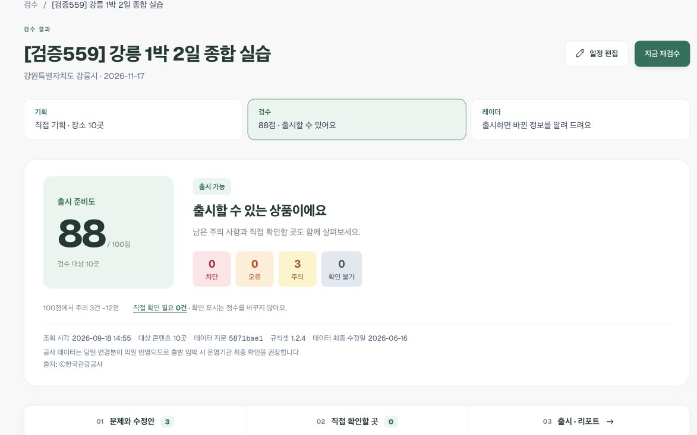

# TourLint 직접 체험 가이드 — 강릉 1박 2일 상품을 기획부터 출시까지

**이 문서의 1~9단계를 순서대로 따라 하면 됩니다.** 준비된 상품을 구경하는 대신, 심사위원 본인이 새 상품을 만들고 문제를 발견·수정합니다. 숙소·식당·카페는 실제 **장소 담기**로 추가합니다. 소요 시간은 약 25~35분이며 외부 조회 시간에 따라 달라집니다.

[서비스 열기](https://tourlint-web.up.railway.app) · 테스트 계정 `openapi@tourlint.kr` · 비밀번호는 제출 서류의 테스트 계정 항목을 사용하세요.

> 상품명의 `내이름`만 본인 이니셜로 바꾸세요. 날짜·박수·장소·시간은 우선 그대로 입력합니다. 공용 계정에 있는 다른 상품·회사 기준은 그대로 둡니다. 아래는 **문제를 일부러 넣은 연습 일정**입니다. 실제 여행을 그대로 실행하는 일정이 아닙니다.

## 전체 흐름 — 이 한 상품에서 무엇을 확인하나요?

**자연어 8개 일정 → 관광정보 장소 연결 → 숙소 담기 → 첫 검수 → 휴무 식당의 일차 이동·행사 제거·시간 수정 → 식당·카페 담기 → 재검수 → 리포트·출시 → 레이더 → 다음 상품 기획**

| 구간 | 체험 기능 | 기능설명서 해시태그 연결 |
|---|---|---|
| 1~3 | 자연어 변환, AI 장소 후보, 공사 장소 확정, 근처 숙소와 상세정보 | #데이터기반상품기획 |
| 4 | 휴무·행사 기간·겹침·이동 부족·편중·식사 누락·타깃 구성 | #여행상품사전검수 #실시간관광데이터검증 |
| 5 | 여러 수정안 선택, 기존/수정 후 일정, 확정, 자동 재검수, 전후 비교 | #수정안자동제시 #출시준비도점수 |
| 6~7 | 근처 식당·카페 담기, 방문 시간 조정, 같은 상품 재검수 | #데이터기반상품기획 #여행상품사전검수 |
| 8~9 | PDF 리포트, 출시 승인, 변경 레이더, 수요 관측, 다음 기획 | #실시간관광데이터검증 |

날씨·변경 알림처럼 실제 조건이 필요한 기능과 CSV·직접 입력 등 다른 입력 경로는 **10단계 추가 체험**에 별도 입력문까지 제공합니다. 핵심 흐름을 먼저 마친 뒤 진행하세요.

## 1. 새 상품을 만들고 아래 일정 붙여넣기

**이동:** 상단 `기획` → `새 상품 기획` → `자연어 붙여넣기`.

**기본정보는 다음과 같이 입력합니다.** 출발일은 연/월/일 세 칸을 모두 입력한 뒤 `2026-11-17`인지 확인하세요.

| 화면 항목 | 입력값 |
|---|---|
| 상품명 | `[실습-내이름] 강릉 1박 2일 종합 실습` |
| 시도 / 시군구 | 강원특별자치도 / 강릉시 |
| 출발일 | 2026-11-17 (화요일) |
| 박수 | 1박 2일 |
| 타깃 고객 | 가족(아이 동반) |
| 예상 인원 | 12 |
| 상품 콘셉트 | 자연경관 |
| 이동수단 | 자가용 |

**아래 상자 전체를 복사해 자연어 입력란에 붙여넣습니다.**

```text
강릉 1박 2일 여행
1일차 10:00~11:30 강릉 경포대 관광
1일차 11:00~12:30 강릉 오죽헌·시립박물관 관광
1일차 13:00~14:00 가람집옹심이 식사
1일차 15:00~16:00 강릉 경포벚꽃축제 관광
2일차 09:00~10:00 경포해변 관광
2일차 10:00~11:00 안목해변 관광
2일차 11:00~12:00 정동진해변 관광
2일차 16:00~17:00 주문진해변 관광
```

1. `일정으로 바꾸기`를 누릅니다.
2. **‘8개 항목으로 바꿨습니다’**를 확인합니다.
3. `직접 입력에서 편집` → `1일차(4)`와 `2일차(4)`를 눌러 시간·유형이 위 상자와 같은지 확인합니다. 2일차 마지막 시간은 **16:00~17:00**입니다.
4. `저장하고 장소 고르기`를 누릅니다.

**지금 잘 된 상태:** 상품명 아래에 `2026-11-17`, 일정이 1·2일차로 나뉘어 표시됩니다. 처음 두 방문이 겹치고, 2일차에 식사가 없는 상태가 맞습니다.

## 2. 이름을 실제 관광정보 장소로 연결하기

저장 후 보이는 화면은 같은 상품의 기획 화면입니다. **‘고른 곳’은 이미 연결 완료**, **‘고르는 중’은 후보 선택이 필요**하다는 뜻입니다.

1. 상단 `AI로 한 번에 찾기`를 누릅니다. 이미 모두 연결되어 버튼이 없으면 3단계로 갑니다.
2. `경포해변`에 **경포해수욕장** 후보가 나오면 추천 이유와 강릉 지역을 확인하고 `이곳으로 선택`을 누릅니다. AI는 후보를 제안하며, 사용자가 선택해야 확정됩니다.
3. AI 후보가 없으면 그 장소의 검색란에 `경포해수욕장`을 입력하고 해당 후보를 선택합니다. 다른 미확정 장소도 위 입력문의 공식 이름으로 검색해 선택합니다.
4. **‘모든 장소를 골랐어요’**를 확인합니다.
5. 오죽헌 카드의 `이용·영업시간`, 가람집옹심이의 `쉬는 날`, 벚꽃축제의 `행사 기간`을 읽습니다. `요금·주차 정보`를 눌러 펼쳤다가 접습니다. 카드 사이에서는 앞 장소로부터의 자동차 이동 예상시간을 확인합니다.

**지금 잘 된 상태:** 이름만 적힌 일정에 운영정보와 이동정보가 붙습니다. `경포해변`이라는 입력 이름은 그대로여도 경포해수욕장에 연결될 수 있습니다. 정보를 찾지 못했다는 이유로 임의로 ‘직접 정한 곳’으로 처리하면 검수 대상이 달라지므로, 이 핵심 실습에서는 실제 후보를 선택하세요.

## 3. 장소 담기 ① — 빠진 숙소를 실제로 넣기

**현재 화면 오른쪽 `장소 담기`에서 실행합니다.** 좁은 화면에서는 일정 아래로 스크롤하면 나옵니다.

| 순서 | 누를 곳 / 선택할 값 | 바로 확인할 것 |
|---|---|---|
| 1 | `넣을 일차` → `1일차` | 1일차로 표시 |
| 2 | `넣을 위치` → `강릉 경포벚꽃축제 다음` | 근처 버튼 활성화 |
| 3 | `숙소` | ‘넣을 위치 근처 3km’와 거리별 숙소 목록 |
| 4 | **하이오션 경포** 카드의 `자세히` | 주소·체크인/체크아웃·주차 등 제공 정보 |
| 5 | 같은 카드의 `일정에 넣기` | 왼쪽 1일차에 숙소 카드 추가, ‘장소 담기에서 넣음’ 표시 |
| 6 | 상단 `일정 편집` → `1일차` | 숙소의 유형이 `숙박`인지 확인 |
| 7 | 하이오션 경포 시작 `18:00`, 종료는 비움 → `저장` | 기획 화면에서 `18:00 · 숙박`, 자동 저장 완료 |

목록에 하이오션 경포가 없으면 다른 **호텔**의 `자세히`에서 체크인 시각을 확인한 후 하나를 담습니다. 이후 표의 ‘하이오션 경포’를 본인이 고른 숙소로 읽으면 됩니다. 실습에서는 숙박 예약이나 결제가 일어나지 않습니다.

**숙소 버튼이 회색이면:** `넣을 위치`를 먼저 고르세요. 그 목록에 장소가 없으면 2단계에서 아직 실제 장소를 연결하지 않은 것입니다.

**지금 잘 된 상태:** 1일차 5개 + 2일차 4개, 총 9개 일정입니다. 자동으로 계산된 시각은 초안이므로 편집 화면에서 확인하는 것까지가 장소 담기 흐름입니다.

## 4. 첫 검수 — 복잡한 일정의 문제를 한 번에 발견하기

**상단 `검수 시작 →` → 설명창의 `검수 시작`**을 누릅니다. 결과 화면에 `아직 검수하지 않았습니다`가 보이면 `검수 실행`을 한 번 누르고 완료될 때까지 기다립니다.

확인 순서는 **요약 → 차단 → 오류 → 주의 → 판단 근거**입니다.

| 누를 필터 | 이 일정에서 찾아볼 문제 | 왜 생기나요? |
|---|---|---|
| 차단 | 가람집옹심이의 쉬는 날 | 1일차가 화요일이며 현재 제공 정보상 화요일 휴무 |
| 차단 | 경포벚꽃축제의 행사 기간 | 제공된 4월 행사에 11월 방문 예정 |
| 오류 | 경포대와 오죽헌의 일정 시간 겹침 | 10:00~11:30과 11:00~12:30이 30분 겹침 |
| 오류 | 경포대→오죽헌 이동 시간 | 겹침 30분에 실제 이동시간도 추가로 필요 |
| 오류 | 경포해변→안목해변, 안목해변→정동진해변 | 끝나는 시각과 다음 시작이 같아 이동 여유가 0분 |
| 주의 | 종류 쏠림 | 해변 등 동일 관광 유형·소분류를 반복 |
| 주의 | 식사·휴식 | 2일차 09:00~17:00에 식사·휴식 항목 없음 |
| 주의 | 상품 구성 | 가족·자연경관 조합에서 빠진 분류 안내 |

각 카드의 **`판단 근거 보기`**를 열어 날짜·시각·제공 정보와 판정을 연결해 읽습니다. 이동 카드의 **‘외부 참고 · 카카오모빌리티’**는 공사 운영정보와 다른 제공자입니다. 현재 교통 기준의 참고 소요시간이며 미래 교통을 확정하는 값은 아닙니다.

**2026-09-18 실제 확인:** 준비도 0점, 차단 2건·오류 4건·주의 4건. 경포대→오죽헌은 겹침 30분 + 이동 6분 = 36분 부족이었습니다. 실제 조회·회사 기준에 따라 건수와 점수는 달라질 수 있습니다. 해당 문제의 근거가 설명되는지를 확인하세요.



`출시 · 리포트`로 내려가 **차단이 남으면 출시 승인 버튼이 비활성화**된 것도 확인합니다. 이 단계에서는 출시하지 않습니다.

## 5. 수정안 3개 적용 — 식당을 다음 날로 옮기고 일정 충돌 해소하기

`전체` 필터로 돌아옵니다. 다음 **세 카드에서 한 개씩만** 선택합니다.

| 카드 | 선택할 수정안 |
|---|---|
| 가람집옹심이 휴무 | `2일차로 이동 · … 로 시간 조정` |
| 경포벚꽃축제 행사 기간 | `일정에서 제거` |
| 경포대↔오죽헌 **일정 시간 겹침** | 오죽헌을 뒤로 미루는 `12:00~13:30 로 시간 조정` 또는 현재 조회가 제시하는 유사한 뒤 시각 |

**같은 경포대↔오죽헌의 ‘이동 시간’ 카드에서는 중복 선택하지 마세요.** 같은 일정을 서로 다른 방식으로 바꾸는 수정안을 동시에 고르면 충돌할 수 있습니다.

1. 화면 아래 **‘수정안 3개 선택됨’ → `미리보기`**.
2. 왼쪽 기존 일정과 오른쪽 수정 후 일정에서 **가람집은 2일차로 이동**, **행사는 제거**, **오죽헌은 뒤로 이동**하는지 확인합니다. 아직 저장 전입니다.
3. 충돌 메시지가 없다면 `확정하고 재검수`.
4. 완료 후 `전후 비교`를 눌러 준비도·차단·오류·일정의 변화를 봅니다. 뒤로 가기로 결과 화면에 돌아옵니다.

**실측 결과:** 준비도 **0 → 64점**, 차단 **2 → 0건**, 오류 **4 → 2건**. 2일차에는 점심이 생기지만 **1일차 점심이 비었기 때문에 식사·휴식 주의가 1일차로 옮겨집니다.** 이 변화가 맞습니다. 이제 장소 담기로 그 빈자리를 채웁니다.

제시된 시각이 다르거나 수정안이 없으면 `일정 편집`에서 7단계 표의 시간으로 조정합니다. 차단 원인인 행사 제거·휴무 식당 날짜 변경도 확인하세요. 현재 제공 정보가 달라졌다면 화면 근거를 우선합니다.

## 6. 장소 담기 ②·③ — 빈 점심과 휴식 자리를 채우기

**검수 결과 상단 `장소 담기`**를 누릅니다. 같은 상품의 기획 화면으로 돌아옵니다.

### 6-1. 오죽헌 근처 식당 담기

1. 오른쪽 `넣을 일차` → **1일차**.
2. `넣을 위치` → **강릉 오죽헌·시립박물관 다음**.
3. **`식당`** → **맛드린**의 **`자세히`**. 운영시간과 쉬는 날을 확인합니다.
4. 같은 카드의 **`일정에 넣기`**.
5. 왼쪽 오죽헌 다음에 맛드린이 추가되고 **유형 ‘식사’**, **‘장소 담기에서 넣음’**이 표시되는지 확인합니다.



맛드린이 목록에 없으면 현재 영업정보를 읽고 같은 근처 식당 한 곳을 고릅니다. 가이드의 다음 시간표에서는 맛드린 자리에 본인이 고른 식당을 사용합니다.

### 6-2. 점심 근처 카페 담기

1. `넣을 일차`는 **1일차** 그대로 둡니다.
2. `넣을 위치` → **맛드린 다음**(또는 방금 담은 식당 다음).
3. **`카페`** → **공대카페 2호점**의 **`자세히`** → 현재 정보의 `09:00~19:00 · 연중무휴` 확인. 목록에 없으면 방문할 화요일에 운영하는 다른 카페를 고릅니다.
4. **`일정에 넣기`** → 왼쪽에 카페가 **‘휴식’**으로 들어오는지 확인합니다.
5. 상단 **`일정 편집`**으로 이동합니다. 다음 표를 보며 시간을 정리합니다.

**여기까지가 장소 담기 핵심입니다:** 실제 장소 연결 → 기준 장소 지정 → 근처 3km 탐색 → 상세정보 확인 → 일차·위치에 삽입 → 자동 저장 → 편집·재검수. 장소 목록을 보는 데서 끝나지 않습니다.

## 7. 시간표를 정리하고 다시 검수하기

아래 표는 **기존 상품의 ‘일정 편집’에서 바꿀 값**입니다. 새 상품을 만들 필요가 없습니다. 1일차와 2일차 탭을 각각 눌러 수정합니다. 장소명과 유형은 유지하고 시작·종료를 바꿉니다.

| 일차 | 장소 | 시작 | 종료 | 유형 |
|---|---|---|---|---|
| 1 | 강릉 경포대 | 10:00 | 11:30 | 관광 |
| 1 | 강릉 오죽헌·시립박물관 | 12:00 | 13:30 | 관광 |
| 1 | 맛드린 또는 담은 식당 | 14:00 | 15:00 | 식사 |
| 1 | 공대카페 2호점 또는 담은 카페 | 16:00 | 17:00 | 휴식 |
| 1 | 하이오션 경포 또는 담은 호텔 | 18:00 | 비움 | 숙박 |
| 2 | 경포해변 | 09:00 | 10:00 | 관광 |
| 2 | 안목해변 | 10:30 | 11:30 | 관광 |
| 2 | 정동진해변 | 12:30 | 13:30 | 관광 |
| 2 | 가람집옹심이 | 14:30 | 15:30 | 식사 |
| 2 | 주문진해변 | 16:30 | 17:30 | 관광 |

1. **`저장` → `지금 재검수`**. 기획 화면에 있으면 **`검수 결과로 돌아가기` → `지금 재검수`**.
2. 차단 0건, 겹침·이동 부족 해소, 1·2일차 식사·휴식 주의 해소를 확인합니다.
3. 조회된 이동시간이 표의 간격보다 길면 뒤 일정을 더 늦춰 다시 검수합니다. 근처에서 다른 식당·카페를 골랐다면 운영시간도 달라질 수 있습니다.
4. **종류 쏠림·상품 구성 주의는 남을 수 있습니다.** 시간표 수정으로 콘텐츠 종류까지 바뀌지는 않기 때문입니다. 10-D에서 분류를 다양화하는 방법을 체험합니다.

**실측 결과:** 준비도 **88점**, 차단 **0건**, 오류 **0건**, 주의 **3건**. 휴무·행사 기간·시간 겹침·이동 부족·식사 누락이 모두 해소되고, 관광 유형/소분류 쏠림과 상품 구성 주의가 남았습니다.



**완료 기준:** 총 10개 일정으로 1박 2일을 구성했고, 직접 담은 식당·카페·호텔이 포함되며, 차단·겹침·이동 부족·식사 누락의 해소를 본인 화면에서 확인합니다.

## 8. 리포트와 출시 — 검수 결과를 실제 산출물로 만들기

1. 결과의 **`출시 · 리포트`**를 누릅니다.
2. **`리포트 생성`**을 누르고 완료되면 PDF 미리보기와 내려받기 버튼을 확인합니다. 리포트의 상품명·여행일·검수 시각·준비도·판정 근거가 방금 상품과 맞는지 봅니다.
3. **`출시 승인`** → 확인 단계가 있으면 내용을 읽고 승인합니다. 출시됨 상태를 확인합니다.
4. 상단 **`검수` → 본인 상품 검색 → `검수 결과 보기`**로 다시 들어갑니다. 결과가 저장되어 있는지 확인합니다.

출시 가능은 서비스의 출시 제한 조건을 통과했다는 의미입니다. 주의·확인 불가가 모두 없거나 현장 운영이 보장된다는 뜻은 아닙니다. 리포트는 당시 검수 결과이므로 일정을 다시 고쳤다면 재검수 후 새로 생성하세요.

## 9. 레이더 → 다음 여행 기획으로 이어가기

**상단 `레이더`**로 갑니다.

1. `관심 키워드` 입력란에 **`역사`** → `추가`. 같은 키워드가 이미 있으면 건너뜁니다.
2. `관심 지역`에서 **강원특별자치도 → 강릉시 → 2026-11** → `관심 지역 추가`. 같은 지역·월이 있으면 중복 추가하지 않습니다.
3. `새 소식 확인` → 나타난 카드의 **집계 기간·근거**를 확인합니다. 아직 산출되지 않았으면 ‘아직 없음’ 안내를 읽습니다. 방문자 수는 예약 건수나 미래 판매 예측이 아닌 관측 자료입니다.
4. `수요 신호`의 상품 선택에서 **방금 출시한 내 상품**을 선택합니다. 여행 지역·기간과 관련된 행사·관측 정보가 연결되는지 확인합니다.
5. **`오늘 할 일 보기`**를 눌러 다음 행동을 확인합니다. 할 일이 없으면 ‘없음’이 정상 결과입니다.
6. 관심 지역 카드의 **`이 지역으로 새 상품 기획`** → 지역·월이 넘어왔는지 확인 → 상품명만 **`[실습-내이름] 레이더에서 시작`**으로 바꿔 저장합니다. 새 기획은 빈 일정으로 저장해도 됩니다.
7. **`바뀐 정보` / `새 소식`**은 실제 변화가 있어야 나타납니다. 알림이 있으면 해당 상품과 근거를 읽고 `다시 검수` 또는 제안된 다음 행동으로 이동합니다. 알림 0건을 실패로 판단하지 않습니다.

**지난 상품 안내:** 한국 날짜의 여행 종료일(출발일+박수)이 지난 상품은 현재 레이더 알림·배지·상품 선택에서 빠집니다. 홈/검수의 **‘지난 상품 N개 펼치기’**에서는 과거 상품을 계속 열어 수동 검수할 수 있습니다. 진행 중인 1박 2일은 종료 당일까지 유지됩니다.

## 10. 남은 기능도 따라 하기 — 같은 흐름의 추가 체험

핵심 실습 상품을 훼손하지 않으려면 아래는 `[실습-내이름-추가]` 상품으로 진행합니다. 완료할 때마다 수정한 값은 되돌립니다.

### A. 직접 입력·자연어 기준 체크·CSV/엑셀

**직접 입력:** `기획 → 새 상품 기획 → 직접 입력`. 1단계 기본정보를 넣고 `+ 항목 추가` → 시작 `10:00`, 종료 `11:00`, 장소명 `오죽`, 유형 `관광`. 후보 중 **강릉 오죽헌·시립박물관** 선택 → 왼쪽 **‘기준’** 체크 → 오른쪽 `식당` 활성화 확인. 필요한 항목을 추가하고 저장합니다.

**자연어로 가져온 줄의 기준:** 새 상품에서 1단계 입력문을 변환 → `직접 입력에서 편집` → 경포대 줄의 `기준`. 후보 선택이 나오면 경포대를 선택합니다. 지역과 출발일까지 입력되어야 근처 목록이 나옵니다.

**CSV:** 다음 내용을 UTF-8 파일 `tourlint-추가실습.csv`로 저장합니다. 또는 함께 제공한 [복합 일정 CSV](강릉_1박2일_종합실습.csv)를 사용합니다.

```csv
일차,시작시간,종료시간,장소명,유형
1,10:00,11:30,강릉 경포대,관광
1,11:00,12:30,강릉 오죽헌·시립박물관,관광
1,13:00,14:00,가람집옹심이,식사
1,15:00,16:00,강릉 경포벚꽃축제,관광
2,09:00,10:00,경포해변,관광
2,10:00,11:00,안목해변,관광
2,11:00,12:00,정동진해변,관광
2,16:00,17:00,주문진해변,관광
```

`새 상품 기획 → 엑셀·CSV 업로드` → 기본정보를 1단계와 같게 입력 → 파일 선택 → ‘8개 항목을 불러왔습니다’ → `직접 입력에서 편집` → 1일차 4개·2일차 4개 확인 → 저장. 엑셀은 같은 헤더와 행을 시트에 넣어 `.xlsx`로 저장해 같은 탭에서 업로드합니다. 파일의 최대 일차로 박수가 자동 설정됩니다. 오류 체험은 첫 행의 시작시간을 `25:00`으로 바꿔 다시 업로드합니다. 해당 행의 오류와 나머지 정상 7개 행 반영을 확인한 후 원본 파일로 복원하세요. 일차를 `4`로 넣으면 최대 3일차 범위 초과로 파일 전체가 거부됩니다.

### B. 장소 담기의 분류·필터·순위·다른 일차·걷기 길

핵심 상품의 검수 결과에서 `장소 담기`로 돌아옵니다. 목록을 **보기만** 하는 단계와 실제 **추가** 단계를 구분합니다.

| 직접 누를 순서 | 확인할 것 |
|---|---|
| `전시시설` | 관광 분류에 맞는 목록과 건수 |
| `휠체어 가능` 체크 → 결과 확인 → 해제 | 제공된 무장애 정보에 따른 후보 변화 |
| `반려동물 동반` 체크 → 결과 확인 → 해제 | 동반 정보에 따른 후보 변화 |
| `실내만` 체크 → 결과 확인 → 해제 | 실내로 판독된 후보만 남는지 |
| 정렬에 `함께 많이 가는 순`이 있으면 선택 | 집계 기간·연관 근거. 없는 분류에서는 가까운 순 등 제공되는 정렬만 사용 |
| `넣을 일차`를 `2일차`, `넣을 위치`를 그날 장소 다음으로 지정 | 해당 일차·위치로 실제 추가되는지 |
| `걷기 길`에서 거리·시간·난이도 읽기 → 하나 `일정에 넣기` | 길이 ‘직접 정한 곳’으로 추가되며 일반 관광지와 검수 범위가 다른지 |

필터 결과가 0개면 필터를 해제하세요. 목록 순위·건수는 실제 데이터에 따라 달라집니다. 걷기 길은 3~5시간 이상일 수 있으므로 **별도 추가 실습 상품에만 넣고**, 본래 관광 일정과 겹치지 않게 편집합니다.

### C. 확인 불가·전화 질문·직접 정한 곳

1. 추가 실습 상품에서 `일정 편집 → 이동수단: 대중교통 → 저장 → 지금 재검수`.
2. `확인 불가` 필터에서 구간별 대중교통 이동시간 직접 확인 안내를 읽습니다. 자동차 소요시간을 대신 넣어 정상 판정하지 않는 것을 확인합니다.
3. `직접 확인할 곳`에 항목이 나오면 `물어볼 내용 만들기` → `질문 복사`. 운영기관에 실제로 문의하기 전에는 `확인했어요`를 누르지 않습니다. 항목이 없는 경우는 추가 확인 대상으로 분류된 내용이 없는 상태입니다.
4. 기획에서 찾지 못한 장소에 `우리 팀 집결 장소`를 입력 → `찾는 곳이 없나요? 직접 정한 곳으로 두기`. 운영시간 등이 자동으로 보장되지 않는다는 안내를 확인합니다. 확인 불가와 사용자가 검수에서 제외한 직접 장소를 구분합니다.
5. 대중교통 체험 후 `자가용`으로 복원하고 재검수합니다.

### D. 운영시간·회사 기준·구성·무시·되돌리기

- **운영시간:** 오죽헌을 `20:00~21:00`으로 편집해 재검수 → 현재 관람시간과 방문시간 비교 → `12:00~13:30`으로 복원 → 재검수. 정보 해석이 불가능하면 확인 불가 안내를 읽습니다.
- **구성 개선:** `주의 → 상품 구성 → 판단 근거 보기`에서 부족한 중분류를 읽습니다. `장소 담기`에서 해당 분류를 찾아 실제 하루의 여유 시간에 추가하거나, 기존 해변 한 곳을 다른 콘텐츠 유형으로 대체 → 재검수. 단순히 카페를 하나 넣는 것으로 관광 분류 편중이 없어지지는 않습니다.
- **검수 기준:** 상단 `검수 기준` → `식사·휴식` 설명 확인. 회사 기준을 바꾸는 실습은 개인 계정에서 수행합니다. 기존 최소 시간을 기록하고 더 엄격한 값으로 설정 → 그보다 짧은 식사로 재검수 → 판정 근거의 회사 기준 확인 → 원래 값으로 복원. 공용 심사 계정의 회사 기준은 변경하지 않습니다.
- **무시:** 본인이 만든 상품의 `주의` 카드에서 `무시` → `기타` → `체험 중 검토 보류` 입력 → 펼쳐진 사유 영역의 `무시` → `무시한 항목` 필터 → 해당 카드 `무시 해제`. 차단은 무시로 우회할 수 없습니다.
- **수정안 충돌:** 같은 오죽헌에 영향을 주는 서로 다른 수정안을 함께 선택해 `미리보기` → 충돌 안내 확인 → `선택 해제` → 한 가지 안만 선택. 충돌한 상태로 확정하지 않습니다.
- **되돌리기:** 수정안 반영 완료 영역의 `되돌리기` → 안내 확인 → 원래 일정 확인 → **지금 재검수**. 현재 알려진 제한 때문에 되돌린 직후 새로고침 화면만으로 결과를 판단하지 말고 재검수 완료 후 확인합니다(별도 이슈 #551).

### E. 날씨와 실제 변경 알림 — 조건이 있을 때 확인

- **날씨:** 본인 상품을 예보가 제공되는 가까운 날짜로 바꾸고 재검수 → 날씨 근거 종류와 실내/야외 구성을 읽습니다. 비가 기준에 해당할 때만 우천 관련 안내·실내 대안이 나옵니다. 11월 실습일처럼 먼 날짜에는 예보 범위 밖 안내나 제공 가능한 다른 관측 근거가 쓰일 수 있습니다. 공용 계정의 제주 우천 예시는 과거 검수 기록을 읽는 용도로만 사용합니다.
- **정보 변경:** 출시 상품의 관광정보가 실제로 바뀌고 수집된 뒤 `레이더 → 바뀐 정보 → 근거 → 다시 검수`. 변화가 없으면 알림 0건이 정상입니다. 즉시 경고를 보이게 하려고 운영 데이터를 조작하지 않습니다.

### F. 이메일 인증·검색·정렬·삭제·재접속

- 신규 개인 계정: 로그인 화면 `회원가입` → 본인 이메일·비밀번호 → 인증코드 발송 → 받은 코드 입력 → 가입 완료. `openapi@tourlint.kr`은 이미 가입된 테스트 계정이므로 재가입할 필요가 없습니다.
- 홈/기획/검수에서 본인 상품명 검색 → 보드/목록 전환 → 출발일/준비도/최근 검수 정렬 → `검수 결과 보기`. 여행이 끝난 상품은 `지난 상품 N개 펼치기`로 조회합니다.
- 삭제는 **9단계에서 본인이 만든 빈 상품**으로 체험: 카드 또는 목록 `삭제` → 상품명·삭제 범위 확인 → 먼저 취소 → 다시 삭제하여 완료. 관련 일정·검수·알림도 함께 삭제됩니다. 기존 예시나 다른 심사위원 상품은 삭제하지 않습니다.
- 계정 메뉴 `로그아웃` → 다시 로그인 → 본인의 핵심 1박 2일 상품과 저장된 결과 확인.

## 11. 마지막 확인표

| 확인 | 직접 확인할 완료 상태 |
|---|---|
| □ 입력과 장소 연결 | 1박 2일 8개 행, AI/검색 후보 확정 |
| □ 장소 담기 | 숙소·식당·카페를 직접 추가, 상세·거리·일차·위치 확인 |
| □ 복합 검수 | 휴무·행사·겹침·이동·편중·식사·구성의 근거 확인 |
| □ 수정안 | 일차 이동·제거·시간 변경 → 미리보기 → 확정·자동 재검수 |
| □ 같은 상품 보완 | 검수 → 장소 담기 → 편집 → 재검수 |
| □ 산출물 | PDF 생성·내용 확인, 출시 승인 |
| □ 다음 기획 | 레이더 관심 조건·근거·오늘 할 일 → 새 상품 |
| □ 확장 경로 | 직접/파일 입력, 필터, 걷기 길, 직접 장소, 대중교통 확인 불가 |
| □ 조건부 기능 | 날씨·변경 알림은 조건 및 조회 시점과 함께 판단 |
| □ 관리 | 인증·검색·정렬·본인 상품 삭제·재접속 |

현재 운영정보와 회사 기준이 달라지면 숫자도 달라집니다. **입력 → 근거 → 사용자의 선택 → 실제 일정 변경 → 새 결과**가 연결되는지가 핵심입니다.

[이전 기능별 실습 기록](2026-09-18_기능별_확장실습.md) · [이전 실제 화면 모음](2026-09-18_이전실측기록.md)


## 검수에서 부족한 장소 보완하기 (2026-09-19)

식사·휴식 경고의 **식당·카페 찾기** 또는 상품 구성 경고의 **부족한 장소 채우기**를 누릅니다. 검수 화면 오른쪽에서 장소 담기가 열리며, 경고의 일차와 기준 장소 또는 부족한 유형이 먼저 선택됩니다. 넣을 일차·위치를 확인하고 식당/카페나 원하는 유형을 고른 뒤 **일정에 넣기**를 누르세요. 새 장소는 바로 저장되고 현재 일정표가 갱신됩니다. 앞 장소의 종료시간과 조회된 예상 이동시간을 반영하며, 이동시간을 알 수 없으면 추정값을 만들지 않습니다. 기존 뒤 일정은 자동으로 밀리지 않으므로 추가 후 **담은 일정 재검수**를 눌러 시간 겹침·이동시간을 다시 확인하세요.

이미 있는 장소를 삭제·교체하거나 시간을 직접 바꾸려면 상단 **일정 편집**을 이용합니다. 수정안 선택만으로는 일정이 바뀌지 않으며 기존 미리보기→확정 절차를 유지합니다. 직접 장소를 추가하면 예전 수정안 선택과 미리보기는 초기화되고, 재검수 전에는 수정안 확정·출시·리포트 생성을 보류합니다. ‘일정에서 확인’과 ‘규칙 설명 보기’ 버튼은 제거했으며 현재 일정표는 기본 표시됩니다. 종류 쏠림 안내는 분류 코드 대신 유형명과 실제 해당 장소 이름을 보여줍니다.
