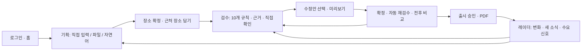

# TourLint 심사위원 체험 가이드 · 해시태그 연계 핵심 기능별 흐름도

2026-09-18 개편. 서비스: https://tourlint-web.up.railway.app

테스트 계정은 **openapi@tourlint.kr**입니다. 비밀번호는 제출 서류의 테스트 계정 항목을 사용하세요. 기존 예시는 보존하고 새 상품명에 `[실습-본인이니셜-A]`처럼 표시하세요. 화면의 이동시간·후보·점수는 실제 조회 결과에 따라 달라집니다. **고정 점수 맞추기보다 발견 → 근거 → 수정 → 재검수의 변화를 확인하는 실습**입니다.

## 1. 전체 흐름과 해시태그



| 해시태그 | 직접 체험할 흐름 | 시나리오 |
|---|---|---|
| #데이터기반상품기획 | 세 가지 입력 → 후보 비교 → 공사 장소 확정 → 장소 담기 | A, B, E |
| #여행상품사전검수 | 운영정보·일정·이동·날씨·구성 검수 → 근거와 직접 확인 | A, C, D, F |
| #출시준비도점수 | 감점 사유 → 보완 → 재검수와 전후 비교 | A, C, F |
| #수정안자동제시 | 수정안 선택 → 충돌 확인 → 미리보기 → 사용자 확정 | A, C |
| #실시간관광데이터검증 | 출시 → 변경/새 소식 → 근거 → 재검수·다음 기획 | G |

권장 순서: A(핵심 흐름, 약 15분) → B~H(기능별 확장). 시간은 사용자 입력과 외부 조회에 따라 달라집니다. 모든 기능을 한 상품에서 발동시키려 하면 원인을 구분하기 어려우므로 별도 상품으로 진행합니다.

## 2. A — 시간 겹침과 이동 부족을 해결하고 출시하기

**입력:** 새 상품 기획 → 자연어 붙여넣기. 상품명 `[실습-이니셜-A] 강릉 시간과 이동`, 강원특별자치도 > 강릉시, 출발 2026-11-12, 당일, 시니어, 12명, 역사문화, 자가용.

```text
당일 강릉 여행
1일차 10:00~11:30 강릉 경포대 관광
1일차 11:00~12:30 강릉 오죽헌·시립박물관 관광
1일차 14:00~15:00 가람집옹심이 점심 식사
```

1. **일정으로 바꾸기** → 3개 항목과 시각·유형 확인 → **직접 입력에서 편집**. 의도적으로 앞 두 일정이 30분 겹칩니다. 점심을 14시로 두어 첫 수정 뒤에도 여유를 확보합니다.
2. 자연어 행의 **기준** 체크를 눌러 후보가 나오면 주소와 이름을 확인하고 선택합니다. 텍스트만 있는 장소는 실제 좌표가 연결되어야 주변 장소의 기준으로 쓸 수 있습니다. 잘못된 후보라면 다시 고릅니다.
3. **저장하고 장소 고르기**. 각 카드의 방문 시각, 이용·영업시간, 쉬는 날, 접힌 요금·주차를 읽습니다. 카드 사이의 “앞 장소에서 차로 약 N분”은 이동 예상값입니다. 장소별 정보가 없다고 정상 영업으로 간주하지 않습니다.
4. **검수 시작 → 검수 시작**. 완료 후 검수 결과로 이동합니다. 결과가 아직 없을 때에만 **검수 실행**을 누릅니다. 이미 실행 중이면 중복으로 누르지 않습니다.
5. **오류 필터**에서 `일정 시간 겹침`과 `이동 시간`을 모두 확인합니다. 겹침 30분, 이동 5분이라면 총 35분을 더 확보해야 합니다. 실제 조회가 6분이면 36분입니다. 두 항목은 별도로 집계합니다.
6. **판단 근거 보기**로 시각·부족분·제공자를 읽습니다. 일정 겹침은 일정표로 판단하고, 이동은 카카오모빌리티의 참고 정보입니다. 현재 시각 기준이라는 표시가 있으면 미래 교통 예측과 구분하세요.
7. 시간 겹침 카드의 **뒤 일정을 미루는 안**을 한 개 선택 → **미리보기**. 일반적으로 오죽헌 12:00–13:30 안이 나옵니다. 정확한 시각은 조회된 이동시간에 따릅니다. 경포대 종료와 오죽헌 시작 사이 간격을 확인하세요. 같은 대상의 이동 카드에서도 같은 수정안을 중복 선택하면 충돌할 수 있으므로 하나만 선택합니다.
8. **확정하고 재검수** → 겹침과 해당 구간 이동 부족이 해소됐는지 확인합니다. 다른 문제까지 모두 해결됐다는 뜻은 아닙니다. 뒤 일정과 충돌 경고가 나오면 확정하지 말고 **일정 편집**에서 오죽헌 12:00–13:30, 점심 14:00–15:00 등 실제 소요시간에 맞춰 조정합니다.
9. **전후 비교**에서 준비도·오류 수·일정·이동 지표를 봅니다. **되돌리기**를 체험하려면 확인창에서 되돌리고 **지금 재검수**로 현재 일정을 다시 확인하세요. 현재 알려진 제한: 되돌린 직후 새로고침하면 직전 반영 결과가 다시 보일 수 있어 재검수 후 확인합니다(이슈 #551).
10. 남은 상품 구성 주의가 있다면 근거에 나온 분류를 장소 담기에서 찾아 일정에 추가하거나 콘셉트를 실제 상품 의도에 맞게 수정합니다. 단순히 점수를 올리기 위해 무시하지 않습니다.
11. **출시 · 리포트** → **리포트 생성** → PDF 미리보기·내려받기. 수정 후에는 재검수하고 리포트를 다시 생성합니다. 출시 가능 표시와 남은 직접 확인 항목을 확인하고 **출시 승인**합니다. 오류·주의가 남아도 차단 등 출시 제한 조건과는 구분됩니다.

**완료 기준:** 장소 3곳 연결, 두 오류의 근거 확인, 이동 여유를 가진 수정안 미리보기·반영, 재검수 전후 비교, PDF와 출시 상태 확인.

## 3. B — 직접 입력·장소 선택·장소 담기의 모든 경로

새 상품 `[실습-이니셜-B] 장소 탐색`, 강릉, 2026-11-12, 1박 2일, 가족(아이 동반), 힐링, 자가용으로 시작합니다.

1. **직접 입력 → + 항목 추가**. 1일차 10:00–11:00, 장소명 `오죽`, 관광. 후보가 여러 개면 주소·종류를 비교해 `강릉 오죽헌·시립박물관`을 고릅니다. 후보가 정확하지 않으면 더 구체적인 이름으로 검색합니다.
2. 2일차에 `우리 팀 모임 장소` 10:00–11:00, 자유를 추가합니다. 검색 결과가 없으면 저장 뒤 **직접 정한 곳으로 두기**를 사용합니다. 운영정보가 표시되지 않고 검수 범위가 다르다는 안내를 확인합니다.
3. AI 후보를 별도로 보려면 불완전한 장소명을 남기고 **AI로 한 번에 찾기**를 실행합니다. 추천 이유·대안 → **이곳으로 선택**을 눌러야 확정되는지 확인하세요. 자동으로 확정됐으면 더 모호한 이름의 새 행으로 체험합니다. AI가 정답을 찾지 못하면 직접 검색하거나 직접 정한 곳으로 둡니다.
4. 기준 장소 선택 → 근처 **식당 / 카페 / 숙소** 각각 열기 → **자세히**에서 운영정보 확인. 새 상품 입력 화면의 기준 체크와 저장된 기획 화면의 **넣을 위치: 오죽헌 다음**은 서로 다른 선택 UI입니다.
5. 관광 분류를 선택하고 **휠체어 가능 / 반려동물 동반 / 실내만**을 하나씩 적용·해제합니다. 제공된 정보에 따라 결과가 줄거나 0건일 수 있습니다. 0건을 오류로 보지 않습니다.
6. 가능한 분류에서 **함께 많이 가는 순**과 집계 기간을 확인합니다. 식당·카페·숙소는 가까운 순으로 확인합니다.
7. 넣을 일차를 2일차, 위치를 지정하고 **일정에 넣기**. 날짜·시각·유형과 자동 저장 표시를 확인합니다. 숙소는 체크인 시각과 종료시간 처리도 확인합니다.
8. **걷기 길**의 거리·소요시간·난이도를 읽고 하나를 추가합니다. 걷기 길은 공사 개별 장소와 같은 검수 대상이 아니라 **직접 정한 곳**으로 들어갑니다.
9. **일정 편집**에서 위로/아래로 순서 변경, 종료시간 비우기, 행 삭제, 이름·출발일·인원 수정 후 저장합니다. 종료시간을 비운 관광 항목은 검수에서 기본 체류시간을 보완하며 근거에 그 사실이 표시됩니다. 지역·박수는 저장 후 변경할 수 없으므로 새 상품을 만드세요.

**완료 기준:** 사용자 선택·AI 후보·직접 정한 곳 구분, 기준 연결, 근처 탐색, 세 조건 필터, 일차/위치 지정 추가와 편집.

## 4. C — 휴무·행사 기간·출시 차단과 대체안

새 상품 `[실습-이니셜-C] 문 여는 날 확인`, 강릉, **2026-11-17(화)**, 1박 2일, 자가용. 자연어 또는 직접 입력:

```text
강릉 1박 2일 여행
1일차 10:00~11:00 강릉 경포대 관광
1일차 12:00~13:00 가람집옹심이 식사
1일차 15:00~16:00 강릉 경포벚꽃축제 관광
2일차 10:00~11:30 강릉 오죽헌·시립박물관 관광
2일차 14:00~15:00 갈골한과체험전시관 관광
```

장소 후보에서 정확한 장소·행사를 선택한 뒤 검수합니다. 가람집옹심이가 현재 정보에도 화요일 휴무면 **쉬는 날 차단**, 선택한 경포벚꽃축제의 제공 행사 기간이 방문일과 다르면 **행사 기간 차단**을 확인합니다. 공사 정보가 바뀌거나 해당 행사가 검색되지 않으면 준비된 `강릉 감성 1박 2일` 예시에서 근거를 읽고, 직접 실습은 현재 후보 중 여행 날짜와 다른 기간의 행사로 대체합니다.

1. **차단 필터** → 판단 근거 → 휴무 요일/방문일, 행사 시작·종료일 비교. 차단 카드에 무시로 우회하는 기능이 없는지, 출시 승인이 막히는지 확인합니다.
2. 휴무 식당은 다른 일차로 이동하거나 대체 장소 수정안을 살펴봅니다. 행사에는 제거·대체 등 현재 제시되는 안을 확인합니다. 후보가 없으면 일정 편집으로 직접 수정합니다.
3. 수정안을 하나씩 미리 보고 다른 일정과 겹치지 않는지 확인 → 확정·재검수. 준비도뿐 아니라 **차단 0건**과 출시 조건을 확인합니다.
4. 운영시간도 시험하려면 오죽헌 방문을 20:00–21:00으로 바꿔 검수한 뒤 낮 시간으로 복원합니다. 현재 제공 운영시간과 비교해 판정하며 해석 불가면 직접 확인으로 안내합니다.

**완료 기준:** 휴무/시간/행사 근거 구분, 출시 차단, 다른 일차 이동·대체·제거와 재검수.

## 5. D — 모르는 정보·대중교통·전화 질문·무시

상품 C를 직접 편집하거나 별도 `[실습-이니셜-D] 직접 확인`을 만듭니다. 대중교통으로 바꿔 확정 장소 두 곳을 10:00–11:00, 12:00–13:00에 배치하고 검수하세요.

1. **확인 불가 필터**에서 구간별 대중교통 소요시간을 직접 확인하라는 안내를 확인합니다. 자동차 이동시간을 대중교통 시간으로 대신 사용하지 않습니다.
2. **직접 확인할 곳**에서 항목과 방문 날짜·시간 확인 → **물어볼 내용 만들기** → 질문 읽기 → **질문 복사**. 갈골한과체험전시관처럼 운영정보 해석이 필요한 곳은 기존 강릉 감성 예시에도 준비돼 있습니다. 현재 정보가 명확해졌다면 해당 항목이 없을 수 있습니다.
3. 실제 운영기관 확인 전에는 **확인했어요**를 누르지 않습니다. 이 버튼은 확인 상태 기록이며 준비도 점수나 원래 판정을 지우는 기능이 아닙니다.
4. 무시 흐름은 본인 실습 상품의 오류·주의 카드에서 확인합니다. **무시 → 사유 선택 → 취소**로 우선 확인하고, 실제 근거가 있을 때만 처리합니다. 처리 후 **무시한 항목** 필터에서 사유와 표시를 확인합니다. 차단은 무시할 수 없습니다.
5. 직접 정한 곳이나 좌표 없는 장소를 사이에 넣으면 그 구간 이동시간도 확인할 수 없음을 확인합니다. 이를 정상 이동으로 해석하지 않습니다.

**완료 기준:** 정보 없음과 정상 구분, 항목/구간 단위 확인, 질문 생성·복사, 확인과 무시의 차이 이해.

## 6. E — CSV·엑셀과 입력 오류, 기본 체류시간

새 상품 `[실습-이니셜-E] 파일 일정`, 강릉, 2026-11-12, 당일. **엑셀·CSV 업로드 → 지정 양식 내려받기**. 아래 내용을 UTF-8 CSV로 저장하거나 양식에 입력합니다. 같은 파일은 [확장 실습 CSV](강릉_확장실습.csv)로 제공합니다.

```csv
일차,시작시간,종료시간,장소명,유형
1,10:00,11:30,강릉 경포대,관광
1,11:00,12:30,강릉 오죽헌·시립박물관,관광
1,14:00,15:00,가람집옹심이,식사
```

1. 파일 선택 → 변환된 3행의 일차·시각·유형 확인 → 직접 입력에서 확인·편집 → 장소 확정 → 저장·검수. A와 동일한 입력이 같은 시간 겹침을 만드는지 확인합니다.
2. 오류용 사본에서 일차를 `4`, 시간을 `25:00`, 유형을 `잘못된유형`으로 각각 바꿔 업로드하고 행/열 오류 안내를 확인합니다. 원본을 다시 올려 복구합니다.
3. 새 행의 종료시간만 비우고 저장 → 검수 근거에서 기본 체류시간 적용 여부를 확인합니다. 입력하지 않은 종료시간을 확정된 사실과 구분합니다.
4. `.xlsx` 양식도 같은 값으로 저장해 같은 흐름을 체험합니다. 파일 확장자만 `.xlsx`로 바꾸면 엑셀 파일이 되지 않습니다.

**완료 기준:** 파일 파싱 → 편집 → 매칭 → 검수, 잘못된 입력 거부, 종료시간 보완.

## 7. F — 식사·휴식·콘텐츠 편중·상품 구성·날씨

`[실습-이니셜-F] 일정 균형`, 강릉, 2026-11-12, 당일, 시니어·역사문화, 자가용.

```text
당일 강릉 여행
1일차 09:00~10:30 강릉 경포대 관광
1일차 11:00~12:30 강릉 선교장 관광
1일차 14:00~15:30 강릉 굴산사지 관광
1일차 16:00~17:30 강릉 오죽헌·시립박물관 관광
```

1. 장소를 실제 콘텐츠로 확정하고 검수합니다. 09:00–17:30에 식사·휴식이 없어 **식사·쉬는 시간** 주의를 확인합니다. 빈 구간에 식사를 넣거나 직접 편집으로 확보합니다.
2. 식사 12:40–13:10(30분)을 넣어 재검수 → 현재 회사 기준보다 짧다는 안내 확인 → 12:40–13:40 등 충분한 길이로 수정합니다. 이동시간도 다시 봅니다.
3. **검수 기준 → 회사 기준**에서 현재 값을 기록합니다. 본인 계정에서 최소 식사 90분처럼 더 엄격하게 저장한 뒤 재검수하면 적용 기준이 달라지는지 확인합니다. 실습 후 원래 값으로 복원하고 재검수합니다. 공용 계정은 다른 심사위원에게 영향을 주므로 기준표 읽기만 권장합니다. 표준보다 느슨한 값은 거부됩니다.
4. **비슷한 곳 반복**은 유형·소분류와 일차/전체 비율을 기준으로 판단합니다. 기준표에서 임계치를 읽고, 관광 항목 네 개 이상을 같은 콘텐츠 유형의 서로 다른 장소로 채워 편중을 체험합니다. 이름이 비슷하다는 이유만으로 발동하는 기능은 아닙니다. 식사·숙박·휴식 등은 이 집계에서 제외됩니다.
5. **상품 구성**에서 선택한 타깃·콘셉트의 부족한 중분류를 읽습니다. 근거에 나온 분류를 장소 담기에서 찾아 추가하거나 실제 상품 목적에 맞게 콘셉트를 수정 → 재검수합니다. 분류를 모두 채우면 주의가 없는 것이 정상입니다.
6. 날씨는 출발일이 예보 제공 범위인지에 따라 예보 또는 평년 관측자료 등 근거가 다릅니다. **제주 우천 리스크 검증 1박 2일** 예시의 날씨 근거와 실내·야외 구성을 비교하세요. 본인 상품의 날짜를 바꿔 재검수해 근거 종류를 읽고, 조건이 맞으면 제안되는 실내 대체/추가/순서 변경을 미리 봅니다. 비가 오지 않거나 기준에 해당하지 않으면 우천 경고가 없어야 하며, 특정 경고를 억지로 만들어내지 않습니다.

**완료 기준:** 일정 균형, 회사 기준, 관광 구성의 정량 조건, 날씨 근거의 차이.

## 8. G — 출시 후 레이더와 다음 상품 기획

1. A의 출시 상품 → **레이더**. 관심 키워드 `역사`, 관심 지역 `강원특별자치도 > 강릉시`, 기준 월 `2026-11`을 추가합니다. 이미 있으면 중복 추가하지 않습니다.
2. **근거 보기**에서 집계 기간, 지난해 같은 달 방문자 등 관측값의 기준을 읽습니다. 방문자 수는 예약/판매량이나 미래 수요 예측이 아닙니다.
3. **수요 신호**에서 본인 상품 선택 → 상품 지역·기간에 맞는 행사/신규 정보 확인. **오늘 할 일 보기**로 우선 확인할 상품과 다음 행동을 확인합니다.
4. **이 지역으로 새 상품 기획** → 지역·월이 전달된 새 상품 화면 → `[실습-이니셜-G] 레이더에서 시작`으로 저장합니다. 월 정보와 실제 출발일을 다시 확인합니다.
5. **바뀐 정보 / 새 소식**에서 알림이 있을 때 상세·변경 근거 → 해당 상품 재검수 또는 새 기획 → 읽음/무시를 체험합니다. 새 소식에 일정 반영 제안이 있으면 기간·지역·추가 위치를 확인하고 미리 봅니다.
6. 알림 0건이면 현재 변경이 없거나 다음 집계 전인 상태일 수 있습니다. 기존 데이터와 미래의 변경을 인위적으로 조작해서 알림을 만들지 않습니다. R06 바뀐 정보는 실제 변경 이력이 필요하므로 이 부분은 **조건부 실습**입니다.
7. 본인이 추가한 관심 조건의 삭제/수정 UI를 확인합니다. 공용 계정에 미리 준비된 관심 조건은 유지합니다.

**완료 기준:** 관측 근거 읽기, 관심 조건, 오늘 할 일, 상품 신호 조회, 레이더→기획 연결, 알림이 있는 경우의 후속 처리.

## 9. H — 회원가입·업무 목록·검색·삭제

- **이메일 인증:** 별도 개인 계정으로 가입하려면 이메일·비밀번호 입력 → 인증코드 발송 → 받은 코드 입력 → 가입 완료 → 로그인. 테스트 계정은 기존 계정이므로 매번 가입 인증을 하지 않습니다. 잘못된 코드/만료 코드/재전송 안내도 확인합니다. 실제 코드는 문서나 캡처에 남기지 않습니다.
- **홈:** 단계별 상품 수와 이어서 할 일 확인. **기획:** 작성 중인 상품에서 **기획 이어하기**. **검수:** 본인 상품의 **검수 결과 보기** 버튼으로 진입합니다.
- 보드/목록 전환 → 상품명·지역 검색 → 단계 필터 → 출발일/준비도/최근 검수 정렬. 과거 상품은 접힌 영역도 확인합니다.
- **삭제:** 본인이 만든 빈 테스트 상품을 별도로 만들어 카드/목록의 **삭제** → 상품명과 함께 삭제되는 데이터 확인 → 취소. 실제 삭제 실습을 원하면 이 빈 테스트 상품만 삭제하고 검색에서 사라지는지 확인합니다. 기존 예시나 다른 심사위원 상품은 삭제하지 않습니다.
- 계정 메뉴에서 로그아웃 → 다시 로그인 후 저장한 상품 확인. 사용량·데모 배지는 표시하지 않습니다.

## 10. 기능 누락 확인표

| 확인할 기능 | 실습 | 완료 판단 |
|---|---|---|
| 자연어/직접/CSV·엑셀 | A/B/E | 입력값 보존과 장소 연결 |
| 장소 후보·AI 제안·직접 정한 곳 | B/D | 사용자가 확정하고 검수 범위 구분 |
| 근처·필터·순위·걷기 길 | B | 조건과 삽입 일차/위치 확인 |
| R01 휴무/운영·R02 행사 | C | 원인과 출시 차단 확인 |
| R03 겹침·R08 이동 | A | 두 오류 확인 후 실제 여유 확보 |
| R04 편중·R07 식사·R10 구성 | F | 기준·유형·설정에 맞는 결과 |
| R05 확인 불가·R09 날씨 | D/F | 모르는 것을 정상으로 오인하지 않음 |
| R06 바뀐 정보 | G(실제 변경 시) | 변경 근거→후속 검수 |
| 근거·필터·무시·직접 확인·질문 | C/D | 판정/사유/확인 기록 구분 |
| 수정안·충돌·전후 비교·되돌리기 | A/C | 미리보기 전에는 미반영 |
| 점수·출시·PDF | A | 최신 일정과 결과로 문서 생성 |
| 레이더·관심 조건·수요·오늘 할 일 | G | 근거와 기획/검수 연결 |
| 인증·검색·정렬·삭제 | H | 본인 데이터로 실행 |

## 11. 실제 화면과 검증 범위

기존 운영 실측 캡처는 아래에 보존합니다. 예전 캡처의 점수·문구·배치는 현재 버전과 다를 수 있습니다. 기존 “겹침만 먼저 고치면 이동 오류가 새로 생긴다” 설명은 개편 전 기록이며, 현재는 겹친 상태에서도 이동 부족을 알리고 수정안에 조회된 이동시간을 반영합니다.

- [이전 실측 기록과 전체 캡처](2026-09-18_이전실측기록.md)
- [시간·이동 새 검증 기록](검증기록_554.md)
- [기획](https://tourlint-web.up.railway.app/planning) · [검수](https://tourlint-web.up.railway.app/review) · [레이더](https://tourlint-web.up.railway.app/radar) · [검수 기준](https://tourlint-web.up.railway.app/standard)

기존 예시: `/products/22` 출시된 역사·힐링, `/products/23` 경계, `/products/24` 휴무·행사·직접 확인, `/products/25` 실패 격리, `/products/26` 제주 우천, `/products/30/plan` 장소 담기, `/products/31` 시간 충돌 해결, `/products/32/plan` 장소 확인. 공용 계정의 실습에 따라 상태가 바뀔 수 있으므로 고정 점수를 정답으로 삼지 않습니다.
