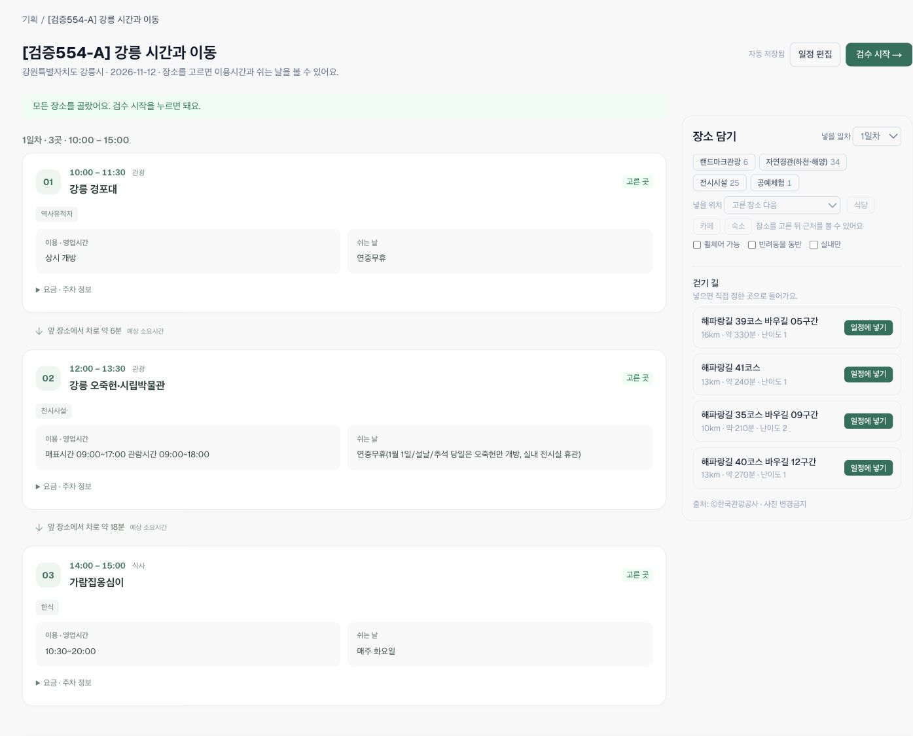
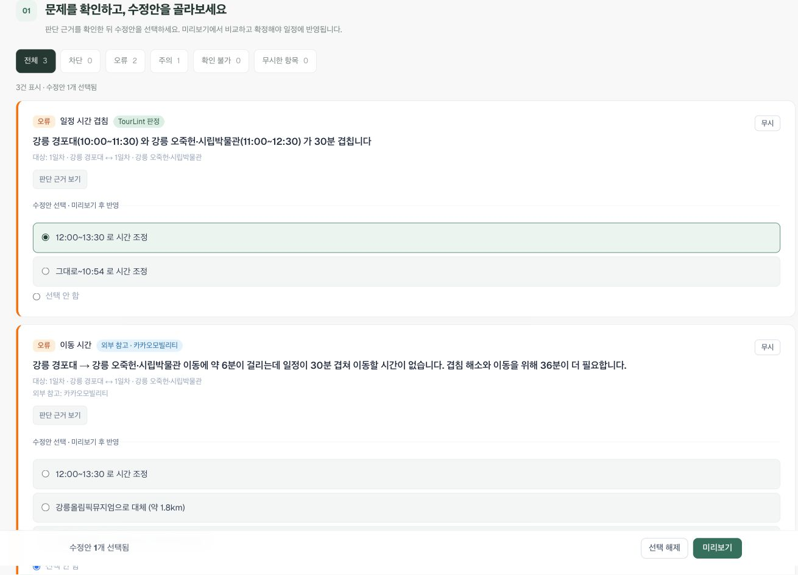
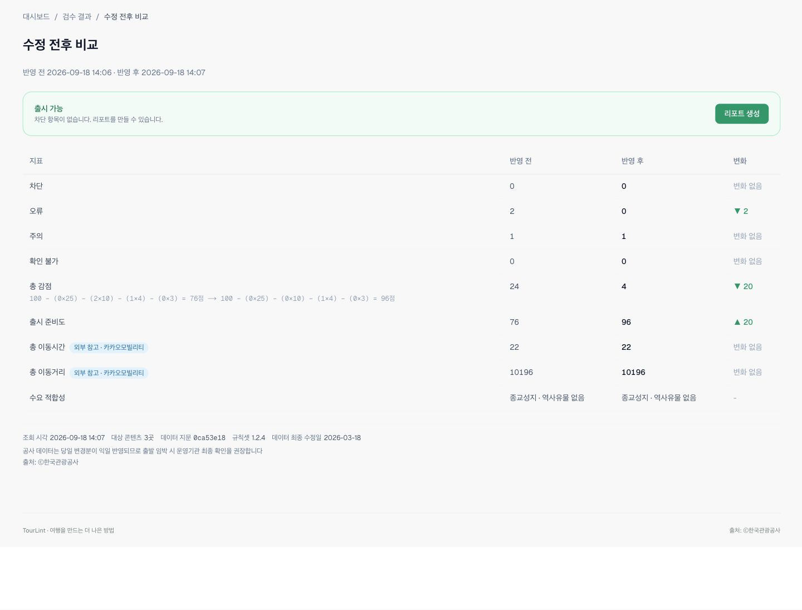

# 기획 정보·이동 검수 검증 기록

2026-09-18, #554.

- 전체 build/lint/typecheck/test 통과. API 1,771개, web 113개, shared 42개 통과, 환경 조건이 필요한 API 17개 skip.
- 변경 로직 9개 회귀 테스트. 음수 간격 건너뛰기 복원, 수정안 이동시간 무시, 러너의 이동시간 전달 제거 세 변이에서 실패 확인.
- 독립 로컬 DB와 KTO/Kakao/KMA 픽스처: 경포대 10:00–11:30 → 오죽헌 11:00–12:30 → 점심 14:00–15:00. 화면에서 겹침 30분과 이동 6분/부족 36분 확인. 뒤로 미루는 수정안 선택 → 미리보기 12:00–13:30 → 확정·자동 재검수 후 두 오류 0건 확인(77→97점; 분류 없는 로컬 입력의 날씨 확인 불가 1건 유지).
- 391px 모바일에서 카드가 한 열로 바뀌고 가로 넘침 없음(clientWidth=scrollWidth=371). 긴 운영시간·휴무일 원문을 잘라내지 않음.
- 로컬 테스트는 외부 AI 키가 없어 자연어 변환을 수행하지 못함. 브라우저 자동화의 파일 선택은 연결 오류로 완료하지 못함. CSV/API 파싱은 자동 테스트와 별도 서버 요청으로 검증하며 브라우저 업로드 완료로 표기하지 않음.

## 운영 배포 및 직접 재현

- release PR #556, main `311ca35`. Railway API `57968025-1246-42b5-b234-5f3343507d13`, web `b1de8e71-3f0a-48ae-98a4-525d637aae46` 모두 SUCCESS. API health ready=true, live, commit=311ca35.
- 새 검증 상품 34를 만들고 가이드 A의 자연어 예문을 3행으로 변환. 각 행의 기준 체크 → 실제 후보 → 장소 확정 → 저장을 브라우저에서 확인. 기존 상품 33과 심사 예시를 변경하지 않음.
- 규칙셋 1.2.4에서 R03 겹침 30분 + R08 이동 6분/부족 36분, 오류 2·주의 1, 준비도 76점 확인.
- R03의 12:00–13:30 이동안을 선택 → 미리보기 → 확정하고 재검수. 오류 0·주의 1, 준비도 96점. 전후 비교에서도 오류 2→0, 준비도 76→96 확인.
- 운영 기획 카드의 이용시간/휴무일 구분, 요금 펼치기, 구간 이동 표시 확인. 캡처에는 계정 메뉴를 제외함.
- 확장 CSV는 별도 로컬 API multipart 요청으로 201, 3행, errors=[] 확인. 브라우저 파일 선택 완료와 구분함.
- 노션 지정 페이지에 A–H 실습과 해시태그별 확인표, 최신 자료 링크를 반영함. 과거 실측 캡처는 과거 결과로 표시해 보존함.

