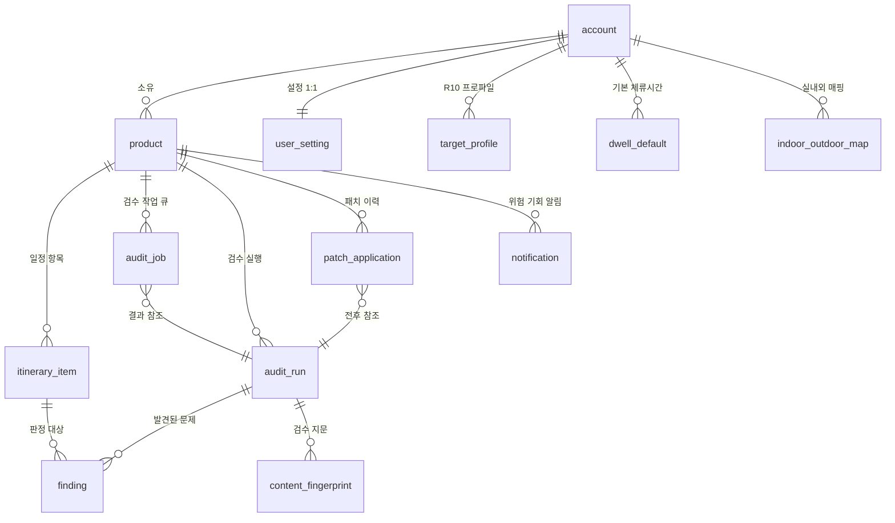

<callout icon="🗄" color="blue_bg">
	# TourLint DB 명세서
	**PostgreSQL 물리 스키마 정의서 — 테이블 19종 · 제약 · 인덱스 · 실행 가능한 DDL**
	본 문서는 `서비스 기획서`와 `통합 요구사항 명세서`(서비스 범위 · 용어 정의 · 기능 · 화면 · 권한 · 데이터 · 비기능 · 외부 연동 · 예외처리)만을 근거로 작성되었습니다.
</callout>
<table fit-page-width="true" header-row="true">
<tr>
<td>문서</td>
<td>DB 명세서 v1.9</td>
</tr>
<tr>
<td>작성일</td>
<td>2026.08.27</td>
</tr>
<tr>
<td>DBMS</td>
<td>PostgreSQL (관리형 · 클라우드 프리티어) · 정규화 결과는 `JSONB`</td>
</tr>
<tr>
<td>선행 문서</td>
<td>서비스 기획서 6장·11-2장 / 데이터 요구사항 (DR) / 권한 요구사항 (PM) / 예외처리 요구사항 (EX) / 비기능 요구사항 (NF)</td>
</tr>
<tr color="red_bg">
<td>최상위 제약</td>
<td>**관광지 원문을 담는 테이블·컬럼은 존재하지 않는다** (DR-PR-001 · FR-MO-002 · NF-CO-011)</td>
</tr>
</table>
<table_of_contents/>
---
# 1. 설계 원칙
## 1-1. 저장 경계 3분류
모든 컬럼은 아래 세 분류 중 하나에 속해야 하며, 신규 컬럼 추가 시 이 표로 먼저 판정합니다.
<table fit-page-width="true" header-row="true">
<tr>
<td>분류</td>
<td>정의</td>
<td>예시</td>
<td>저장</td>
</tr>
<tr color="red_bg">
<td>공사 원문</td>
<td>공사가 만들고 관리하는 텍스트·이미지</td>
<td>`restdate` 문장, `overview`, `title`, `addr1`, 이미지 바이너리</td>
<td>❌ 금지</td>
</tr>
<tr>
<td>공사 메타값</td>
<td>식별자·상태 원자값 (문장이 아님)</td>
<td>`contentid` `contentTypeId` `modifiedtime` `createdtime` `showflag` `lDongRegnCd` `lclsSystm1/2/3` `mapx` `mapy`</td>
<td>✅ 허용 (사용처 있는 범위만)</td>
</tr>
<tr color="green_bg">
<td>자체 산출물</td>
<td>TourLint가 만든 데이터</td>
<td>상품·일정·검수 실행·finding·정규화 결과·지문 해시·설정·로그</td>
<td>✅ 저장</td>
</tr>
</table>
<callout icon="🔒" color="green_bg">
	**스키마 자체가 설계 원칙의 증거입니다.**
	관광지명·주소·개요·설명·이미지 URL을 담는 컬럼이 전체 17개 테이블에 단 하나도 존재하지 않습니다.
	`itinerary_item.place_label`은 **사용자가 직접 입력한 장소명**이며 공사 원문이 아닙니다.
	비표출(`show_flag = 0`) 콘텐츠는 명칭·주소·이미지가 화면·API 응답·PDF 어디에도 노출되지 않습니다 (PM-NG-009).
</callout>
## 1-2. 공통 규칙
<table fit-page-width="true" header-row="true">
<tr>
<td>항목</td>
<td>규칙</td>
<td>근거</td>
</tr>
<tr>
<td>기본키</td>
<td>모든 테이블 `id BIGSERIAL PRIMARY KEY`</td>
<td>DR-MD 공통</td>
</tr>
<tr>
<td>생성 시각</td>
<td>모든 테이블 `created_at timestamptz NOT NULL DEFAULT now()`</td>
<td>DR-MD 공통</td>
</tr>
<tr>
<td>시각 타입</td>
<td>모든 시각 컬럼 `timestamptz`. 표시는 KST(Asia/Seoul) 기준</td>
<td>DR-PR-008</td>
</tr>
<tr color="yellow_bg">
<td>`modifiedtime` 예외</td>
<td>`content_fingerprint.kto_modified_time`은 **비교 목적이므로 원본 ****`YYYYMMDDHHmmss`**** 문자열을 ****`text`****로 보관**</td>
<td>DR-PR-008</td>
</tr>
<tr>
<td>열거값</td>
<td>DB `enum` 타입 미사용. `text`  • `CHECK` 제약으로 표현 (값 추가 시 마이그레이션 부담 최소화)</td>
<td>NF-DP-009</td>
</tr>
<tr>
<td>개인정보</td>
<td>이메일 1종만 저장. 이름·연락처·소속·위치 컬럼 0건</td>
<td>DR-PR-006 · PM-AC-009</td>
</tr>
<tr>
<td>비밀번호</td>
<td>적응형 해시(bcrypt 등) 단방향 저장. 단순 SHA 계열 단독 금지</td>
<td>DR-PR-007 · NF-SC-003</td>
</tr>
<tr>
<td>삭제</td>
<td>물리 삭제. 소프트 삭제 미도입. 종속 데이터는 `ON DELETE CASCADE`</td>
<td>DR-LC-002</td>
</tr>
<tr>
<td>외래키</td>
<td>`kto_content_id`에는 **외래키를 걸지 않음** (공사 콘텐츠 테이블이 없으므로 참조 무결성 대상 아님)</td>
<td>DR-IN-001</td>
</tr>
<tr>
<td>스키마 변경</td>
<td>마이그레이션 스크립트로 관리. 정식 배포(2026.08.28) 이후 컬럼 삭제·타입 변경 금지</td>
<td>NF-DP-009</td>
</tr>
</table>
---
# 2. 엔터티 관계도
## 2-1. 관계 구조

## 2-2. 계층 요약
```plain text
account 1 ──< product 1 ──< itinerary_item
                  │              └──< (kto_content_id 참조, FK 아님)
                  ├──< audit_job              검수 작업 큐
                  ├──< audit_run 1 ──< finding
                  │         └──< content_fingerprint
                  ├──< patch_application      (before/after audit_run 참조)
                  └──< notification           위험 · 기회 알림

account 1 ──< user_setting 1
          ├──< target_profile        R10 기대 프로파일
          ├──< dwell_default         중분류별 기본 체류시간
          └──< indoor_outdoor_map    중분류별 실내 · 야외

전역 기준 데이터 (계정 무관)
  lcls_systm_code     분류체계 대 · 중 · 소 (배포 시 1회 수집)
  climate_normal      평년 강수일수 (지역 x 월)
  api_call_log        외부 호출 로그
  batch_state         last_covered 등 배치 상태
  system_setting      배치 시각 · 활성화 · 일일 호출 예산 (전역 1행)
```
## 2-3. 엔터티 목록 19종
<table fit-page-width="true" header-row="true">
<tr>
<td>#</td>
<td>테이블</td>
<td>성격</td>
<td>주 소비 기능</td>
<td>불변</td>
</tr>
<tr>
<td>1</td>
<td>`account`</td>
<td>계정</td>
<td>PM-AC · FR-CM-001–004</td>
<td>–</td>
</tr>
<tr>
<td>2</td>
<td>`product`</td>
<td>상품</td>
<td>F01 · F13</td>
<td>–</td>
</tr>
<tr>
<td>3</td>
<td>`itinerary_item`</td>
<td>일정 항목</td>
<td>F01 · F02 · 전 규칙</td>
<td>–</td>
</tr>
<tr>
<td>4</td>
<td>`audit_job`</td>
<td>검수 작업 큐</td>
<td>F04 비동기 실행</td>
<td>–</td>
</tr>
<tr color="gray_bg">
<td>5</td>
<td>`audit_run`</td>
<td>검수 실행</td>
<td>F04 · F05 · F10</td>
<td>✅</td>
</tr>
<tr color="gray_bg">
<td>6</td>
<td>`finding`</td>
<td>발견된 문제</td>
<td>F05–F08</td>
<td>✅ (무시·확인 플래그만 예외)</td>
</tr>
<tr color="gray_bg">
<td>7</td>
<td>`content_fingerprint`</td>
<td>검수 지문</td>
<td>F12 · R06</td>
<td>✅</td>
</tr>
<tr color="gray_bg">
<td>8</td>
<td>`patch_application`</td>
<td>패치 이력</td>
<td>F09 · F10</td>
<td>✅ (되돌리기 시각만 예외)</td>
</tr>
<tr>
<td>9</td>
<td>`notification`</td>
<td>알림</td>
<td>F13 · F14</td>
<td>–</td>
</tr>
<tr>
<td>10</td>
<td>`user_setting`</td>
<td>계정 설정</td>
<td>F16</td>
<td>–</td>
</tr>
<tr>
<td>11</td>
<td>`target_profile`</td>
<td>R10 기대 프로파일</td>
<td>R10</td>
<td>–</td>
</tr>
<tr>
<td>12</td>
<td>`dwell_default`</td>
<td>중분류별 기본 체류시간</td>
<td>FR-IN-011 · R03</td>
<td>–</td>
</tr>
<tr>
<td>13</td>
<td>`indoor_outdoor_map`</td>
<td>중분류별 실내·야외</td>
<td>R09</td>
<td>–</td>
</tr>
<tr>
<td>14</td>
<td>`lcls_systm_code`</td>
<td>분류체계 코드 (전역)</td>
<td>R04·R09·R10·설정 초기값</td>
<td>–</td>
</tr>
<tr>
<td>15</td>
<td>`climate_normal`</td>
<td>평년 강수일수 (전역)</td>
<td>R09</td>
<td>–</td>
</tr>
<tr>
<td>16</td>
<td>`api_call_log`</td>
<td>외부 호출 로그 (전역)</td>
<td>F15 · 공모전 활용 증빙</td>
<td>✅</td>
</tr>
<tr>
<td>17</td>
<td>`batch_state`</td>
<td>배치 상태 (전역)</td>
<td>F12</td>
<td>–</td>
</tr>
<tr>
<td>18</td>
<td>`system_setting`</td>
<td>전역 운영 설정 (전역 1행)</td>
<td>F12 · F15 · F16</td>
<td>–</td>
</tr>
<tr>
<td>19</td>
<td>`demand_signal`</td>
<td>수요 신호 T1 · T2 산출값 (배치)</td>
<td>F14</td>
<td>–</td>
</tr>
</table>
---
# 3. 테이블별 상세 명세
## 3-1. `account` — 계정
계정 단위 단일 사용자 모델입니다. 조직·팀·역할 개념이 없으며 상품은 계정 단위로 격리됩니다 (SC-US-003 · PM-DA-001).
<table fit-page-width="true" header-row="true">
<tr>
<td>컬럼</td>
<td>타입</td>
<td>제약</td>
<td>설명</td>
</tr>
<tr>
<td>`id`</td>
<td>bigserial</td>
<td>PK</td>
<td>계정 식별자</td>
</tr>
<tr>
<td>`email`</td>
<td>text</td>
<td>NOT NULL · UNIQUE</td>
<td>로그인 ID 겸 유일한 개인정보 항목</td>
</tr>
<tr>
<td>`password_hash`</td>
<td>text</td>
<td>NOT NULL</td>
<td>bcrypt 등 적응형 해시. 평문·가역 암호화 금지</td>
</tr>
<tr>
<td>`is_demo`</td>
<td>boolean</td>
<td>NOT NULL DEFAULT false</td>
<td>심사용 테스트 계정 여부. 계정 ID `openapi`</td>
</tr>
<tr>
<td>`created_at`</td>
<td>timestamptz</td>
<td>NOT NULL DEFAULT now()</td>
<td>가입 시각</td>
</tr>
</table>
<callout icon="🚫" color="red_bg">
	**이 테이블에 이름·연락처·소속·프로필 이미지·최근 접속 IP·위치 컬럼을 추가하지 않습니다.** (PM-AC-009 · SC-DT-012 · NF-CO-020)
</callout>
## 3-2. `product` — 관광상품
<table fit-page-width="true" header-row="true">
<tr>
<td>컬럼</td>
<td>타입</td>
<td>제약</td>
<td>설명</td>
</tr>
<tr>
<td>`id`</td>
<td>bigserial</td>
<td>PK</td>
<td>상품 식별자</td>
</tr>
<tr>
<td>`account_id`</td>
<td>bigint</td>
<td>NOT NULL · FK account(id) CASCADE</td>
<td>소유 계정. 모든 조회에서 요청자와 대조 (PM-DA-003)</td>
</tr>
<tr>
<td>`name`</td>
<td>text</td>
<td>NOT NULL</td>
<td>상품명 (사용자 입력)</td>
</tr>
<tr>
<td>`ldong_regn_cd`</td>
<td>text</td>
<td>NOT NULL</td>
<td>법정동 시도 코드. **길이 가정 금지** (세종 `36110` 5자리)</td>
</tr>
<tr>
<td>`ldong_signgu_cd`</td>
<td>text</td>
<td>NULL 허용</td>
<td>법정동 시군구 코드. 단층제 지역은 NULL</td>
</tr>
<tr>
<td>`start_date`</td>
<td>date</td>
<td>NOT NULL</td>
<td>출발일. R01·R02 판정 기준일 · R09 예보/평년 분기는 일자별(start_date + day_no − 1) 기준 (FR-RU-091)</td>
</tr>
<tr>
<td>`nights`</td>
<td>smallint</td>
<td>NOT NULL DEFAULT 0 · CHECK 0–2</td>
<td>박수. 0 = 당일 · 1 = 1박 2일 · 2 = 2박 3일 (SC-PD 범위)</td>
</tr>
<tr>
<td>`target_key`</td>
<td>text</td>
<td>NULL 허용</td>
<td>타깃 고객. R10 기대 프로파일 조회 키</td>
</tr>
<tr>
<td>`concept_key`</td>
<td>text</td>
<td>NULL 허용</td>
<td>상품 콘셉트. R10 조회 키 · R04 편중 예외 판정</td>
</tr>
<tr>
<td>`head_count`</td>
<td>int</td>
<td>NULL 허용</td>
<td>예상 인원</td>
</tr>
<tr>
<td>`transport`</td>
<td>text</td>
<td>NOT NULL · CHECK</td>
<td>`CHARTER_BUS` `CAR` `PUBLIC_TRANSIT`. R08 계산 기준</td>
</tr>
<tr>
<td>`released_at`</td>
<td>timestamptz</td>
<td>NULL 허용</td>
<td>출시 승인 시각. NULL = 미출시. 차단 1건 이상이면 설정 불가 (DR-IN-007)</td>
</tr>
<tr>
<td>`created_at`</td>
<td>timestamptz</td>
<td>NOT NULL DEFAULT now()</td>
<td>등록 시각</td>
</tr>
<tr color="blue_bg">
<td>`updated_at`</td>
<td>timestamptz</td>
<td>NOT NULL DEFAULT now()</td>
<td>**\[보완\]** 마지막 수정 시각 · 자동저장 표시용 (종전 UI-ST-011 참조는 오인용이어서 제거)</td>
</tr>
</table>
## 3-3. `itinerary_item` — 일정 항목
일정 한 줄을 나타내는 핵심 테이블이며 전 규칙의 입력입니다.
<table fit-page-width="true" header-row="true">
<tr>
<td>컬럼</td>
<td>타입</td>
<td>제약</td>
<td>설명</td>
</tr>
<tr>
<td>`id`</td>
<td>bigserial</td>
<td>PK</td>
<td>일정 항목 식별자</td>
</tr>
<tr>
<td>`product_id`</td>
<td>bigint</td>
<td>NOT NULL · FK product(id) CASCADE</td>
<td>소속 상품</td>
</tr>
<tr>
<td>`day_no`</td>
<td>smallint</td>
<td>NOT NULL · CHECK 1 이상</td>
<td>일차. 상한은 `product.nights + 1` (트리거로 강제, DR-IN-003)</td>
</tr>
<tr>
<td>`seq`</td>
<td>smallint</td>
<td>NOT NULL</td>
<td>같은 일차 내 순번. `(product_id, day_no, seq)` UNIQUE</td>
</tr>
<tr>
<td>`start_time`</td>
<td>time</td>
<td>NOT NULL</td>
<td>방문 예정 시작 시각</td>
</tr>
<tr>
<td>`end_time`</td>
<td>time</td>
<td>NULL 허용</td>
<td>종료 시각. NULL이면 기본 체류시간으로 보완</td>
</tr>
<tr>
<td>`end_time_source`</td>
<td>text</td>
<td>NOT NULL · CHECK</td>
<td>`INPUT` 사용자 입력 · `DWELL_DEFAULT` 중분류 매핑 적용 · `DWELL_FALLBACK` 미매핑 90분 적용</td>
</tr>
<tr color="green_bg">
<td>`place_label`</td>
<td>text</td>
<td>NOT NULL</td>
<td>**사용자가 입력한 장소명. 공사 원문이 아님** (무저장 원칙 준수)</td>
</tr>
<tr>
<td>`item_type`</td>
<td>text</td>
<td>NOT NULL · CHECK</td>
<td>`SIGHT` 관광 · `MEAL` 식사 · `LODGING` 숙박 · `REST` 휴식 · `MOVE` 이동 · `FREE` 자유시간</td>
</tr>
<tr>
<td>`kto_content_id`</td>
<td>text</td>
<td>NULL 허용 · FK 없음</td>
<td>확정된 `contentid`. 재검수·변경 감지·영향 탐색의 **유일한 기준 식별자** (FR-IN-027)</td>
</tr>
<tr>
<td>`content_type_id`</td>
<td>smallint</td>
<td>NULL 허용</td>
<td>공사 콘텐츠 유형. 12·14·15·28·32·38·39</td>
</tr>
<tr>
<td>`lcls_systm1`</td>
<td>text</td>
<td>NULL 허용</td>
<td>신분류체계 대분류 코드</td>
</tr>
<tr>
<td>`lcls_systm2`</td>
<td>text</td>
<td>NULL 허용</td>
<td>중분류 코드. 체류시간·실내외 매핑 조인 키</td>
</tr>
<tr>
<td>`lcls_systm3`</td>
<td>text</td>
<td>NULL 허용</td>
<td>소분류 코드. R04 편중 집계 기준</td>
</tr>
<tr>
<td>`mapx`</td>
<td>numeric(12,8)</td>
<td>NULL 허용</td>
<td>경도 (WGS84). 좌표계 변환 없이 지도 API에 그대로 전달</td>
</tr>
<tr>
<td>`mapy`</td>
<td>numeric(12,8)</td>
<td>NULL 허용</td>
<td>위도 (WGS84)</td>
</tr>
<tr>
<td>`match_status`</td>
<td>text</td>
<td>NOT NULL · CHECK</td>
<td>`CONFIRMED` 확정 · `EXCLUDED` 검수 제외 · `PENDING` 미확정</td>
</tr>
<tr>
<td>`created_at`</td>
<td>timestamptz</td>
<td>NOT NULL DEFAULT now()</td>
<td>–</td>
</tr>
<tr color="blue_bg">
<td>`updated_at`</td>
<td>timestamptz</td>
<td>NOT NULL DEFAULT now()</td>
<td>**\[보완\]** 자동저장 시각 표시용</td>
</tr>
</table>
<callout icon="📍" color="blue_bg">
	**`match_status`**** 상태 전이**
	`PENDING` → (후보 1건 자동 확정 또는 사용자 선택) → `CONFIRMED`
	`PENDING` → (검색 0건 또는 "해당 없음" 선택) → `EXCLUDED`
	`EXCLUDED` 항목은 **삭제하지 않고 유지**하며 전 규칙 판정 대상에서 제외되고 감점 대상도 아닙니다 (FR-IN-025·026).
	상품에 `PENDING`이 1건이라도 남아 있으면 검수 실행이 거부됩니다 (`PLACE_UNRESOLVED`, EX-AU-001).
</callout>
## 3-4. `audit_job` — 검수 작업 큐
검수는 비동기 실행이며, 별도 메시지 브로커 없이 **DB 테이블 + 스케줄러**로 큐를 구현합니다 (NF-CP-012).
<table fit-page-width="true" header-row="true">
<tr>
<td>컬럼</td>
<td>타입</td>
<td>제약</td>
<td>설명</td>
</tr>
<tr>
<td>`id`</td>
<td>bigserial</td>
<td>PK</td>
<td>**작업 ID.** 검수 요청 시 즉시 반환되는 값 (FR-AU-021)</td>
</tr>
<tr>
<td>`product_id`</td>
<td>bigint</td>
<td>NOT NULL · FK product(id) CASCADE</td>
<td>대상 상품</td>
</tr>
<tr>
<td>`status`</td>
<td>text</td>
<td>NOT NULL · CHECK</td>
<td>`QUEUED` `RUNNING` `DONE` `FAILED`</td>
</tr>
<tr>
<td>`trigger_type`</td>
<td>text</td>
<td>NOT NULL · CHECK</td>
<td>`INITIAL` 등록 직후 · `MANUAL` 지금 재검수 · `PATCH` 패치 확정 직후 · `BATCH` 자동 경량 배치 (FR-AU-026)</td>
</tr>
<tr>
<td>`progress_done`</td>
<td>int</td>
<td>NOT NULL DEFAULT 0</td>
<td>조회 완료 콘텐츠 수. "N곳 중 M곳 조회 완료"의 M</td>
</tr>
<tr>
<td>`progress_total`</td>
<td>int</td>
<td>NOT NULL DEFAULT 0</td>
<td>대상 콘텐츠 수. 위 문구의 N</td>
</tr>
<tr>
<td>`audit_run_id`</td>
<td>bigint</td>
<td>NULL 허용 · FK audit_run(id)</td>
<td>완료 시 생성된 검수 실행. **마이그레이션 순서는 ****`audit_run`**** 생성 이후**</td>
</tr>
<tr>
<td>`error_code`</td>
<td>text</td>
<td>NULL 허용</td>
<td>실패 사유 코드 (`AUDIT_TIMEOUT` `KTO_QUOTA_EXCEEDED` 등)</td>
</tr>
<tr>
<td>`created_at`</td>
<td>timestamptz</td>
<td>NOT NULL DEFAULT now()</td>
<td>큐 진입 시각</td>
</tr>
<tr>
<td>`finished_at`</td>
<td>timestamptz</td>
<td>NULL 허용</td>
<td>종료 시각. `created_at` 기준 30분 초과 시 스케줄러가 `FAILED` 확정 (NF-AV-008)</td>
</tr>
</table>
<callout icon="⏱" color="yellow_bg">
	**중복 실행 방지** — 같은 상품에 `QUEUED` 또는 `RUNNING` 작업이 있으면 새 작업을 만들지 않고 **기존 작업 ID를 반환**합니다 (EX-AU-004). 부분 유니크 인덱스로 강제합니다.
	**동시 실행 상한** — 전역 `RUNNING` 작업은 3건까지이며 초과분은 `QUEUED`로 대기합니다 (NF-CP-004).
</callout>
## 3-5. `audit_run` — 검수 실행 (불변)
<table fit-page-width="true" header-row="true">
<tr>
<td>컬럼</td>
<td>타입</td>
<td>제약</td>
<td>설명</td>
</tr>
<tr>
<td>`id`</td>
<td>bigserial</td>
<td>PK</td>
<td>검수 실행 식별자</td>
</tr>
<tr>
<td>`product_id`</td>
<td>bigint</td>
<td>NOT NULL · FK product(id) CASCADE</td>
<td>대상 상품</td>
</tr>
<tr>
<td>`executed_at`</td>
<td>timestamptz</td>
<td>NOT NULL</td>
<td>실행 시각. 검수 근거 영역의 "조회 시각"</td>
</tr>
<tr>
<td>`ruleset_version`</td>
<td>text</td>
<td>NOT NULL</td>
<td>규칙셋 버전 (예 `v1.3.0`). 화면·리포트에 표시</td>
</tr>
<tr>
<td>`readiness_score`</td>
<td>smallint</td>
<td>NULL 허용 · CHECK 0–100</td>
<td>출시 준비도. **`is_partial = true`****이면 반드시 NULL** (DR-IN-005)</td>
</tr>
<tr>
<td>`is_partial`</td>
<td>boolean</td>
<td>NOT NULL DEFAULT false</td>
<td>부분 검수 여부. 실패 콘텐츠 50% 초과 시 true</td>
</tr>
<tr>
<td>`target_count`</td>
<td>smallint</td>
<td>NOT NULL</td>
<td>대상 콘텐츠 수. 점수와 병기 표기 (FR-AU-049)</td>
</tr>
<tr>
<td>`failed_count`</td>
<td>smallint</td>
<td>NOT NULL DEFAULT 0</td>
<td>조회 실패 콘텐츠 수</td>
</tr>
<tr>
<td>`blocker_cnt`</td>
<td>smallint</td>
<td>NOT NULL DEFAULT 0</td>
<td>차단 건수</td>
</tr>
<tr>
<td>`error_cnt`</td>
<td>smallint</td>
<td>NOT NULL DEFAULT 0</td>
<td>오류 건수</td>
</tr>
<tr>
<td>`warn_cnt`</td>
<td>smallint</td>
<td>NOT NULL DEFAULT 0</td>
<td>주의 건수</td>
</tr>
<tr>
<td>`unverified_cnt`</td>
<td>smallint</td>
<td>NOT NULL DEFAULT 0</td>
<td>확인 불가 건수. 점수와 **분리 표기**</td>
</tr>
<tr color="green_bg">
<td>`weight_snapshot`</td>
<td>jsonb</td>
<td>NOT NULL</td>
<td>**산출 시점 가중치 스냅샷.** 설정 변경의 소급 적용을 구조적으로 차단 (DR-CF-006 · PM-NG-004)</td>
</tr>
<tr>
<td>`travel_seconds`</td>
<td>int</td>
<td>NULL 허용</td>
<td>상품 단위 총 이동시간(초). R08 산출값의 합 (FR-RU-084). **조회하지 못한 구간은 빼고 더한 값**이며, 대중교통 상품이나 길찾기 실패 시 0 이다 — 0 과 NULL 이 다르다</td>
</tr>
<tr>
<td>`travel_meters`</td>
<td>int</td>
<td>NULL 허용</td>
<td>상품 단위 총 이동거리(m). 위와 같다</td>
</tr>
<tr>
<td>`created_at`</td>
<td>timestamptz</td>
<td>NOT NULL DEFAULT now()</td>
<td>–</td>
</tr>
</table>
<callout icon="🧮" color="green_bg">
	**출시 준비도 산식** — `readiness_score = max(0, 100 − 차단×25 − 오류×10 − 주의×4 − 확인불가×3)`
	가중치는 `weight_snapshot`에 기록된 값을 사용하며, 무시(`dismissed_at IS NOT NULL`)된 finding은 집계에서 제외합니다. **저장된 ****`readiness_score`**** · 등급 카운트는 실행 시점 값으로 불변이며, 무시 · 무시 해제를 반영한 표시 점수는 화면 · 리포트 조회 시점에 재계산합니다** (FR-AU-046).
	**과거 ****`audit_run`****을 수정하는 경로는 존재하지 않습니다.** UPDATE·DELETE API를 제공하지 않으며, 패치 재검수는 항상 **새로운 ****`audit_run`****을 생성**합니다 (FR-PA-025 · EX-AU-010).
</callout>
<callout icon="🚗" color="blue_bg">
	**총 이동시간 · 거리를 여기 두는 이유** (2026.08.27 신설)
	F10 전후 비교가 이 둘을 대조 지표로 요구하고(FR-PA-040), 그 값의 출처는 R08 산출값의 합입니다(FR-RU-084). 그런데 이동시간은 **외부 호출로만 얻는 값**이라 나중에 다시 계산할 수가 없습니다 — `finding` 에는 부족한 구간만 남고 정상 구간은 남지 않으며, 재계산하면 그때의 교통 상황으로 다른 값이 나옵니다.
	실행 시점에 저장하지 않으면 전후 비교에서 이 두 지표를 영영 보여줄 수 없습니다. `audit_run` 이 불변인 것과 같은 이유로 여기 둡니다.
	**NULL 과 0 을 구분합니다** — NULL 은 「산출하지 않았다」(이 컬럼이 생기기 전 실행), 0 은 「산출했는데 합이 0」(대중교통 상품이라 판정하지 않았거나 전 구간 조회 실패)입니다.
</callout>
## 3-6. `finding` — 발견된 문제
<table fit-page-width="true" header-row="true">
<tr>
<td>컬럼</td>
<td>타입</td>
<td>제약</td>
<td>설명</td>
</tr>
<tr>
<td>`id`</td>
<td>bigserial</td>
<td>PK</td>
<td>–</td>
</tr>
<tr>
<td>`audit_run_id`</td>
<td>bigint</td>
<td>NOT NULL · FK audit_run(id) CASCADE</td>
<td>소속 검수 실행</td>
</tr>
<tr>
<td>`rule_code`</td>
<td>text</td>
<td>NOT NULL · CHECK</td>
<td>`R01`–`R10`. R06-b는 독립 코드가 아니라 `R06` 내부 판정</td>
</tr>
<tr>
<td>`rule_version`</td>
<td>text</td>
<td>NOT NULL</td>
<td>규칙 개별 버전. 판정 재구성용 (NF-MT-008)</td>
</tr>
<tr>
<td>`severity`</td>
<td>text</td>
<td>NOT NULL · CHECK</td>
<td>`BLOCKER` `ERROR` `WARNING` `UNVERIFIED`</td>
</tr>
<tr color="yellow_bg">
<td>`reason_code`</td>
<td>text</td>
<td>NOT NULL</td>
<td>**두 네임스페이스 공존** — 규칙 판정 사유코드 15종 또는 예외 사유코드 38종 (전체 목록: 예외처리 4장). 화면 미노출, 로그·API 응답 전용 (EX-CM-002 · EX-CM-022 · G-015)</td>
</tr>
<tr>
<td>`target_item_id`</td>
<td>bigint</td>
<td>NULL 허용 · FK itinerary_item(id) SET NULL</td>
<td>대상 일정 항목</td>
</tr>
<tr>
<td>`target_item_id2`</td>
<td>bigint</td>
<td>NULL 허용 · FK itinerary_item(id) SET NULL</td>
<td>구간 규칙(R03 중복 · R08 이동)의 두 번째 항목</td>
</tr>
<tr>
<td>`message`</td>
<td>text</td>
<td>NOT NULL</td>
<td>사용자 표시 문구. 원인과 다음 행동 병기 (EX-MS-001)</td>
</tr>
<tr>
<td>`evidence`</td>
<td>jsonb</td>
<td>NOT NULL</td>
<td>판정 입력값. **공사 원문 미포함**, 규칙별 구조 자율 (4-2절)</td>
</tr>
<tr>
<td>`requires_external`</td>
<td>boolean</td>
<td>NOT NULL DEFAULT false</td>
<td>true면 화면에 "외부 참고" 배지 자동 부착. R08·R09만 true</td>
</tr>
<tr>
<td>`external_source`</td>
<td>text</td>
<td>NULL 허용</td>
<td>외부 제공자명 (지도·기상). 공사 판정과 시각 분리 표기용</td>
</tr>
<tr>
<td>`patches`</td>
<td>jsonb</td>
<td>NOT NULL DEFAULT 빈 배열</td>
<td>수정안 배열. **최대 3개** (FR-PA-002). R05는 항상 빈 배열</td>
</tr>
<tr color="red_bg">
<td>`dismissed_at`</td>
<td>timestamptz</td>
<td>NULL 허용 · CHECK</td>
<td>무시 처리 시각. **`severity = BLOCKER`****이면 반드시 NULL** (DR-IN-006 · PM-NG-001)</td>
</tr>
<tr>
<td>`dismiss_reason`</td>
<td>text</td>
<td>NULL 허용</td>
<td>무시 사유 (사용자 입력)</td>
</tr>
<tr>
<td>`confirmed_at`</td>
<td>timestamptz</td>
<td>NULL 허용</td>
<td>확인 필요 목록의 "확인함" 체크 시각. **점수에 미반영**</td>
</tr>
<tr>
<td>`created_at`</td>
<td>timestamptz</td>
<td>NOT NULL DEFAULT now()</td>
<td>–</td>
</tr>
</table>
<callout icon="📞" color="gray_bg">
	**확인 결과 값 자체는 저장하지 않습니다.** `confirmed_at`은 체크 여부만 기록하며, 사용자가 전화로 확인한 운영시간을 입력·저장하는 컬럼과 기능은 제공하지 않습니다 (FR-AU-084 · PM-NG-006). 저장하면 그 순간 공사 데이터와 어긋나는 자체 원문 사본이 생기기 때문입니다.
</callout>
## 3-7. `content_fingerprint` — 검수 지문 (핵심)
<callout icon="🔑" color="blue_bg">
	**이 테이블이 무저장 변경 감지 아키텍처의 심장입니다.**
	공사 원문은 저장하지 않으면서 "이전 상태"를 알 수 있게 하는 유일한 장치이며, 컬럼 구성 자체가 원문 무저장의 증거입니다.
</callout>
<table fit-page-width="true" header-row="true">
<tr>
<td>컬럼</td>
<td>타입</td>
<td>제약</td>
<td>설명</td>
</tr>
<tr>
<td>`id`</td>
<td>bigserial</td>
<td>PK</td>
<td>–</td>
</tr>
<tr>
<td>`audit_run_id`</td>
<td>bigint</td>
<td>NOT NULL · FK audit_run(id) CASCADE</td>
<td>소속 검수 실행</td>
</tr>
<tr>
<td>`kto_content_id`</td>
<td>text</td>
<td>NOT NULL · FK 없음</td>
<td>공사 콘텐츠 식별자. `(audit_run_id, kto_content_id)` UNIQUE — **실행당 콘텐츠별 1행** (DR-FP-007)</td>
</tr>
<tr>
<td>`content_type_id`</td>
<td>smallint</td>
<td>NOT NULL</td>
<td>지문 입력 필드 조합을 결정하는 키</td>
</tr>
<tr>
<td>`fetched_at`</td>
<td>timestamptz</td>
<td>NOT NULL</td>
<td>공사 API 조회 시각. 검수 근거 영역에 표시</td>
</tr>
<tr color="yellow_bg">
<td>`kto_modified_time`</td>
<td>text</td>
<td>NOT NULL</td>
<td>**원본 ****`YYYYMMDDHHmmss`**** 문자열 그대로.** `timestamptz` 변환 금지 (비교 목적, DR-PR-008)</td>
</tr>
<tr>
<td>`show_flag`</td>
<td>smallint</td>
<td>NOT NULL · CHECK 0 또는 1</td>
<td>표출 상태 메타값. 1 = 표출, 0 = 비표출. 직전 1 에서 현재 0이면 무조건 차단</td>
</tr>
<tr>
<td>`field_names`</td>
<td>text 배열</td>
<td>NOT NULL</td>
<td>지문 생성에 사용한 **필드명 목록**. 값이 아니라 이름만. 목록이 다르면 비교 불가 판정</td>
</tr>
<tr>
<td>`field_hash`</td>
<td>text</td>
<td>NOT NULL · CHECK 64자</td>
<td>SHA-256 소문자 16진 64자. **전처리하지 않은 원문 그대로**로 생성 (DR-FP-004)</td>
</tr>
<tr>
<td>`normalized_json`</td>
<td>jsonb</td>
<td>NULL 허용</td>
<td>자체 정규화 산출물 (5장 스키마). **스키마 검증 실패 · 전면 파싱 실패 시에만 NULL.** 일부 조각만 실패한 부분 해석은 `unparsed` 배열을 포함한 객체를 그대로 저장한다</td>
</tr>
<tr>
<td>`parse_confidence`</td>
<td>text</td>
<td>NOT NULL · CHECK</td>
<td>`CONFIRMED` 확정 · `ESTIMATED` 추정 · `UNPARSED` 확인 불가 — `confidence.overall`(byPath 최솟값)의 복제값(DR-NM-035). **`UNPARSED`****여도 부분 해석이면 ****`normalized_json`****이 존재할 수 있다**</td>
</tr>
<tr>
<td>`created_at`</td>
<td>timestamptz</td>
<td>NOT NULL DEFAULT now()</td>
<td>–</td>
</tr>
</table>
### `contentTypeId`별 지문 입력 필드와 이어붙임 순서
지문은 아래 필드의 원문 값을 **정해진 순서로** 유닛 구분자(`U+001F`)로 이어붙인 뒤 SHA-256을 취합니다. 값이 `null`이면 빈 문자열로 치환합니다 (DR-FP-002·005).
<table fit-page-width="true" header-row="true">
<tr>
<td>`contentTypeId`</td>
<td>유형</td>
<td>지문 입력 필드 (순서 고정)</td>
</tr>
<tr>
<td>12</td>
<td>관광지</td>
<td>`restdate` → `usetime`</td>
</tr>
<tr>
<td>14</td>
<td>문화시설</td>
<td>`restdateculture` → `usetimeculture`</td>
</tr>
<tr>
<td>15</td>
<td>축제공연행사</td>
<td>`eventstartdate` → `eventenddate` → `playtime`</td>
</tr>
<tr>
<td>28</td>
<td>레포츠</td>
<td>`restdateleports` → `usetimeleports`</td>
</tr>
<tr>
<td>32</td>
<td>숙박</td>
<td>`checkintime` → `checkouttime`</td>
</tr>
<tr>
<td>38</td>
<td>쇼핑</td>
<td>`restdateshopping` → `opentime`</td>
</tr>
<tr>
<td>39</td>
<td>음식점</td>
<td>`restdatefood` → `opentimefood`</td>
</tr>
</table>
### 변경 감지 판정 로직
```plain text
직전 지문 P, 현재 지문 C 에 대해

  P.field_names <> C.field_names        → FINGERPRINT_INCOMPARABLE
                                          비교 불가. 전 규칙 재판정 후 알림 없음
  P.show_flag = 1 이고 C.show_flag = 0  → CONTENT_HIDDEN
                                          비표출 전환. 무조건 차단 (R06-b)
  P.field_hash = C.field_hash           → 변경 없음. 직전 판정 재사용 가능
                                          (kto_modified_time만 달라진 경우 포함,
                                           판정 무관 변경으로 분류하고 알림 미생성)
  P.field_hash <> C.field_hash          → 변경 감지. 재판정 후 알림 생성

변경 이력 표시는 P.normalized_json 과 C.normalized_json 을
필드 경로 단위로 비교해 만든다. 원문 텍스트 diff는 만들 수 없다.

  지문        = "바뀌었나"를 빠짐없이 감지 (해석 못한 부분의 변경도 잡힘)
  정규화 결과 = "무엇이 어떻게" 바뀌었는지 사람에게 설명

양쪽 normalized_json이 모두 NULL이면 해시만 비교하고,
변경 감지 시 "내용 확인 불가 · 재확인 필요"로 알림한다.
```
**실행 대표 지문** — 검수 근거 영역의 "데이터 지문"은 해당 `audit_run`의 콘텐츠별 `field_hash`를 `kto_content_id` 오름차순으로 U+001F 연결 후 SHA-256을 취한 값이다. 컬럼으로 저장하지 않고 조회 시 산출하며, 화면에는 앞 8자리로 축약 표기한다 (DR-FP-008 · UI-CM-031 · 032).
## 3-8. `patch_application` — 패치 적용 이력
<table fit-page-width="true" header-row="true">
<tr>
<td>컬럼</td>
<td>타입</td>
<td>제약</td>
<td>설명</td>
</tr>
<tr>
<td>`id`</td>
<td>bigserial</td>
<td>PK</td>
<td>–</td>
</tr>
<tr>
<td>`product_id`</td>
<td>bigint</td>
<td>NOT NULL · FK product(id) CASCADE</td>
<td>대상 상품</td>
</tr>
<tr>
<td>`applied_at`</td>
<td>timestamptz</td>
<td>NOT NULL</td>
<td>확정 시각</td>
</tr>
<tr>
<td>`applied_by`</td>
<td>bigint</td>
<td>NOT NULL · FK account(id)</td>
<td>적용자 계정</td>
</tr>
<tr>
<td>`selected_patches`</td>
<td>jsonb</td>
<td>NOT NULL</td>
<td>선택된 수정안 목록 (`finding_id`  • `patch_id` 쌍의 배열)</td>
</tr>
<tr>
<td>`before_snapshot`</td>
<td>jsonb</td>
<td>NOT NULL</td>
<td>적용 직전 일정 전체 스냅샷. **되돌리기 복원 소스**</td>
</tr>
<tr>
<td>`after_snapshot`</td>
<td>jsonb</td>
<td>NOT NULL</td>
<td>적용 후 일정 전체 스냅샷</td>
</tr>
<tr>
<td>`before_audit_run_id`</td>
<td>bigint</td>
<td>NULL 허용 · FK audit_run(id)</td>
<td>적용 전 검수 실행. 전후 비교 화면의 좌측</td>
</tr>
<tr>
<td>`after_audit_run_id`</td>
<td>bigint</td>
<td>NULL 허용 · FK audit_run(id)</td>
<td>적용 후 자동 재검수 실행. 전후 비교 화면의 우측</td>
</tr>
<tr>
<td>`reverted_at`</td>
<td>timestamptz</td>
<td>NULL 허용</td>
<td>되돌리기 시각. **직전 1건만 되돌릴 수 있음** (FR-PA-026 · DR-LC-006)</td>
</tr>
<tr>
<td>`created_at`</td>
<td>timestamptz</td>
<td>NOT NULL DEFAULT now()</td>
<td>–</td>
</tr>
</table>
## 3-9. `notification` — 위험·기회 알림
<table fit-page-width="true" header-row="true">
<tr>
<td>컬럼</td>
<td>타입</td>
<td>제약</td>
<td>설명</td>
</tr>
<tr>
<td>`id`</td>
<td>bigserial</td>
<td>PK</td>
<td>–</td>
</tr>
<tr>
<td>`product_id`</td>
<td>bigint</td>
<td>NOT NULL · FK product(id) CASCADE</td>
<td>영향받는 상품</td>
</tr>
<tr>
<td>`kind`</td>
<td>text</td>
<td>NOT NULL · CHECK</td>
<td>`RISK` 위험 (지금 상품이 깨졌다) · `OPPORTUNITY` 기회 (지금 상품을 개선할 수 있다)</td>
</tr>
<tr>
<td>`match_condition`</td>
<td>smallint</td>
<td>NOT NULL · CHECK 1–6</td>
<td>F13 탐색 조건 번호. 1–3 = 위험, 4–6 = 기회</td>
</tr>
<tr>
<td>`kto_content_id`</td>
<td>text</td>
<td>NULL 허용 · FK 없음</td>
<td>변경이 감지된 콘텐츠</td>
</tr>
<tr>
<td>`change_hash_from`</td>
<td>text</td>
<td>NULL 허용</td>
<td>변경 전 지문. **근거 표시용** — 재노출 판정에는 쓰지 않는다 (v1.7)</td>
</tr>
<tr>
<td>`change_hash_to`</td>
<td>text</td>
<td>NULL 허용</td>
<td>변경 후 지문. 근거 표시용. 조건 2·3 은 지문 이력이 없어 둘 다 NULL 이다</td>
</tr>
<tr>
<td>`change_key`</td>
<td>text</td>
<td>NOT NULL</td>
<td>**재노출 판정 키** (FR-MO-036). 동일 조합은 재노출 금지. 조건별로 무엇이 「같은 변경」인지가 달라 앱이 만든다 — `FP:{직전지문|-}:{현재지문}` (조건 1) · `MT:{modifiedtime}` (조건 2·3)</td>
</tr>
<tr>
<td>`body`</td>
<td>jsonb</td>
<td>NOT NULL</td>
<td>알림 본문. 무엇이 어떻게 바뀌었는지 · 영향 · 권장 조치 (4-5절)</td>
</tr>
<tr>
<td>`dismissed_at`</td>
<td>timestamptz</td>
<td>NULL 허용</td>
<td>무시 시각. **비표출 전환 알림은 무시 불가** (FR-MO-037)</td>
</tr>
<tr>
<td>`read_at`</td>
<td>timestamptz</td>
<td>NULL 허용</td>
<td>확인 시각. 대시보드 미확인 건수 집계 기준</td>
</tr>
<tr>
<td>`created_at`</td>
<td>timestamptz</td>
<td>NOT NULL DEFAULT now()</td>
<td>–</td>
</tr>
</table>
### F13 탐색 조건 6종
<table fit-page-width="true" header-row="true">
<tr>
<td>번호</td>
<td>조건</td>
<td>분류</td>
<td>구현 근거</td>
</tr>
<tr color="red_bg">
<td>1</td>
<td>해당 `contentid`를 일정에 포함한 상품</td>
<td>위험</td>
<td>`itinerary_item(kto_content_id)` 인덱스</td>
</tr>
<tr color="red_bg">
<td>2</td>
<td>동일 지역 방문 — **시군구 단위 코드 일치 + 여행일이 감지일 ±7일 이내**</td>
<td>위험</td>
<td>`product(ldong_signgu_cd, start_date)`</td>
</tr>
<tr color="red_bg">
<td>3</td>
<td>행사기간과 여행일이 겹치는 상품</td>
<td>위험</td>
<td>`product.start_date`  • `nights`</td>
</tr>
<tr>
<td>4</td>
<td>콘텐츠 유형이 유사한 상품</td>
<td>기회</td>
<td>`itinerary_item.content_type_id` · `lcls_systm2`</td>
</tr>
<tr>
<td>5</td>
<td>일정에 추가 가능한 빈 시간대가 있는 상품</td>
<td>기회</td>
<td>`itinerary_item` 시간 구간 계산</td>
</tr>
<tr>
<td>6</td>
<td>추가 시 이동거리 증가가 임계치 이하인 상품</td>
<td>기회</td>
<td>R08 사전 검증</td>
</tr>
</table>
## 3-10. `user_setting` — 계정 설정
계정당 1행이며, 설정 10종 중 **계정 단위 항목**이 모이는 지점입니다. 상품별 덮어쓰기는 제공하지 않습니다 (FR-OP-024). 배치 실행 시각 · 배치 활성화 · 일일 호출 예산은 계정 단위가 아니라 **전역 설정**이므로 이 테이블이 아니라 `system_setting`(3-12)에 저장합니다.
<table fit-page-width="true" header-row="true">
<tr>
<td>컬럼</td>
<td>타입</td>
<td>기본값</td>
<td>설명</td>
</tr>
<tr>
<td>`account_id`</td>
<td>bigint</td>
<td>–</td>
<td>NOT NULL · UNIQUE · FK account(id) CASCADE</td>
</tr>
<tr>
<td>`weights`</td>
<td>jsonb</td>
<td>차단 25 / 오류 10 / 주의 4 / 확인불가 3</td>
<td>출시 준비도 가중치</td>
</tr>
<tr>
<td>`r07_span_hours`</td>
<td>smallint</td>
<td>6</td>
<td>R07 연속 일정 기준 시간</td>
</tr>
<tr>
<td>`r07_meal_minutes`</td>
<td>smallint</td>
<td>60</td>
<td>R07 최소 식사 시간</td>
</tr>
<tr>
<td>`r04_threshold`</td>
<td>smallint</td>
<td>3</td>
<td>R04 콘텐츠 편중 임계치 (동일 유형 N곳)</td>
</tr>
<tr>
<td>`watch_keywords`</td>
<td>text 배열</td>
<td>빈 배열</td>
<td>관심 키워드. T1 신호 필터링</td>
</tr>
<tr>
<td>`created_at`</td>
<td>timestamptz</td>
<td>now()</td>
<td>–</td>
</tr>
</table>
<callout icon="⚙️" color="gray_bg">
	설정 10종 중 표 편집형 3종은 별도 테이블입니다 — R10 기대 프로파일(`target_profile`), 중분류별 기본 체류시간(`dwell_default`), 중분류별 실내·야외 매핑(`indoor_outdoor_map`). **배치 실행 시각과 일일 호출 예산(및 배치 활성화)은 서비스 전체에 적용되는 전역 값**으로 `system_setting`(3-12)에 저장합니다 — 계정마다 예산을 가지면 단일 인증키의 물리 한도(개발계정 1일 1,000건)와 합산이 어긋나기 때문입니다 (PM-DA-006).
	**설정 변경은 다음 검수부터 적용되며 과거 ****`audit_run`**** 점수를 소급 변경하지 않습니다** (DR-CF-006).
</callout>
## 3-11. 계정 단위 기준 테이블 3종
### `target_profile` — R10 기대 콘텐츠 프로파일
<table fit-page-width="true" header-row="true">
<tr>
<td>컬럼</td>
<td>타입</td>
<td>제약</td>
<td>설명</td>
</tr>
<tr>
<td>`account_id`</td>
<td>bigint</td>
<td>NOT NULL · FK CASCADE</td>
<td>소유 계정</td>
</tr>
<tr>
<td>`target_key`</td>
<td>text</td>
<td>NOT NULL</td>
<td>타깃 고객 (20대 · 가족 · 시니어 등)</td>
</tr>
<tr>
<td>`concept_key`</td>
<td>text</td>
<td>NOT NULL</td>
<td>상품 콘셉트 (감성 · 미식 · 카페투어 등)</td>
</tr>
<tr>
<td>`expected_lcls2`</td>
<td>text 배열</td>
<td>NOT NULL</td>
<td>기대 중분류 코드 배열</td>
</tr>
<tr>
<td>`expects_night`</td>
<td>boolean</td>
<td>NOT NULL DEFAULT false</td>
<td>야간 콘텐츠(19:00 이후 일정) 기대 여부</td>
</tr>
</table>
`UNIQUE (account_id, target_key, concept_key)`
### `dwell_default` — 중분류별 기본 체류시간
<table fit-page-width="true" header-row="true">
<tr>
<td>컬럼</td>
<td>타입</td>
<td>제약</td>
<td>설명</td>
</tr>
<tr>
<td>`account_id`</td>
<td>bigint</td>
<td>NOT NULL · FK CASCADE</td>
<td>소유 계정</td>
</tr>
<tr>
<td>`lcls_systm2`</td>
<td>text</td>
<td>NOT NULL</td>
<td>중분류 코드 (`AC01` `NA01` 등)</td>
</tr>
<tr>
<td>`minutes`</td>
<td>smallint</td>
<td>NOT NULL · CHECK 1 이상</td>
<td>기본 체류시간. 미매핑 중분류는 **90분** 적용</td>
</tr>
</table>
`UNIQUE (account_id, lcls_systm2)` · 계정 생성 시 **중분류 59행 전체를 기본값으로 복제 생성** (DR-CF-002)
<callout icon="⚠️" color="yellow_bg">
	**공사 반복정보에 소요시간 필드가 없으므로 이 값을 "공사 데이터 취득값"으로 표현하지 않습니다.** 화면에는 `기본값 적용` 배지로 자체 산출물임을 명시합니다 (FR-IN-011).
</callout>
### `indoor_outdoor_map` — 중분류별 실내·야외
<table fit-page-width="true" header-row="true">
<tr>
<td>컬럼</td>
<td>타입</td>
<td>제약</td>
<td>설명</td>
</tr>
<tr>
<td>`account_id`</td>
<td>bigint</td>
<td>NOT NULL · FK CASCADE</td>
<td>소유 계정</td>
</tr>
<tr>
<td>`lcls_systm2`</td>
<td>text</td>
<td>NOT NULL</td>
<td>중분류 코드</td>
</tr>
<tr>
<td>`space_type`</td>
<td>text</td>
<td>NOT NULL · CHECK</td>
<td>`INDOOR` `OUTDOOR` `MIXED`</td>
</tr>
</table>
`UNIQUE (account_id, lcls_systm2)` · 야외 비중 = (야외 건수 + 혼재 건수 x 0.5) ÷ 전체 건수
**대분류 기준 초기값** (중분류에서 개별 조정)
<table fit-page-width="true" header-row="true">
<tr>
<td>대분류</td>
<td>기본 `space_type`</td>
<td>개별 조정 권장</td>
</tr>
<tr>
<td>`NA` 자연관광</td>
<td>OUTDOOR</td>
<td>`NA03` 동굴은 INDOOR</td>
</tr>
<tr>
<td>`LS` 레저스포츠</td>
<td>OUTDOOR</td>
<td>`LS01` 실내 인라인·볼링은 MIXED</td>
</tr>
<tr>
<td>`EV` 축제/공연/행사</td>
<td>MIXED</td>
<td>`EV01` 축제 OUTDOOR · `EV02` 공연 INDOOR</td>
</tr>
<tr>
<td>`HS` 역사관광</td>
<td>MIXED</td>
<td>고궁·성곽 OUTDOOR · 유물 전시 INDOOR</td>
</tr>
<tr>
<td>`EX` 체험관광</td>
<td>MIXED</td>
<td>`EX05` 웰니스 INDOOR · `EX03` 농산어촌 OUTDOOR</td>
</tr>
<tr>
<td>`VE` 문화관광</td>
<td>INDOOR</td>
<td>`VE03` 도시공원 · `VE04` 도시문화관광은 OUTDOOR</td>
</tr>
<tr>
<td>`FD` 음식 · `SH` 쇼핑 · `AC` 숙박</td>
<td>INDOOR</td>
<td>`AC05` 캠핑만 OUTDOOR</td>
</tr>
<tr>
<td>`C01` 추천코스</td>
<td>MIXED</td>
<td>구성이 가변적</td>
</tr>
</table>
## 3-12. 전역 기준·운영 테이블 5종
### `lcls_systm_code` — 분류체계 코드
<table fit-page-width="true" header-row="true">
<tr>
<td>컬럼</td>
<td>타입</td>
<td>제약</td>
<td>설명</td>
</tr>
<tr>
<td>`level`</td>
<td>smallint</td>
<td>NOT NULL · CHECK 1–3</td>
<td>1 대분류 10개 · 2 중분류 59개 · 3 소분류 246개</td>
</tr>
<tr>
<td>`code`</td>
<td>text</td>
<td>NOT NULL · UNIQUE</td>
<td>분류 코드</td>
</tr>
<tr>
<td>`name`</td>
<td>text</td>
<td>NOT NULL</td>
<td>분류명</td>
</tr>
<tr>
<td>`parent_code`</td>
<td>text</td>
<td>NULL 허용</td>
<td>상위 분류 코드</td>
</tr>
<tr>
<td>`collected_at`</td>
<td>timestamptz</td>
<td>NOT NULL</td>
<td>수집 시각. 배포 시 1회 수집 (약 70콜), 재수집 주기 없음</td>
</tr>
</table>
<callout icon="📚" color="green_bg">
	**분류체계 코드는 무저장 원칙의 대상이 아닙니다.** 관광지 원문이 아니라 **코드 체계 기준표**이기 때문입니다 (DR-CF-001). 다만 소스코드에 하드코딩하지 않고 반드시 이 테이블을 참조합니다 (NF-MT-005).
</callout>
### `climate_normal` — 평년 강수일수
<table fit-page-width="true" header-row="true">
<tr>
<td>컬럼</td>
<td>타입</td>
<td>제약</td>
<td>설명</td>
</tr>
<tr>
<td>`ldong_regn_cd`</td>
<td>text</td>
<td>NOT NULL</td>
<td>시도 코드 (대표 지점 기준)</td>
</tr>
<tr>
<td>`month`</td>
<td>smallint</td>
<td>NOT NULL · CHECK 1–12</td>
<td>월</td>
</tr>
<tr>
<td>`rain_days`</td>
<td>numeric(4,1)</td>
<td>NOT NULL</td>
<td>평년 강수일수</td>
</tr>
<tr>
<td>`rain_ratio`</td>
<td>numeric(4,3)</td>
<td>NOT NULL</td>
<td>`rain_days` ÷ 해당 월 일수. R09 임계치 비교값</td>
</tr>
<tr>
<td>`normal_period`</td>
<td>text</td>
<td>NOT NULL</td>
<td>평년 기간 (예 `1991-2020`). 화면 표기용</td>
</tr>
<tr>
<td>`source_note`</td>
<td>text</td>
<td>NOT NULL</td>
<td>`출처: 기상청 기상자료개방포털` (공공누리 제1유형)</td>
</tr>
</table>
`UNIQUE (ldong_regn_cd, month)`
### `api_call_log` — 외부 호출 로그
<table fit-page-width="true" header-row="true">
<tr>
<td>컬럼</td>
<td>타입</td>
<td>제약</td>
<td>설명</td>
</tr>
<tr>
<td>`provider`</td>
<td>text</td>
<td>NOT NULL · CHECK</td>
<td>`KTO` `KAKAO_MOBILITY` `KMA` `LLM`</td>
</tr>
<tr>
<td>`operation`</td>
<td>text</td>
<td>NOT NULL</td>
<td>오퍼레이션명 (`searchKeyword2` 등)</td>
</tr>
<tr>
<td>`called_at`</td>
<td>timestamptz</td>
<td>NOT NULL</td>
<td>호출 시각</td>
</tr>
<tr color="yellow_bg">
<td>`quota_date`</td>
<td>date</td>
<td>NOT NULL</td>
<td>**KST 기준 일자.** UTC로 채우면 예산 집계가 9시간 어긋남 (DR-CF-004)</td>
</tr>
<tr>
<td>`status`</td>
<td>text</td>
<td>NOT NULL · CHECK</td>
<td>`OK` `FAIL` `TIMEOUT`</td>
</tr>
<tr>
<td>`http_status`</td>
<td>smallint</td>
<td>NULL 허용</td>
<td>HTTP 상태 코드</td>
</tr>
<tr>
<td>`result_code`</td>
<td>text</td>
<td>NULL 허용</td>
<td>공사 `resultCode` 등 제공자 결과 코드</td>
</tr>
<tr>
<td>`latency_ms`</td>
<td>int</td>
<td>NOT NULL</td>
<td>응답 시간</td>
</tr>
<tr>
<td>`audit_run_id`</td>
<td>bigint</td>
<td>NULL 허용 · FK SET NULL</td>
<td>연관 검수 실행 (배치 호출은 NULL)</td>
</tr>
</table>
<callout icon="🧾" color="orange_bg">
	**이 테이블은 공모전 API 활용 증빙 자료입니다.** 개발 기간 전체(2026.08–09) 보존하며 임의 정리를 금지합니다 (DR-LC-004).
	**인증키는 어떤 컬럼에도 기록하지 않습니다** (PM-SC-005 · NF-OB-006).
</callout>
### `batch_state` — 배치 상태
<table fit-page-width="true" header-row="true">
<tr>
<td>컬럼</td>
<td>타입</td>
<td>제약</td>
<td>설명</td>
</tr>
<tr>
<td>`key`</td>
<td>text</td>
<td>NOT NULL · UNIQUE</td>
<td>배치 식별자. 현재는 `sync_list` 1행</td>
</tr>
<tr color="red_bg">
<td>`last_covered`</td>
<td>date</td>
<td>NULL 허용</td>
<td>**마지막으로 조회 완료한 기준일. 배치 성공 시에만 갱신하며, 평일 조회 0건이면 갱신하지 않는다** (DR-CF-005 · FR-MO-014·015)</td>
</tr>
<tr>
<td>`last_run_at`</td>
<td>timestamptz</td>
<td>NULL 허용</td>
<td>마지막 실행 시각. 레이더 화면에 표시</td>
</tr>
<tr>
<td>`last_status`</td>
<td>text</td>
<td>NULL 허용</td>
<td>`OK` `EMPTY` `FAILED` `HIDDEN_OVERFLOW`</td>
</tr>
<tr>
<td>`last_item_count`</td>
<td>int</td>
<td>NULL 허용</td>
<td>마지막 회차 조회 건수</td>
</tr>
</table>
<callout icon="🔁" color="blue_bg">
	**`last_covered`**** 하나가 배치 복구 전략의 전부입니다.**
	배치는 `last_covered + 1일`부터 어제까지 날짜를 **하루씩 순회 호출**합니다. `areaBasedSyncList2`의 `modifiedtime`이 해당일 분만 반환하고 누적되지 않기 때문입니다 (실측 2026-08-12).
	배치를 건너뛰거나 실패한 구간은 `last_covered`가 갱신되지 않아 다음 회차가 자동으로 다시 훑습니다. 별도 복구 절차가 필요 없습니다.
	주말 스킵 후 월요일 배치가 금·토·일을 함께 훑는 것도 같은 원리입니다.
</callout>
### `system_setting` — 전역 운영 설정 (전역 1행)
<table fit-page-width="true" header-row="true">
<tr>
<td>컬럼</td>
<td>타입</td>
<td>제약</td>
<td>설명</td>
</tr>
<tr>
<td>`key`</td>
<td>text</td>
<td>NOT NULL · UNIQUE</td>
<td>`'global'` 1행만 사용</td>
</tr>
<tr>
<td>`batch_time`</td>
<td>time</td>
<td>NOT NULL · DEFAULT 05:00</td>
<td>자동 경량 배치 실행 시각 (KST · 평일만). **전 계정 공통** (FR-MO-010)</td>
</tr>
<tr>
<td>`batch_enabled`</td>
<td>boolean</td>
<td>NOT NULL · DEFAULT false</td>
<td>배치 활성화. 개발 기간 중 기본 OFF (NF-DP-007). 심사용 계정은 변경 불가 (PM-TA-006)</td>
</tr>
<tr>
<td>`daily_quota`</td>
<td>int</td>
<td>NOT NULL · DEFAULT 800 · CHECK 1–100000</td>
<td>**서비스 전체** 일일 호출 예산. 계정 한도 초과 설정 불가 (DR-IN-008)</td>
</tr>
</table>
<callout icon="🌐" color="orange_bg">
	**배치 · 예산 설정은 계정 단위가 아니라 전역입니다.** 인증키(팀 대표 1개) · `api_call_log` · `batch_state`가 모두 서비스 전역이므로, 계정별로 두면 예산 합산이 물리 한도를 초과하고 배치 동작이 정의되지 않습니다 (PM-DA-006 · PM-SY-004 · DR-CF-007).
	**소진율 = 당일(****`quota_date`**** · KST) 전역 ****`api_call_log`****(provider = KTO) 합산 ÷ ****`system_setting.daily_quota`****.** 설정 화면의 두 항목에는 "서비스 전체 기준" 라벨을 표시합니다 (UI-S8-002 · 006).
</callout>
---
# 4. JSONB 컬럼 스키마
## 4-1. `audit_run.weight_snapshot` · `user_setting.weights`
```json
{
  "BLOCKER": 25,
  "ERROR": 10,
  "WARNING": 4,
  "UNVERIFIED": 3
}
```
## 4-2. `finding.evidence` — 판정 입력값
<callout icon="🚫" color="red_bg">
	**공사 원문 문장을 담지 않습니다.** 정규화 결과와 자체 산출값, 외부 API 산출값만 기록합니다. 화면에 병기하는 공사 원문은 판정 시점에 **다시 조회한 실시간 값**을 사용합니다 (DR-PR-004).
</callout>
규칙별 구조는 자율이며 아래는 대표 예시입니다.
```json
// R01 휴무일 충돌 — 값은 구조 설명용 가상 예시 (실측 오죽헌·시립박물관은 contentTypeId 14 · contentid 129784 · 연중무휴 — 데이터 요구사항 5-7 사례 1과 혼동 주의)
{
  "ktoContentId": "126508",
  "visitDate": "2026-10-13",
  "visitWeekday": "MON",
  "weeklyClosed": ["MON"],
  "pathConfidence": "CONFIRMED",
  "fingerprintId": 4821
}

// R03 일정 시간 중복
{
  "dayNo": 1,
  "itemA": { "id": 101, "start": "14:00", "end": "15:30", "endSource": "DWELL_DEFAULT" },
  "itemB": { "id": 102, "start": "15:00", "end": "16:00", "endSource": "INPUT" },
  "overlapMinutes": 30
}

// R08 이동시간 부족 (외부 데이터 병용)
{
  "fromItemId": 102,
  "toItemId": 103,
  "transport": "CHARTER_BUS",
  "departureTime": "2026-10-28T13:00:00+09:00",
  "routeBasis": "FUTURE",
  "distanceMeters": 4762,
  "durationSeconds": 3900,
  "availableSeconds": 1800,
  "shortfallMinutes": 35,
  "provider": "KAKAO_MOBILITY"
}

// R09 우천 리스크
{
  "outdoorRatio": 0.8,
  "hasRainAlternative": false,
  "basis": "CLIMATE_NORMAL",
  "rainRatio": 0.30,
  "normalPeriod": "1991-2020",
  "label": "평년 기준 — 10월 강릉 강수일수 9.2일 (30%)"
}

// R10 타깃-콘텐츠 적합성
{
  "targetKey": "20대",
  "conceptKey": "감성",
  "expectedLcls2": ["EX01", "FD02", "EV01"],
  "actualLcls2": ["NA01", "FD01", "VE01"],
  "missingTypes": ["EX01", "EV01"],
  "hasNightSlot": false,
  "expectsNight": true
}
```
## 4-3. `finding.patches` — 수정안 배열 (최대 3개)
```json
[
  {
    "patchId": "p-1",
    "type": "REPLACE_CONTENT",
    "targetItemId": 101,
    "payload": {
      "ktoContentId": "126512",
      "contentTypeId": 12,
      "lclsSystm2": "HS01",
      "mapx": 128.88790000,
      "mapy": 37.78120000,
      "distanceMeters": 4200,
      "parseConfidence": "CONFIRMED"
    }
  },
  {
    "patchId": "p-2",
    "type": "TIME_SHIFT",
    "targetItemId": 101,
    "payload": { "newDayNo": 2, "newStartTime": "10:00" }
  },
  {
    "patchId": "p-3",
    "type": "REORDER",
    "targetItemId": 101,
    "payload": { "swapWithItemId": 103 }
  }
]
```
**수정안 유형 ****`type`**** 열거값**
<table fit-page-width="true" header-row="true">
<tr>
<td>값</td>
<td>의미</td>
<td>생성 규칙</td>
</tr>
<tr>
<td>`TIME_SHIFT`</td>
<td>날짜·시각 변경</td>
<td>R01 · R03 · R08</td>
</tr>
<tr>
<td>`REORDER`</td>
<td>방문 순서 교체</td>
<td>R01 · R08 · R09</td>
</tr>
<tr>
<td>`REPLACE_CONTENT`</td>
<td>대체 관광지로 교체</td>
<td>R01 · R02 · R04 · R06-b · R08</td>
</tr>
<tr>
<td>`INSERT_ITEM`</td>
<td>일정 항목 추가 (식사·실내 관광지·행사)</td>
<td>R07 · R09 · R10</td>
</tr>
<tr>
<td>`REMOVE_ITEM`</td>
<td>일정 항목 제거</td>
<td>R02</td>
</tr>
</table>
<callout icon="🏷" color="red_bg">
	**표시 문구(****`label`****)를 저장하지 않습니다.**
	`REPLACE_CONTENT` 수정안의 대체 관광지는 사용자가 입력한 장소가 아니라 `locationBasedList2`로 찾아온 콘텐츠이므로, 그 명칭은 **공사 원문**입니다. `"선교장으로 대체"` 같은 문구를 `label` 컬럼에 저장하면 명칭 저장이 됩니다 (DR-PR-001 위반).
	따라서 `patches`에는 **구조화된 ****`type`****과 ****`payload`****만** 담고, 화면 문구는 표시 시점에 조합합니다.
	`REPLACE_CONTENT` — 패치 화면 진입 시 `payload.ktoContentId`로 실시간 조회해 명칭을 채웁니다 (수정안 3건이면 3콜)
	`TIME_SHIFT` · `REORDER` · `INSERT_ITEM` · `REMOVE_ITEM` — 대상이 사용자의 일정 항목이므로 `itinerary_item.place_label`로 조합합니다 (**0콜**)
</callout>
<callout icon="🎯" color="gray_bg">
	**대체 관광지 정렬 순서** — ① 동일 `contentTypeId` 우선 ② 거리 오름차순 ③ 운영정보 신뢰도 `CONFIRMED` 우선.
	공사 데이터에 평점 필드가 없으므로 **평점 기반 정렬은 사용하지 않습니다** (FR-PA-003).
</callout>
## 4-4. `patch_application.before_snapshot` · `after_snapshot`
일정 전체를 복원 가능한 형태로 담습니다. 되돌리기는 `before_snapshot`을 그대로 재적용합니다.
```json
{
  "snapshotVersion": "1.0",
  "snapshotAt": "2026-09-15T14:40:12+09:00",
  "productId": 31,
  "items": [
    {
      "id": 207,
      "dayNo": 1, "seq": 1,
      "startTime": "10:00", "endTime": "11:30", "endTimeSource": "INPUT",
      "placeLabel": "오죽헌", "itemType": "SIGHT",
      "ktoContentId": "126508", "contentTypeId": 12,
      "lclsSystm1": "HS", "lclsSystm2": "HS01", "lclsSystm3": "HS010100",
      "mapx": 128.87784100, "mapy": 37.77921400,
      "matchStatus": "CONFIRMED"
    }
  ]
}
```
<callout icon="↩️" color="blue_bg">
	**항목 ****`id`**** 를 담습니다** (2026.08.23 · F09 구현에서 확정).
	`id` 없이 담으면 되돌리기가 항목을 **새 id로** 되살립니다. 그 순간 `finding.target_item_id`와 `notification.affectedItemIds`가 전부 없는 항목을 가리킵니다 — 되돌린 뒤 봐야 할 결과가 `before_audit_run_id`의 검수 결과인데, 그 결과의 지목 대상이 사라지는 것입니다.
	지웠던 id를 다시 넣어도 안전합니다. `bigserial`은 값을 재사용하지 않으므로 그 사이 다른 행이 그 번호를 가져갔을 수 없습니다.
	`snapshotVersion`은 DR-NM-002와 같은 이유로 둡니다 — 스키마가 바뀌어도 기존 스냅샷을 마이그레이션하지 않고 버전으로 구분해 읽습니다.
</callout>
## 4-5. `notification.body`
```json
{
  "affectedItemIds": [207],
  "changeKind": "OPEN_HOURS_CHANGED",
  "changeSummary": [
    { "path": "openHours.close", "before": "18:00", "after": "17:00" }
  ],
  "impact": {
    "dayNo": 2,
    "startTime": "14:00",
    "severityBefore": null,
    "severityAfter": "ERROR"
  },
  "recommendation": {
    "type": "REORDER",
    "payload": { "swapWithItemId": 209 }
  },
  "detectedAt": "2026-09-20T05:03:11+09:00"
}
```
<callout icon="🔔" color="red_bg">
	**알림 본문에도 관광지 명칭을 저장하지 않습니다.**
	`"A전망대 운영시간이 변경되었습니다"` 같은 완성된 문장을 `body`에 넣으면 **공사 ****`title`**** 원문을 영구 저장**하는 것이 됩니다. 알림은 출발일 + 30일까지 남습니다.
	대신 `affectedItemIds`만 두고, 화면 렌더링 시 `itinerary_item.place_label`을 조인해 문구를 조합합니다.
	`changeKind` + `changeSummary` + `place_label` → **"오죽헌 운영시간이 18시 → 17시로 변경되었습니다"**
	공사 API 호출 **0콜**이며, 사용자가 직접 입력한 이름으로 보여주므로 오히려 친숙합니다.
	`recommendation`도 자유 문장이 아니라 **수정안 유형 + payload 구조**로 두어, F08 패치 흐름으로 그대로 이어지게 합니다.
</callout>
## 4-6. `patch_application.selected_patches`
```json
[
  { "findingId": 9101, "patchId": "p-1" },
  { "findingId": 9104, "patchId": "p-2" }
]
```
---
# 5. `normalized_json` — 운영정보 정규화 스키마
## 5-1. 설계 원칙
<table fit-page-width="true" header-row="true">
<tr>
<td>ID</td>
<td>원칙</td>
</tr>
<tr>
<td>DR-NM-001</td>
<td>**휴무(닫힘)** 와 **운영시간(열린 시간)** 두 축으로 분리. 필드군과 평가 순서가 다름</td>
</tr>
<tr>
<td>DR-NM-002</td>
<td>`schemaVersion` 포함. 스키마 변경 시 기존 데이터를 마이그레이션하지 않고 버전으로 구분해 읽음</td>
</tr>
<tr>
<td>DR-NM-003</td>
<td>시각은 `HH:mm` 24시간제, 월일은 `MM-DD`, 요일은 `MON`–`SUN` 대문자 3자</td>
</tr>
<tr>
<td>DR-NM-004</td>
<td>해석 못한 조각은 버리지 않고 `unparsed`에 사유 코드와 함께 남김. 비어 있지 않으면 관련 판정은 확인 불가</td>
</tr>
<tr>
<td>DR-NM-005</td>
<td>신뢰도는 **필드 경로 단위**로 기록. 한 원문에 확정·추정 조각이 섞이는 것이 실데이터의 기본형</td>
</tr>
</table>
## 5-2. 전체 스키마
```json
{
  "schemaVersion": "1.0",
  "sourceFieldNames": ["restdateculture", "usetimeculture"],

  "alwaysOpen": false,
  "weeklyClosed": ["MON"],
  "nthWeekday": [{ "nth": 3, "day": "MON" }],
  "fixedClosed": ["01-01"],
  "holidayRule": ["LUNAR_NEW_YEAR", "CHUSEOK"],
  "conditionalRule": [
    { "kind": "HOLIDAY_NEXT_DAY", "appliesTo": ["MON"], "note": "공휴일인 경우 익일 휴관" }
  ],
  "partialClosed": [
    { "scope": "실내 전시실", "on": ["01-01", "LUNAR_NEW_YEAR", "CHUSEOK"] }
  ],

  "openHours": {
    "open": "09:00",
    "close": "18:00",
    "breaks": [],
    "admissionCutoff": "17:00"
  },
  "dayOfWeekHours": [
    { "days": ["MON"],
      "open": "07:40", "close": "16:00",
      "breaks": [], "admissionCutoff": "15:45" },
    { "days": ["WED", "THU", "FRI", "SAT", "SUN"],
      "open": "07:40", "close": "19:30",
      "breaks": [{ "from": "15:30", "to": "17:00" }], "admissionCutoff": "18:30" }
  ],
  "seasonalHours": [
    { "from": "03-01", "to": "10-31", "label": "하절기",
      "open": "09:00", "close": "18:00", "breaks": [], "admissionCutoff": null }
  ],

  "confidence": {
    "overall": "ESTIMATED",
    "byPath": {
      "weeklyClosed": "CONFIRMED",
      "conditionalRule": "ESTIMATED",
      "openHours": "CONFIRMED"
    }
  },
  "unparsed": [
    { "fragment": "점포별 상이함", "reason": "TARGET_VARIES", "affects": ["openHours"] }
  ]
}
```
## 5-3. 필드 정의 — 휴무 축
<table fit-page-width="true" header-row="true">
<tr>
<td>필드</td>
<td>타입</td>
<td>의미</td>
<td>원문 예</td>
</tr>
<tr>
<td>`alwaysOpen`</td>
<td>boolean</td>
<td>연중 휴무 없음. true면 다른 휴무 필드가 모두 비어 있어야 함. `partialClosed`는 예외</td>
<td>연중무휴 · 상시 개방</td>
</tr>
<tr>
<td>`weeklyClosed`</td>
<td>요일 배열</td>
<td>매주 반복 휴무</td>
<td>매주 월요일 · 매주 월·화요일</td>
</tr>
<tr>
<td>`nthWeekday`</td>
<td>객체 배열</td>
<td>매월 N번째 요일 휴무. `nth`는 1–5</td>
<td>매달 셋째 월요일</td>
</tr>
<tr>
<td>`fixedClosed`</td>
<td>`MM-DD` 배열</td>
<td>양력 고정일 휴무</td>
<td>1월 1일</td>
</tr>
<tr>
<td>`holidayRule`</td>
<td>열거 배열</td>
<td>`LUNAR_NEW_YEAR` `CHUSEOK` `LEGAL_HOLIDAY`</td>
<td>설날·추석 당일 · 명절</td>
</tr>
<tr>
<td>`conditionalRule`</td>
<td>객체 배열</td>
<td>조건부 휴무. `kind`는 `HOLIDAY_NEXT_DAY` `OTHER`. **신뢰도 ESTIMATED 고정**</td>
<td>월요일이 공휴일인 경우 익일 휴관</td>
</tr>
<tr>
<td>`partialClosed`</td>
<td>객체 배열</td>
<td>시설 일부만 휴관. **전체 휴무로 판정하지 않음** (차단 대신 주의)</td>
<td>실내 전시실 휴관</td>
</tr>
</table>
## 5-4. 필드 정의 — 운영시간 축
<table fit-page-width="true" header-row="true">
<tr>
<td>필드</td>
<td>타입</td>
<td>의미</td>
</tr>
<tr>
<td>`openHours`</td>
<td>객체 또는 null</td>
<td>기본 운영시간. 요일·계절 구분이 없는 경우</td>
</tr>
<tr>
<td>`dayOfWeekHours`</td>
<td>객체 배열</td>
<td>요일별 운영시간. `days` 집합은 서로 겹칠 수 없음</td>
</tr>
<tr>
<td>`seasonalHours`</td>
<td>객체 배열</td>
<td>기간별 운영시간. `from`·`to`는 `MM-DD`, 연말 넘김 허용</td>
</tr>
<tr>
<td>`.open` · `.close`</td>
<td>`HH:mm`</td>
<td>개장·폐장. `close`가 `open`보다 작으면 익일 종료로 해석</td>
</tr>
<tr>
<td>`.breaks`</td>
<td>객체 배열</td>
<td>영업시간 내 휴게·준비시간. 이 구간 방문은 **주의**(`IN_BREAK_TIME`)</td>
</tr>
<tr>
<td>`.admissionCutoff`</td>
<td>`HH:mm` 또는 null</td>
<td>매표·입장·마지막 주문 마감. 운영시간 항목마다 개별로 가짐</td>
</tr>
<tr>
<td>`checkIn` · `checkOut`</td>
<td>`HH:mm` 또는 null</td>
<td>**숙박(****`contentTypeId`**** = 32) 전용.** `checkintime` · `checkouttime` 해석 결과. 숙박은 휴무 축 · 위 운영시간 필드를 사용하지 않고 이 두 필드만 갖는다 (DR-NM-024)</td>
</tr>
</table>
## 5-5. 필드 정의 — 메타 축
<table fit-page-width="true" header-row="true">
<tr>
<td>필드</td>
<td>타입</td>
<td>의미</td>
</tr>
<tr>
<td>`schemaVersion`</td>
<td>string</td>
<td>스키마 버전</td>
</tr>
<tr>
<td>`sourceFieldNames`</td>
<td>string 배열</td>
<td>해석에 사용한 공사 필드명. **값이 아니라 필드명만**</td>
</tr>
<tr>
<td>`confidence.overall`</td>
<td>열거</td>
<td>`byPath` 값들의 최솟값. CONFIRMED 다음 ESTIMATED 다음 UNPARSED</td>
</tr>
<tr>
<td>`confidence.byPath`</td>
<td>맵</td>
<td>필드 경로별 신뢰도. **규칙은 자신이 쓰는 경로의 신뢰도만 본다**</td>
</tr>
<tr>
<td>`unparsed`</td>
<td>객체 배열</td>
<td>`fragment` 조각 원문 · `reason` · `affects` 영향 필드 경로 배열</td>
</tr>
</table>
**`unparsed.reason`**** 열거값**
<table fit-page-width="true" header-row="true">
<tr>
<td>값</td>
<td>의미</td>
<td>대응 예외 사유코드</td>
</tr>
<tr>
<td>`MISSING`</td>
<td>필드 자체가 빈 문자열</td>
<td>`PARSE_MISSING`</td>
</tr>
<tr>
<td>`TARGET_VARIES`</td>
<td>대상별로 다름 (점포별 상이함)</td>
<td>`PARSE_TARGET_VARIES`</td>
</tr>
<tr>
<td>`REFERENCE`</td>
<td>외부 참조 안내 (홈페이지 참조)</td>
<td>`PARSE_REFERENCE`</td>
</tr>
<tr>
<td>`CONDITIONAL`</td>
<td>조건부이나 구조화 실패 · 조각 간 시간 충돌</td>
<td>`PARSE_CONDITIONAL`</td>
</tr>
<tr>
<td>`SCHEMA_INVALID`</td>
<td>LLM 출력이 스키마 검증 실패</td>
<td>`PARSE_SCHEMA_INVALID`</td>
</tr>
<tr>
<td>`LLM_UNAVAILABLE`</td>
<td>LLM 호출 실패·타임아웃</td>
<td>`LLM_UNAVAILABLE`</td>
</tr>
</table>
<callout icon="✂️" color="yellow_bg">
	**`unparsed.fragment`****에는 분해된 조각만 담고 원문 전문을 복사하지 않습니다.** 조각 길이가 200자를 넘으면 앞 200자로 절단합니다 (DR-NM-014 · DR-PR-003). 이것이 무저장 원칙과 "해석 실패를 산출물로 남긴다"는 요구를 동시에 만족시키는 지점입니다.
</callout>
## 5-6. 저장 규칙
<table fit-page-width="true" header-row="true">
<tr>
<td>상황</td>
<td>`normalized_json`</td>
<td>`parse_confidence`</td>
<td>`field_hash`</td>
</tr>
<tr>
<td>전 조각 해석 성공</td>
<td>스키마 검증 통과 객체</td>
<td>`CONFIRMED`</td>
<td>정상 생성</td>
</tr>
<tr>
<td>일부 조각 추정</td>
<td>객체 (`confidence.byPath`에 ESTIMATED 혼재)</td>
<td>`ESTIMATED`</td>
<td>정상 생성</td>
</tr>
<tr>
<td>일부 조각 해석 실패 (부분 해석)</td>
<td>객체 — `unparsed` 배열 포함 · `byPath`에 UNPARSED 혼재 (**NULL 아님**)</td>
<td>`UNPARSED`</td>
<td>정상 생성</td>
</tr>
<tr color="gray_bg">
<td>스키마 검증 실패 · 전면 파싱 실패</td>
<td>**NULL** (검증 실패 값 저장 금지)</td>
<td>`UNPARSED`</td>
<td>**정상 생성** (원문은 존재하므로)</td>
</tr>
</table>
---
# 6. 제약조건
## 6-1. 무결성 제약 (DR-IN)
<table fit-page-width="true" header-row="true">
<tr>
<td>ID</td>
<td>제약</td>
<td>구현 수단</td>
</tr>
<tr>
<td>DR-IN-001</td>
<td>`kto_content_id`에 외래키를 걸지 않는다</td>
<td>설계 (FK 미선언)</td>
</tr>
<tr>
<td>DR-IN-002</td>
<td>`itinerary_item`은 `(product_id, day_no, seq)` 유일</td>
<td>UNIQUE 제약</td>
</tr>
<tr>
<td>DR-IN-003</td>
<td>`day_no`는 1 이상 `product.nights + 1` 이하</td>
<td>CHECK(하한) + **트리거**(상한, 교차 테이블)</td>
</tr>
<tr>
<td>DR-IN-004</td>
<td>`CONFIRMED`면 `kto_content_id` NOT NULL, `EXCLUDED`면 NULL</td>
<td>CHECK 제약</td>
</tr>
<tr>
<td>DR-IN-005</td>
<td>`is_partial = true`이면 `readiness_score` NULL</td>
<td>CHECK 제약</td>
</tr>
<tr color="red_bg">
<td>DR-IN-006</td>
<td>**`severity = BLOCKER`****인 행은 ****`dismissed_at`****이 NULL**</td>
<td>**CHECK 제약** (API 거부만으로 불충분)</td>
</tr>
<tr color="red_bg">
<td>DR-IN-007</td>
<td>`released_at`이 NOT NULL이 되려면 최신 `audit_run.blocker_cnt = 0`</td>
<td>**트리거**  • API 거부 (교차 테이블)</td>
</tr>
<tr>
<td>DR-IN-008</td>
<td>`system_setting.daily_quota`(전역)는 계정 유형 한도 초과 불가</td>
<td>CHECK(1–100000) + 애플리케이션 검증</td>
</tr>
<tr>
<td>DR-IN-009</td>
<td>`normalized_json`은 스키마 검증. **검증 실패 · 전면 파싱 실패 시에만** NULL + `UNPARSED`</td>
<td>애플리케이션 검증 (부분 해석의 `UNPARSED`  • 객체 저장을 허용해야 하므로 CHECK로 강제하지 않음)</td>
</tr>
<tr>
<td>DR-IN-010</td>
<td>`ldong_regn_cd`·`ldong_signgu_cd`에 길이 제약을 두지 않음</td>
<td>`text` 타입 (세종 `36110`)</td>
</tr>
</table>
<callout icon="🛡" color="red_bg">
	**DR-IN-006과 DR-IN-007은 DB 레벨에서 강제해야 합니다.**
	화면 버튼 비활성화만으로는 불충분하며 API 직접 호출로 우회할 수 있기 때문입니다. 요구사항은 **화면 · API · DB 3중 방어**를 요구합니다 (PM-NG-001·002 · EX-AU-008·009).
	W7 예외 시나리오 전수 테스트에 "차단 finding 무시 API 직접 호출 거부"와 "차단 상태 출시 승인 API 직접 호출 거부" 2건이 포함되어 있습니다.
</callout>
## 6-2. 인덱스
<table fit-page-width="true" header-row="true">
<tr>
<td>인덱스</td>
<td>대상</td>
<td>근거</td>
</tr>
<tr>
<td>`idx_product_account`</td>
<td>`product(account_id)`</td>
<td>DR-IN-011 · 대시보드 목록</td>
</tr>
<tr>
<td>`uq_item_product_day_seq`</td>
<td>`itinerary_item(product_id, day_no, seq)` UNIQUE</td>
<td>DR-IN-002 · 일정 조회</td>
</tr>
<tr color="orange_bg">
<td>`idx_item_content`</td>
<td>`itinerary_item(kto_content_id)`</td>
<td>**DR-IN-012 — F13 탐색 조건 1의 성능 근거. 반드시 둔다**</td>
</tr>
<tr>
<td>`idx_run_product_time`</td>
<td>`audit_run(product_id, executed_at DESC)`</td>
<td>DR-IN-011 · 최신 검수 결과 조회</td>
</tr>
<tr>
<td>`idx_finding_run_sev`</td>
<td>`finding(audit_run_id, severity)`</td>
<td>DR-IN-011 · 등급 필터 조회</td>
</tr>
<tr>
<td>`idx_fp_content_time`</td>
<td>`content_fingerprint(kto_content_id, fetched_at DESC)`</td>
<td>DR-IN-011 · 직전 지문 조회</td>
</tr>
<tr>
<td>`idx_call_quota`</td>
<td>`api_call_log(quota_date, provider)`</td>
<td>DR-IN-011 · 예산 소진율 집계</td>
</tr>
<tr color="blue_bg">
<td>`uq_job_active`</td>
<td>`audit_job(product_id)` 부분 인덱스</td>
<td>**\[보완\]** EX-AU-004 중복 실행 방지</td>
</tr>
<tr color="blue_bg">
<td>`idx_notif_product_read`</td>
<td>`notification(product_id, read_at)`</td>
<td>**\[보완\]** 대시보드 미확인 알림 건수</td>
</tr>
<tr color="blue_bg">
<td>`uq_fp_run_content`</td>
<td>`content_fingerprint(audit_run_id, kto_content_id)` UNIQUE</td>
<td>**\[보완\]** DR-FP-007 "실행당 콘텐츠별 1행" 강제</td>
</tr>
<tr color="blue_bg">
<td>`idx_product_region_start`</td>
<td>`product(ldong_signgu_cd, start_date)`</td>
<td>**\[보완\]** F13 탐색 조건 2 (시군구 일치 + ±7일)</td>
</tr>
</table>
## 6-3. 절대 금지 스키마 (설계 검증 대상)
<table fit-page-width="true" header-row="true">
<tr>
<td>금지 항목</td>
<td>근거</td>
</tr>
<tr>
<td>관광지 원문 테이블 — 개요·이미지·주소·설명·명칭 컬럼</td>
<td>FR-MO-002 · SC-DT-005 · PM-NG-014 · NF-CO-011</td>
</tr>
<tr>
<td>공사 응답 원문 스냅샷 테이블 (raw payload 보관)</td>
<td>DR-PR-001</td>
</tr>
<tr>
<td>계정 테이블의 이메일·비밀번호 해시 외 개인정보 컬럼</td>
<td>PM-AC-009 · DR-PR-006</td>
</tr>
<tr>
<td>이용자 위치정보 컬럼 (GPS 좌표·접속 위치)</td>
<td>SC-DT-012 · PM-NG-013 · NF-CO-020</td>
</tr>
<tr>
<td>확인 필요 항목의 사용자 확인 결과값 저장 컬럼</td>
<td>FR-AU-084 · PM-NG-006</td>
</tr>
<tr>
<td>`api_call_log`의 인증키 컬럼</td>
<td>PM-SC-005 · NF-OB-006</td>
</tr>
<tr>
<td>이미지 바이너리·썸네일 캐시 저장소</td>
<td>NF-CO-012 · 기획서 13-1 설계 금지 사항</td>
</tr>
</table>
## 6-4. 무저장 원칙 누출 경로 (구현 시 점검)
스키마가 깨끗해도 **다른 경로로 공사 원문이 디스크에 남을 수 있습니다.** 아래 6개는 실제로 밟기 쉬운 지점이며 코드 리뷰 체크리스트에 포함합니다.
<table fit-page-width="true" header-row="true">
<tr>
<td>경로</td>
<td>어떻게 새는가</td>
<td>차단 방법</td>
</tr>
<tr color="red_bg">
<td>**응답 로깅**</td>
<td>`log.debug("KTO response: {}", response)` 한 줄이면 `overview` `title` `addr1`이 로그 파일에 영구 기록. 로그 수집기가 붙어 있으면 더 오래 남음</td>
<td>어댑터 로깅은 `contentid` · 오퍼레이션명 · 상태 · 응답시간만. **응답 본문 로깅은 개발 중에도 금지**</td>
</tr>
<tr>
<td>예외 스택트레이스</td>
<td>파싱 실패 시 예외 메시지에 원문이 섞임 (`Unexpected token at "매주 월요일 휴관..."`)</td>
<td>예외 메시지에서 원문 제거, `contentid`로 대체. 오류 응답에 스택트레이스 포함은 어차피 금지 (NF-SC-009)</td>
</tr>
<tr>
<td>PDF 리포트 파일</td>
<td>생성된 PDF에 관광지명과 `restdate` 원문이 들어감. 서버에 보관하면 그 파일이 곧 원문 저장소</td>
<td>스트리밍 응답으로 내려보내고 파일을 남기지 않음. `report` 테이블에 PDF 바이너리를 넣는 설계 금지. **구현 확정(2026.08.29)** — 생성과 내려받기가 두 엔드포인트로 갈려 있어 그 사이만 **프로세스 메모리에 5분** 보관하고 수명이 지나면 버린다. 디스크 · DB 어디에도 쓰지 않는다 (API 설계 4-7)</td>
</tr>
<tr>
<td>캐시 계층</td>
<td>KTO 어댑터 메서드에 `@Cacheable`을 붙이면 응답 객체가 직렬화되어 저장됨. 인메모리든 Redis든 저장</td>
<td>검수 실행 내 캐시는 **요청 스코프 Map**으로만 구현. 어댑터에 `@Cacheable` 부착 금지</td>
</tr>
<tr>
<td>알림 본문</td>
<td>`notification.body`에 완성 문장을 넣으면 `title` 원문이 30일 이상 잔존</td>
<td>4-5절 구조 준수. `affectedItemIds`  • `place_label` 조인</td>
</tr>
<tr>
<td>수정안 표시 문구</td>
<td>`finding.patches[].label`에 대체 관광지 명칭을 담으면 원문 저장</td>
<td>4-3절 구조 준수. `type`  • `payload`만 저장하고 문구는 표시 시 조합</td>
</tr>
</table>
<callout icon="🔍" color="orange_bg">
	**검증 방법** — W7 전수 테스트에 다음 2건을 추가합니다.
	① 시연 상품 검수 1회 실행 후 **DB 전체에서 관광지명·주소 문자열 검색 → 0건** (`place_label`은 사용자 입력이므로 제외)
	② 같은 조건에서 **로그 파일 전수 검색 → ****`restdate`****·****`overview`**** 문장 0건**
</callout>
---
# 7. 생애주기와 보존
<table fit-page-width="true" header-row="true">
<tr>
<td>대상</td>
<td>정책</td>
<td>근거</td>
</tr>
<tr>
<td>`audit_run` · `finding` · `content_fingerprint` · `patch_application`</td>
<td>**불변 기록.** 생성 후 수정·삭제 금지. 상품 삭제 시에만 연쇄 삭제</td>
<td>DR-LC-001</td>
</tr>
<tr>
<td>상품 삭제</td>
<td>물리 삭제 + `ON DELETE CASCADE`. 소프트 삭제 미도입</td>
<td>DR-LC-002</td>
</tr>
<tr>
<td>`content_fingerprint`</td>
<td>상품별 최근 20개 검수 실행 분량 보존. 단 **각 콘텐츠의 최초 지문 1건은 항상 보존**</td>
<td>DR-LC-003 (S)</td>
</tr>
<tr color="orange_bg">
<td>`api_call_log`</td>
<td>**개발 기간 전체(2026.08–09) 보존. 공모전 활용 증빙이므로 임의 정리 금지**</td>
<td>DR-LC-004</td>
</tr>
<tr>
<td>`notification`</td>
<td>상품 출발일 + 30일 이후 정리 가능</td>
<td>DR-LC-005 (C)</td>
</tr>
<tr>
<td>되돌리기</td>
<td>직전 패치 1단계까지만. 이전 이력은 조회 전용</td>
<td>DR-LC-006</td>
</tr>
<tr>
<td>백업</td>
<td>관리형 DB 자동 백업 의존. 별도 파이프라인 미구축</td>
<td>DR-LC-007 · NF-AV-009</td>
</tr>
</table>
**예상 규모** — 상품 50건 · 검수 500회 기준 수백 MB 수준. 원문 미저장 구조 덕분에 프리티어 한도 이내입니다 (NF-CP-008).
---
# 8. 실행 가능한 DDL
## 8-1. 테이블 생성
```sql
-- =====================================================================
-- TourLint DB Schema v1.0
-- PostgreSQL / 2026.08.15
-- 원칙: 공사 원문을 담는 테이블·컬럼은 존재하지 않는다 (DR-PR-001)
-- =====================================================================

-- ---------------------------------------------------------------------
-- 1. account : 계정
-- ---------------------------------------------------------------------
CREATE TABLE account (
    id              BIGSERIAL PRIMARY KEY,
    email           TEXT        NOT NULL UNIQUE,
    password_hash   TEXT        NOT NULL,
    is_demo         BOOLEAN     NOT NULL DEFAULT FALSE,
    created_at      TIMESTAMPTZ NOT NULL DEFAULT now()
);
COMMENT ON TABLE  account IS '계정. 수집 개인정보는 이메일 1종으로 한정 (PM-AC-009)';
COMMENT ON COLUMN account.is_demo IS '심사용 테스트 계정 여부 (PM-TA)';

-- ---------------------------------------------------------------------
-- 2. product : 관광상품
-- ---------------------------------------------------------------------
CREATE TABLE product (
    id               BIGSERIAL PRIMARY KEY,
    account_id       BIGINT      NOT NULL REFERENCES account(id) ON DELETE CASCADE,
    name             TEXT        NOT NULL,
    ldong_regn_cd    TEXT        NOT NULL,
    ldong_signgu_cd  TEXT,
    start_date       DATE        NOT NULL,
    nights           SMALLINT    NOT NULL DEFAULT 0,
    target_key       TEXT,
    concept_key      TEXT,
    head_count       INT,
    transport        TEXT        NOT NULL,
    released_at      TIMESTAMPTZ,
    created_at       TIMESTAMPTZ NOT NULL DEFAULT now(),
    updated_at       TIMESTAMPTZ NOT NULL DEFAULT now(),

    CONSTRAINT ck_product_nights    CHECK (nights BETWEEN 0 AND 2),
    CONSTRAINT ck_product_transport CHECK (transport IN ('CHARTER_BUS','CAR','PUBLIC_TRANSIT')),
    CONSTRAINT ck_product_headcount CHECK (head_count IS NULL OR head_count > 0)
);
COMMENT ON COLUMN product.ldong_regn_cd IS '법정동 시도 코드. 길이 가정 금지 (세종 36110) - DR-IN-010';
COMMENT ON COLUMN product.released_at   IS '출시 승인 시각. 차단 1건 이상이면 설정 불가 - DR-IN-007';

-- ---------------------------------------------------------------------
-- 3. itinerary_item : 일정 항목
-- ---------------------------------------------------------------------
CREATE TABLE itinerary_item (
    id               BIGSERIAL PRIMARY KEY,
    product_id       BIGINT      NOT NULL REFERENCES product(id) ON DELETE CASCADE,
    day_no           SMALLINT    NOT NULL,
    seq              SMALLINT    NOT NULL,
    start_time       TIME        NOT NULL,
    end_time         TIME,
    end_time_source  TEXT        NOT NULL,
    place_label      TEXT        NOT NULL,
    item_type        TEXT        NOT NULL,
    kto_content_id   TEXT,
    content_type_id  SMALLINT,
    lcls_systm1      TEXT,
    lcls_systm2      TEXT,
    lcls_systm3      TEXT,
    mapx             NUMERIC(12,8),
    mapy             NUMERIC(12,8),
    match_status     TEXT        NOT NULL,
    created_at       TIMESTAMPTZ NOT NULL DEFAULT now(),
    updated_at       TIMESTAMPTZ NOT NULL DEFAULT now(),

    CONSTRAINT uq_item_product_day_seq UNIQUE (product_id, day_no, seq),
    CONSTRAINT ck_item_day_no    CHECK (day_no >= 1),
    CONSTRAINT ck_item_end_src   CHECK (end_time_source IN ('INPUT','DWELL_DEFAULT','DWELL_FALLBACK')),
    CONSTRAINT ck_item_type      CHECK (item_type IN ('SIGHT','MEAL','LODGING','REST','MOVE','FREE')),
    CONSTRAINT ck_item_match     CHECK (match_status IN ('CONFIRMED','EXCLUDED','PENDING')),
    -- DR-IN-004 : CONFIRMED면 contentid 필수, EXCLUDED면 NULL
    CONSTRAINT ck_item_match_content CHECK (
        (match_status = 'CONFIRMED' AND kto_content_id IS NOT NULL)
     OR (match_status = 'EXCLUDED'  AND kto_content_id IS NULL)
     OR (match_status = 'PENDING')
    )
);
COMMENT ON COLUMN itinerary_item.place_label    IS '사용자가 입력한 장소명. 공사 원문이 아님 - DR-PR-001';
COMMENT ON COLUMN itinerary_item.kto_content_id IS '확정된 contentid. FK를 걸지 않음 - DR-IN-001';

-- ---------------------------------------------------------------------
-- 5. audit_run : 검수 실행 (불변) - audit_job보다 먼저 생성
-- ---------------------------------------------------------------------
CREATE TABLE audit_run (
    id               BIGSERIAL PRIMARY KEY,
    product_id       BIGINT      NOT NULL REFERENCES product(id) ON DELETE CASCADE,
    executed_at      TIMESTAMPTZ NOT NULL,
    ruleset_version  TEXT        NOT NULL,
    readiness_score  SMALLINT,
    is_partial       BOOLEAN     NOT NULL DEFAULT FALSE,
    target_count     SMALLINT    NOT NULL,
    failed_count     SMALLINT    NOT NULL DEFAULT 0,
    blocker_cnt      SMALLINT    NOT NULL DEFAULT 0,
    error_cnt        SMALLINT    NOT NULL DEFAULT 0,
    warn_cnt         SMALLINT    NOT NULL DEFAULT 0,
    unverified_cnt   SMALLINT    NOT NULL DEFAULT 0,
    weight_snapshot  JSONB       NOT NULL,
    created_at       TIMESTAMPTZ NOT NULL DEFAULT now(),

    CONSTRAINT ck_run_score   CHECK (readiness_score IS NULL
                                     OR readiness_score BETWEEN 0 AND 100),
    -- DR-IN-005 : 부분 검수에는 점수를 부여하지 않는다
    CONSTRAINT ck_run_partial CHECK (is_partial = FALSE OR readiness_score IS NULL),
    CONSTRAINT ck_run_counts  CHECK (target_count >= 0 AND failed_count >= 0
                                     AND failed_count <= target_count)
);
COMMENT ON TABLE  audit_run IS '검수 실행. 불변 기록이며 수정 API를 제공하지 않는다 (PM-NG-004)';
COMMENT ON COLUMN audit_run.weight_snapshot IS '산출 시점 가중치. 설정 변경의 소급 적용 차단 - DR-CF-006';

-- ---------------------------------------------------------------------
-- 4. audit_job : 검수 작업 큐
-- ---------------------------------------------------------------------
CREATE TABLE audit_job (
    id               BIGSERIAL PRIMARY KEY,
    product_id       BIGINT      NOT NULL REFERENCES product(id) ON DELETE CASCADE,
    status           TEXT        NOT NULL,
    trigger_type     TEXT        NOT NULL,
    progress_done    INT         NOT NULL DEFAULT 0,
    progress_total   INT         NOT NULL DEFAULT 0,
    audit_run_id     BIGINT      REFERENCES audit_run(id),
    error_code       TEXT,
    created_at       TIMESTAMPTZ NOT NULL DEFAULT now(),
    finished_at      TIMESTAMPTZ,

    CONSTRAINT ck_job_status   CHECK (status IN ('QUEUED','RUNNING','DONE','FAILED')),
    CONSTRAINT ck_job_trigger  CHECK (trigger_type IN ('INITIAL','MANUAL','PATCH','BATCH')),
    CONSTRAINT ck_job_progress CHECK (progress_done >= 0 AND progress_done <= progress_total)
);

-- ---------------------------------------------------------------------
-- 6. finding : 발견된 문제
-- ---------------------------------------------------------------------
CREATE TABLE finding (
    id                BIGSERIAL PRIMARY KEY,
    audit_run_id      BIGINT      NOT NULL REFERENCES audit_run(id) ON DELETE CASCADE,
    rule_code         TEXT        NOT NULL,
    rule_version      TEXT        NOT NULL,
    severity          TEXT        NOT NULL,
    reason_code       TEXT        NOT NULL,
    target_item_id    BIGINT      REFERENCES itinerary_item(id) ON DELETE SET NULL,
    target_item_id2   BIGINT      REFERENCES itinerary_item(id) ON DELETE SET NULL,
    message           TEXT        NOT NULL,
    evidence          JSONB       NOT NULL,
    requires_external BOOLEAN     NOT NULL DEFAULT FALSE,
    external_source   TEXT,
    patches           JSONB       NOT NULL DEFAULT '[]'::jsonb,
    dismissed_at      TIMESTAMPTZ,
    dismiss_reason    TEXT,
    confirmed_at      TIMESTAMPTZ,
    created_at        TIMESTAMPTZ NOT NULL DEFAULT now(),

    CONSTRAINT ck_finding_rule     CHECK (rule_code IN
        ('R01','R02','R03','R04','R05','R06','R07','R08','R09','R10')),
    CONSTRAINT ck_finding_severity CHECK (severity IN
        ('BLOCKER','ERROR','WARNING','UNVERIFIED')),
    -- DR-IN-006 : 차단 등급은 무시할 수 없다 (PM-NG-001). DB 레벨 강제.
    CONSTRAINT ck_finding_blocker_not_dismissed
        CHECK (severity <> 'BLOCKER' OR dismissed_at IS NULL),
    -- FR-PA-002 : 수정안은 최대 3개
    CONSTRAINT ck_finding_patch_max CHECK (jsonb_array_length(patches) <= 3),
    CONSTRAINT ck_finding_external  CHECK (requires_external = FALSE
                                           OR external_source IS NOT NULL)
);
COMMENT ON COLUMN finding.reason_code IS
    '규칙 판정 사유코드 또는 예외 사유코드. 두 네임스페이스 공존 - EX-CM-002. 화면 미노출';
COMMENT ON COLUMN finding.evidence    IS '판정 입력값. 공사 원문 미포함 - DR-PR-001';
COMMENT ON COLUMN finding.confirmed_at IS
    '확인 필요 목록 체크 시각. 확인 결과 값 자체는 저장하지 않는다 - PM-NG-006';

-- ---------------------------------------------------------------------
-- 7. content_fingerprint : 검수 지문
-- ---------------------------------------------------------------------
CREATE TABLE content_fingerprint (
    id                BIGSERIAL PRIMARY KEY,
    audit_run_id      BIGINT      NOT NULL REFERENCES audit_run(id) ON DELETE CASCADE,
    kto_content_id    TEXT        NOT NULL,
    content_type_id   SMALLINT    NOT NULL,
    fetched_at        TIMESTAMPTZ NOT NULL,
    kto_modified_time TEXT        NOT NULL,
    show_flag         SMALLINT    NOT NULL,
    field_names       TEXT[]      NOT NULL,
    field_hash        TEXT        NOT NULL,
    normalized_json   JSONB,
    parse_confidence  TEXT        NOT NULL,
    created_at        TIMESTAMPTZ NOT NULL DEFAULT now(),

    -- DR-FP-007 : 검수 실행당 콘텐츠별 1행
    CONSTRAINT uq_fp_run_content UNIQUE (audit_run_id, kto_content_id),
    CONSTRAINT ck_fp_showflag   CHECK (show_flag IN (0,1)),
    CONSTRAINT ck_fp_hash       CHECK (field_hash ~ '^[0-9a-f]{64}$'),
    CONSTRAINT ck_fp_fields     CHECK (array_length(field_names, 1) >= 1),
    CONSTRAINT ck_fp_confidence CHECK (parse_confidence IN
        ('CONFIRMED','ESTIMATED','UNPARSED'))
    -- DR-IN-009 의 'NULL + UNPARSED'는 스키마 검증 실패 · 전면 파싱 실패에만 해당 (앱 레벨 검증).
    -- 부분 해석(confidence.overall = UNPARSED · 객체 존재)을 허용해야 하므로 CHECK로 강제하지 않는다.
    -- (구 ck_fp_unparsed_null 삭제 — 데이터 요구사항 5-7 사례 3 · DR-NM-033–035 정합)
);
COMMENT ON COLUMN content_fingerprint.kto_modified_time IS
    '원본 YYYYMMDDHHmmss 문자열. 비교 목적이므로 timestamptz로 변환하지 않는다 - DR-PR-008';
COMMENT ON COLUMN content_fingerprint.field_hash IS
    'sha256(판정 필드 원문을 U+001F로 이어붙인 문자열). 전처리 금지 - DR-FP-004';

-- ---------------------------------------------------------------------
-- 8. patch_application : 패치 적용 이력
-- ---------------------------------------------------------------------
CREATE TABLE patch_application (
    id                  BIGSERIAL PRIMARY KEY,
    product_id          BIGINT      NOT NULL REFERENCES product(id) ON DELETE CASCADE,
    applied_at          TIMESTAMPTZ NOT NULL,
    applied_by          BIGINT      NOT NULL REFERENCES account(id),
    selected_patches    JSONB       NOT NULL,
    before_snapshot     JSONB       NOT NULL,
    after_snapshot      JSONB       NOT NULL,
    before_audit_run_id BIGINT      REFERENCES audit_run(id),
    after_audit_run_id  BIGINT      REFERENCES audit_run(id),
    reverted_at         TIMESTAMPTZ,
    created_at          TIMESTAMPTZ NOT NULL DEFAULT now(),

    CONSTRAINT ck_patch_selected CHECK (jsonb_array_length(selected_patches) >= 1)
);

-- ---------------------------------------------------------------------
-- 9. notification : 위험 · 기회 알림
-- ---------------------------------------------------------------------
CREATE TABLE notification (
    id               BIGSERIAL PRIMARY KEY,
    product_id       BIGINT      NOT NULL REFERENCES product(id) ON DELETE CASCADE,
    kind             TEXT        NOT NULL,
    match_condition  SMALLINT    NOT NULL,
    kto_content_id   TEXT,
    change_hash_from TEXT,
    change_hash_to   TEXT,
    change_key       TEXT        NOT NULL,
    body             JSONB       NOT NULL,
    dismissed_at     TIMESTAMPTZ,
    read_at          TIMESTAMPTZ,
    created_at       TIMESTAMPTZ NOT NULL DEFAULT now(),

    CONSTRAINT ck_notif_kind      CHECK (kind IN ('RISK','OPPORTUNITY')),
    CONSTRAINT ck_notif_condition CHECK (match_condition BETWEEN 1 AND 6),
    -- FR-MO-036 : 동일 콘텐츠 · 동일 변경은 재노출하지 않는다
    --   지문 두 컬럼을 키로 쓰지 않는다. NULL 이 섞이면 평범한 UNIQUE 가 행마다 다른 것으로
    --   보아 제약이 놀고, NULLS NOT DISTINCT 로 바꾸면 (상품, 콘텐츠) 만으로 막혀 진짜 새
    --   변경까지 차단된다. 조건별 「같은 변경」의 정의가 달라 앱이 change_key 를 만든다.
    CONSTRAINT uq_notif_change UNIQUE (product_id, kto_content_id, change_key)
);

-- ---------------------------------------------------------------------
-- 10. user_setting : 계정 설정
-- ---------------------------------------------------------------------
CREATE TABLE user_setting (
    id               BIGSERIAL PRIMARY KEY,
    account_id       BIGINT      NOT NULL UNIQUE REFERENCES account(id) ON DELETE CASCADE,
    weights          JSONB       NOT NULL
        DEFAULT '{"BLOCKER":25,"ERROR":10,"WARNING":4,"UNVERIFIED":3}'::jsonb,
    r07_span_hours   SMALLINT    NOT NULL DEFAULT 6,
    r07_meal_minutes SMALLINT    NOT NULL DEFAULT 60,
    r04_threshold    SMALLINT    NOT NULL DEFAULT 3,
    watch_keywords   TEXT[]      NOT NULL DEFAULT '{}',
    created_at       TIMESTAMPTZ NOT NULL DEFAULT now(),

    CONSTRAINT ck_set_span   CHECK (r07_span_hours   BETWEEN 1 AND 24),
    CONSTRAINT ck_set_meal   CHECK (r07_meal_minutes BETWEEN 1 AND 240),
    CONSTRAINT ck_set_r04    CHECK (r04_threshold    BETWEEN 2 AND 10)
);

-- ---------------------------------------------------------------------
-- 11~13. 계정 단위 기준 테이블
-- ---------------------------------------------------------------------
CREATE TABLE target_profile (
    id             BIGSERIAL PRIMARY KEY,
    account_id     BIGINT      NOT NULL REFERENCES account(id) ON DELETE CASCADE,
    target_key     TEXT        NOT NULL,
    concept_key    TEXT        NOT NULL,
    expected_lcls2 TEXT[]      NOT NULL,
    expects_night  BOOLEAN     NOT NULL DEFAULT FALSE,
    created_at     TIMESTAMPTZ NOT NULL DEFAULT now(),

    CONSTRAINT uq_profile UNIQUE (account_id, target_key, concept_key),
    CONSTRAINT ck_profile_lcls CHECK (array_length(expected_lcls2, 1) >= 1)
);

CREATE TABLE dwell_default (
    id          BIGSERIAL PRIMARY KEY,
    account_id  BIGINT      NOT NULL REFERENCES account(id) ON DELETE CASCADE,
    lcls_systm2 TEXT        NOT NULL,
    minutes     SMALLINT    NOT NULL,
    created_at  TIMESTAMPTZ NOT NULL DEFAULT now(),

    CONSTRAINT uq_dwell   UNIQUE (account_id, lcls_systm2),
    CONSTRAINT ck_dwell_m CHECK (minutes BETWEEN 1 AND 1440)
);

CREATE TABLE indoor_outdoor_map (
    id          BIGSERIAL PRIMARY KEY,
    account_id  BIGINT      NOT NULL REFERENCES account(id) ON DELETE CASCADE,
    lcls_systm2 TEXT        NOT NULL,
    space_type  TEXT        NOT NULL,
    created_at  TIMESTAMPTZ NOT NULL DEFAULT now(),

    CONSTRAINT uq_io    UNIQUE (account_id, lcls_systm2),
    CONSTRAINT ck_io_st CHECK (space_type IN ('INDOOR','OUTDOOR','MIXED'))
);

-- ---------------------------------------------------------------------
-- 14~18. 전역 기준 · 운영 테이블
-- ---------------------------------------------------------------------
CREATE TABLE lcls_systm_code (
    id           BIGSERIAL PRIMARY KEY,
    level        SMALLINT    NOT NULL,
    code         TEXT        NOT NULL UNIQUE,
    name         TEXT        NOT NULL,
    parent_code  TEXT,
    collected_at TIMESTAMPTZ NOT NULL,
    created_at   TIMESTAMPTZ NOT NULL DEFAULT now(),

    CONSTRAINT ck_lcls_level CHECK (level BETWEEN 1 AND 3)
);
COMMENT ON TABLE lcls_systm_code IS
    '분류체계 기준표. 관광지 원문이 아니므로 무저장 원칙 대상 아님 - DR-CF-001';

CREATE TABLE climate_normal (
    id            BIGSERIAL PRIMARY KEY,
    ldong_regn_cd TEXT         NOT NULL,
    month         SMALLINT     NOT NULL,
    rain_days     NUMERIC(4,1) NOT NULL,
    rain_ratio    NUMERIC(4,3) NOT NULL,
    normal_period TEXT         NOT NULL,
    source_note   TEXT         NOT NULL,
    created_at    TIMESTAMPTZ  NOT NULL DEFAULT now(),

    CONSTRAINT uq_climate    UNIQUE (ldong_regn_cd, month),
    CONSTRAINT ck_climate_m  CHECK (month BETWEEN 1 AND 12),
    CONSTRAINT ck_climate_r  CHECK (rain_ratio BETWEEN 0 AND 1)
);

CREATE TABLE api_call_log (
    id           BIGSERIAL PRIMARY KEY,
    provider     TEXT        NOT NULL,
    operation    TEXT        NOT NULL,
    called_at    TIMESTAMPTZ NOT NULL,
    quota_date   DATE        NOT NULL,
    status       TEXT        NOT NULL,
    http_status  SMALLINT,
    result_code  TEXT,
    latency_ms   INT         NOT NULL,
    audit_run_id BIGINT      REFERENCES audit_run(id) ON DELETE SET NULL,
    created_at   TIMESTAMPTZ NOT NULL DEFAULT now(),

    CONSTRAINT ck_log_provider CHECK (provider IN ('KTO','KAKAO_MOBILITY','KMA','LLM')),
    CONSTRAINT ck_log_status   CHECK (status   IN ('OK','FAIL','TIMEOUT')),
    CONSTRAINT ck_log_latency  CHECK (latency_ms >= 0)
);
COMMENT ON COLUMN api_call_log.quota_date IS
    'KST 기준 일자. UTC로 채우면 예산 집계가 9시간 어긋남 - DR-CF-004';

CREATE TABLE batch_state (
    id              BIGSERIAL PRIMARY KEY,
    key             TEXT        NOT NULL UNIQUE,
    last_covered    DATE,
    last_run_at     TIMESTAMPTZ,
    last_status     TEXT,
    last_item_count INT,
    created_at      TIMESTAMPTZ NOT NULL DEFAULT now(),

    CONSTRAINT ck_batch_status CHECK (last_status IS NULL OR last_status IN
        ('OK','EMPTY','FAILED','HIDDEN_OVERFLOW'))
);
COMMENT ON COLUMN batch_state.last_covered IS
    '배치 성공 시에만 갱신. 평일 조회 0건이면 갱신 금지 - DR-CF-005';

-- ---------------------------------------------------------------------
-- 18. system_setting : 전역 운영 설정 (전역 1행)
--     배치 시각 · 활성화 · 일일 호출 예산은 계정별 값이 아니라 서비스 전체 값
-- ---------------------------------------------------------------------
CREATE TABLE system_setting (
    id             BIGSERIAL   PRIMARY KEY,
    key            TEXT        NOT NULL UNIQUE DEFAULT 'global',
    batch_time     TIME        NOT NULL DEFAULT '05:00',
    batch_enabled  BOOLEAN     NOT NULL DEFAULT FALSE,
    daily_quota    INT         NOT NULL DEFAULT 800,
    created_at     TIMESTAMPTZ NOT NULL DEFAULT now(),

    -- DR-IN-008 : 개발계정 1000 / 운영계정 100000 상한 (계정 유형별 상한은 앱 검증)
    CONSTRAINT ck_sys_quota CHECK (daily_quota BETWEEN 1 AND 100000)
);
COMMENT ON TABLE  system_setting IS
    '전역 운영 설정. 배치 시각·활성화·일일 호출 예산은 전 계정 공통 - PM-DA-006 · DR-CF-007';
```
## 8-2. 인덱스 생성
```sql
-- DR-IN-011 최소 목록
CREATE INDEX idx_product_account    ON product(account_id);
CREATE INDEX idx_item_content       ON itinerary_item(kto_content_id)
                                       WHERE kto_content_id IS NOT NULL;
CREATE INDEX idx_run_product_time   ON audit_run(product_id, executed_at DESC);
CREATE INDEX idx_finding_run_sev    ON finding(audit_run_id, severity);
CREATE INDEX idx_fp_content_time    ON content_fingerprint(kto_content_id, fetched_at DESC);
CREATE INDEX idx_call_quota         ON api_call_log(quota_date, provider);

-- 보완 인덱스
CREATE UNIQUE INDEX uq_job_active   ON audit_job(product_id)
                                       WHERE status IN ('QUEUED','RUNNING');
CREATE INDEX idx_notif_product_read ON notification(product_id, read_at);
CREATE INDEX idx_product_region_start ON product(ldong_signgu_cd, start_date);
CREATE INDEX idx_patch_product_time ON patch_application(product_id, applied_at DESC);
```
## 8-3. 교차 테이블 제약 트리거
```sql
-- ---------------------------------------------------------------------
-- DR-IN-003 : day_no <= product.nights + 1
-- ---------------------------------------------------------------------
CREATE OR REPLACE FUNCTION trg_check_item_day_no() RETURNS trigger AS $fn$
DECLARE
    max_day SMALLINT;
BEGIN
    SELECT nights + 1 INTO max_day FROM product WHERE id = NEW.product_id;
    IF NEW.day_no > max_day THEN
        RAISE EXCEPTION 'DAY_COUNT_MISMATCH: day_no % exceeds product day count %',
            NEW.day_no, max_day;
    END IF;
    RETURN NEW;
END;
$fn$ LANGUAGE plpgsql;

CREATE TRIGGER check_item_day_no
    BEFORE INSERT OR UPDATE OF day_no, product_id ON itinerary_item
    FOR EACH ROW EXECUTE FUNCTION trg_check_item_day_no();

-- ---------------------------------------------------------------------
-- DR-IN-007 : 출시 승인은 최신 audit_run.blocker_cnt = 0 일 때만
-- ---------------------------------------------------------------------
CREATE OR REPLACE FUNCTION trg_check_release() RETURNS trigger AS $fn$
DECLARE
    latest_blockers SMALLINT;
BEGIN
    IF NEW.released_at IS NOT NULL
       AND (OLD.released_at IS NULL OR OLD.released_at <> NEW.released_at) THEN

        SELECT blocker_cnt INTO latest_blockers
        FROM audit_run
        WHERE product_id = NEW.id
        ORDER BY executed_at DESC
        LIMIT 1;

        IF latest_blockers IS NULL THEN
            RAISE EXCEPTION 'FORBIDDEN_ACTION: no audit_run for product %', NEW.id;
        END IF;
        IF latest_blockers > 0 THEN
            RAISE EXCEPTION 'FORBIDDEN_ACTION: % blocker(s) present', latest_blockers;
        END IF;
    END IF;
    RETURN NEW;
END;
$fn$ LANGUAGE plpgsql;

CREATE TRIGGER check_release
    BEFORE UPDATE OF released_at ON product
    FOR EACH ROW EXECUTE FUNCTION trg_check_release();

-- ---------------------------------------------------------------------
-- DR-LC-001 : audit_run · finding 불변성
--             (finding은 무시 · 확인 플래그만 UPDATE 허용)
-- ---------------------------------------------------------------------
CREATE OR REPLACE FUNCTION trg_audit_run_immutable() RETURNS trigger AS $fn$
BEGIN
    RAISE EXCEPTION 'FORBIDDEN_ACTION: audit_run is immutable (PM-NG-004)';
END;
$fn$ LANGUAGE plpgsql;

CREATE TRIGGER audit_run_immutable
    BEFORE UPDATE ON audit_run
    FOR EACH ROW EXECUTE FUNCTION trg_audit_run_immutable();

CREATE OR REPLACE FUNCTION trg_finding_immutable() RETURNS trigger AS $fn$
BEGIN
    IF ROW(NEW.audit_run_id, NEW.rule_code, NEW.rule_version, NEW.severity,
           NEW.reason_code, NEW.message, NEW.evidence, NEW.patches)
       IS DISTINCT FROM
       ROW(OLD.audit_run_id, OLD.rule_code, OLD.rule_version, OLD.severity,
           OLD.reason_code, OLD.message, OLD.evidence, OLD.patches) THEN
        RAISE EXCEPTION
            'FORBIDDEN_ACTION: only dismissed_at / dismiss_reason / confirmed_at are mutable';
    END IF;
    RETURN NEW;
END;
$fn$ LANGUAGE plpgsql;

CREATE TRIGGER finding_immutable
    BEFORE UPDATE ON finding
    FOR EACH ROW EXECUTE FUNCTION trg_finding_immutable();
```
## 8-4. 초기 데이터
```sql
-- 배치 상태 1행
INSERT INTO batch_state (key, last_covered)
VALUES ('sync_list', NULL);

-- 전역 운영 설정 1행 (배치 시각 · 활성화 · 일일 호출 예산 — 전 계정 공통)
INSERT INTO system_setting (key) VALUES ('global');

-- 심사용 테스트 계정 (PM-TA · NF-CO-005)
-- 비밀번호 2026openapi! 는 애플리케이션에서 bcrypt 해시 후 주입
-- ⚠️ 이메일 도메인(tourlint.example)은 자리표시자 — 실서비스 도메인 확정 시 치환하고,
--    콘텐츠랩 제출 '테스트 계정' 기재값(이메일계정 openapi@메일도메인 / 2026openapi!)과 반드시 일치시킨다
INSERT INTO account (email, password_hash, is_demo)
VALUES ('openapi@tourlint.example', :bcrypt_hash, TRUE);

-- 계정 생성 시 기본값 복제 (DR-CF-002)
--   user_setting        1행
--   dwell_default       중분류 59행
--   indoor_outdoor_map  중분류 59행
--   target_profile      사전 제공 프로파일
-- 위 4종은 회원가입 트랜잭션에서 함께 생성한다. 빈 상태를 허용하지 않는다.

-- 데모 상품 시드 (PM-TA-003 · DR-TD-007)
-- 데모 계정의 상품 · 일정은 리포지토리의 시드 스크립트로 정의한다.
-- 복원(POST /api/v1/demo/reset)은 데모 계정 데이터 삭제 후 시드 재실행이며,
-- DB에 별도 스냅샷 테이블을 두지 않는다.
```
---
# 9. 요구사항 추적
<table fit-page-width="true" header-row="true">
<tr>
<td>요구사항</td>
<td>스키마 반영</td>
</tr>
<tr>
<td>DR-PR-001 원문 무저장</td>
<td>17개 테이블에 명칭·주소·개요·이미지 컬럼 0건. 6-3절 금지 목록</td>
</tr>
<tr>
<td>DR-PR-006 개인정보 1종</td>
<td>`account`는 `email` `password_hash` `is_demo` 3컬럼</td>
</tr>
<tr>
<td>DR-PR-008 시각 타입</td>
<td>전 컬럼 `timestamptz`. `kto_modified_time`만 `text` 예외</td>
</tr>
<tr>
<td>DR-FP-001–012 지문</td>
<td>`content_fingerprint`  • 3-7절 판정 로직 + `ck_fp_hash`</td>
</tr>
<tr>
<td>DR-NM-001–016 정규화</td>
<td>5장 `normalized_json` 스키마</td>
</tr>
<tr>
<td>DR-IN-001–012 무결성</td>
<td>6-1절 제약표 + 8-1·8-3절 DDL</td>
</tr>
<tr>
<td>DR-LC-001–007 보존</td>
<td>7장 + `trg_audit_run_immutable` · `trg_finding_immutable`</td>
</tr>
<tr>
<td>PM-NG-001 차단 무시 금지</td>
<td>`ck_finding_blocker_not_dismissed`</td>
</tr>
<tr>
<td>PM-NG-002 차단 시 출시 금지</td>
<td>`trg_check_release`</td>
</tr>
<tr>
<td>PM-NG-004 검수 결과 불변</td>
<td>`trg_audit_run_immutable`  • UPDATE API 미제공</td>
</tr>
<tr>
<td>FR-AU-050 등급별 건수 집계</td>
<td>`audit_run`의 4개 카운트 컬럼</td>
</tr>
<tr>
<td>FR-MO-014·015 배치 복구</td>
<td>`batch_state.last_covered`</td>
</tr>
<tr>
<td>FR-OP-001–009 예산 관리</td>
<td>`api_call_log`  • `system_setting.daily_quota` (전역)</td>
</tr>
<tr>
<td>NF-CP-012 큐 구현</td>
<td>`audit_job` 테이블 + 스케줄러 (브로커 미도입)</td>
</tr>
<tr>
<td>NF-DP-009 마이그레이션</td>
<td>8장 DDL을 마이그레이션 스크립트로 관리</td>
</tr>
</table>
---
# 10. 미결·확인 필요 항목
<table fit-page-width="true" header-row="true">
<tr>
<td>항목</td>
<td>내용</td>
<td>기한</td>
</tr>
<tr>
<td>`dwell_default` 초기값 59행</td>
<td>중분류별 기본 체류시간의 실제 분 수가 아직 확정되지 않음. 미매핑 90분만 확정</td>
<td>W5 재검토</td>
</tr>
<tr>
<td>`target_profile` 사전 제공값</td>
<td>타깃·콘셉트 조합과 기대 중분류 배열의 초기 세트 확정 필요</td>
<td>W4</td>
</tr>
<tr>
<td>`climate_normal` 데이터</td>
<td>기상자료개방포털에서 시도 대표 지점 x 12개월 테이블 구축</td>
<td>W3</td>
</tr>
<tr>
<td>`lcls_systm_code` 수집</td>
<td>배포 시 1회 약 70콜로 대 10 · 중 59 · 소 246 수집</td>
<td>배포 시</td>
</tr>
<tr>
<td>R09 임계치</td>
<td>야외 비중과 강수 지표의 주의 판정 임계값이 수치로 확정되지 않음</td>
<td>W4</td>
</tr>
<tr>
<td>F13 조건 6 임계치</td>
<td>"이동거리 증가 임계치"의 구체값 미정</td>
<td>W6</td>
</tr>
</table>
<callout icon="📌" color="gray_bg">
	**개정 이력**
	v1.0 (2026.08.15) — 최초 작성. 테이블 17종 · 제약 · 인덱스 · 실행 가능한 DDL.
	v1.1 (2026.08.19) — 문서 정합성 점검 반영. ① `ck_fp_unparsed_null` CHECK 삭제 — 부분 해석(`confidence.overall = UNPARSED`)에서도 `normalized_json` 객체 저장을 허용(데이터 요구사항 5-7 사례 3 · DR-NM-033–035와 정합). NULL 강제는 스키마 검증 실패 · 전면 파싱 실패에 한정하고 앱 레벨로 검증 ② 배치 실행 시각 · 배치 활성화 · 일일 호출 예산을 `user_setting`에서 전역 1행 `system_setting`으로 이동(테이블 17종 → 18종). 예산 소진율 = 당일 전역 `api_call_log` 합산 ÷ `system_setting.daily_quota` (PM-DA-006 · DR-CF-007 정합).
	v1.2 (2026.08.19) — 배치 1 반영. ① 5-4 운영시간 축에 숙박(32) 전용 `checkIn` · `checkOut` 추가 ② 실행 대표 지문 산출 규칙 명기(3-7 · DR-FP-008) ③ 무시 반영 점수의 재계산 규칙 명문화 — 저장값 불변 · 표시값은 조회 시점 재계산(FR-AU-046) ④ `finding.reason_code` 설명을 판정 15종 · 예외 38종 체계로 갱신(EX-CM-022).
	v1.3 (2026.08.19) — 배치 2 반영. 8-4에 데모 상품 시드 관리 방식 명기 — 복원은 시드 재실행(PM-TA-003 · DR-TD-007), 스냅샷 테이블 없음. 2박 이상 등록 차단은 기존 `ck_product_nights` CHECK 유지로 확정(SC-PD-001 v1.2 정합).
	v1.4 (2026.08.19) — 상품 범위 확대(팀 합의 2026.08.19, 당일\~2박 3일): `ck_product_nights` CHECK 0–1 → 0–2 완화 — 구현 착수 전 개정이므로 데이터 이관 없음, 유일한 스키마 변경(DR-IN-003 트리거는 nights+1 동적 계산이라 무변경). R09 분기 기준을 일자별로 명기(FR-RU-091 v1.5 정합). 정합성 점검 반영: 4-3 `TIME_SHIFT` 생성 규칙에서 R02 제거, `product.updated_at`의 UI-ST-011 오인용 제거, 8-4 테스트 계정 이메일 도메인 자리표시자 명시.
	v1.5 (2026.08.23) — F09 패치 확정 · 되돌리기 구현에서 확정. 4-4 스냅샷에 항목 `id`와 `snapshotVersion` 추가 — `id` 없이 담으면 되돌리기가 항목을 새 id로 되살려 `finding.target_item_id`와 `notification.affectedItemIds`가 전부 없는 항목을 가리킨다. 스키마 변경은 없다(JSONB 내부 형태만 확정).
	v1.6 (2026.08.27) — F10 전후 비교 구현에서 확정. `audit_run` 에 `travel_seconds` · `travel_meters` 두 컬럼 신설 — FR-PA-040 이 총 이동시간 · 거리를 대조 지표로 요구하는데(FR-RU-084), 이동시간은 외부 호출로만 얻는 값이라 나중에 다시 계산할 수 없다. `finding` 에는 부족한 구간만 남고 정상 구간은 남지 않으며, 재계산하면 그때의 교통 상황으로 다른 값이 나온다. NULL(산출하지 않음)과 0(산출했으나 합이 0)을 구분한다. **기존 행에는 NULL 이 들어가므로 운영 DB 에 ALTER 가 필요하다.**
	v1.7 (2026.08.28) — 배치 2단계 구현에서 확정. `notification` 에 `change_key` 신설하고 `uq_notif_change` 를 `(product_id, kto_content_id, change_key)` 로 바꾼다. 지문 두 컬럼을 키로 쓰던 것이 실제로 작동하지 않았다 — 조건 2·3 알림은 그 콘텐츠가 어느 일정에도 없어 지문 이력이 없고, NULL 이 섞이면 평범한 `UNIQUE` 가 행마다 다른 것으로 보아 제약이 통째로 논다(로컬 재현: 지문이 있으면 2회째 INSERT 0건, NULL 이면 계속 들어감). `NULLS NOT DISTINCT` 로 바꾸면 반대로 (상품, 콘텐츠) 만으로 막혀 진짜 새 변경까지 차단돼 FR-MO-036 뒷 문장을 깬다. 조건별로 「같은 변경」의 정의가 달라(조건 1 = 지문 전이, 조건 2·3 = `modifiedtime`) 앱이 키를 만든다. 지문 두 컬럼은 근거 표시용으로 남긴다. **기존 행이 있으면 백필 후 NOT NULL 이므로 운영 DB 에 ALTER 가 필요하다.**
	v1.8 (2026.08.29) — F11 리포트 구현에서 확정. 6-4 무저장 누출 경로의 「PDF 리포트 파일」 차단 방법을 구체화. 생성(`POST`)과 내려받기(`GET`)가 두 엔드포인트로 갈려 있어 그 사이만 프로세스 메모리에 5분 보관하고 수명이 지나면 버린다 — 디스크 · DB 어디에도 쓰지 않으며 `report` 테이블은 여전히 없다(엔터티 18종 불변). 스키마 변경 없음. API 설계 v1.9 4-7 과 동시 개정. 머리표 버전이 v1.4 인데 개정 이력은 v1.7 까지 있어 v1.8 로 맞췄다.
	v1.9 (2026.08.30) — F14 수요 신호 구현에서 확정. **`demand_signal` 테이블 신설 — 엔터티 18종 → 19종.** T1 · T2 를 조회 시점에 산출하면 레이더 화면을 열 때마다 공사 호출이 나가므로 배치가 미리 산출해 두기로 했다(2026.08.30 결정). 저장 형태는 `(signal_type, region_key, window_from, window_to)` 단위이며 `by_type` 은 `contentTypeId` → 건수 분포다 — 공사 원문을 담지 않는다. `region_key` 를 따로 둔 것은 시군구가 NULL 인 행이 섞이면 평범한 `UNIQUE` 가 행마다 다른 것으로 보아 제약이 통째로 놀기 때문이다(`notification.change_key` 와 같은 함정, v1.7 참조). 마이그레이션 `db/migrations/2026-08-30_demand_signal.sql`. API 설계 v2.0 4-8 과 동시 개정.
</callout>
<callout icon="©️" color="gray_bg">
	출처: ⓒ한국관광공사
</callout>
